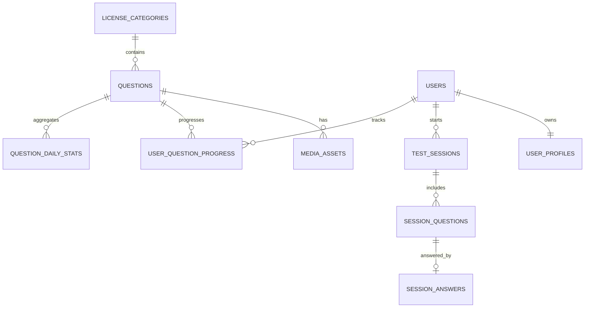

# Specyfikacja Bazy Danych

## 1. Cel dokumentu

Ten dokument definiuje kanoniczny model danych dla produktu.

Jego celem jest:

- ustalenie struktury danych MVP,
- ograniczenie ryzyka zbyt chaotycznego wzrostu tabel,
- opisanie relacji potrzebnych do egzaminu, nauki i analityki,
- przygotowanie bazy pod przyszle V2 i B2B,
- odseparowanie danych biznesowych od mediow.

## 2. Zasady projektowe

Model danych opiera sie na nastepujacych zasadach:

1. `PostgreSQL` jest source of truth dla danych aplikacyjnych.
2. Multimedia nie sa przechowywane w bazie.
3. Kazda sesja testowa ma wlasny snapshot przydzielonych pytan.
4. Zapisy odpowiedzi sa deterministyczne i mozliwe do odtworzenia.
5. Dane analityczne ciezkie obliczeniowo sa agregowane, a nie liczone zawsze live.
6. Model MVP ma byc prosty, ale gotowy na `organization_id` w V2.
7. Kazda tabela ma jasno zdefiniowana odpowiedzialnosc.

## 3. Zakres MVP vs V2

### MVP

Do MVP wchodza:

- kategorie,
- pytania,
- assety mediowe,
- profile uzytkownikow,
- sesje testowe,
- snapshot pytan w sesji,
- odpowiedzi uzytkownika,
- postep per pytanie,
- podstawowe agregaty analityczne.

### V2

Do V2 dochodza:

- organizacje,
- czlonkostwo organizacyjne,
- zaproszenia,
- audit log,
- branding organizacyjny,
- eksporty i raporty B2B.

## 4. Konwencje nazewnicze

Przyjmujemy:

- `snake_case` dla tabel i kolumn,
- liczba mnoga dla tabel,
- `id UUID PRIMARY KEY` jako domyslny klucz glowny,
- `created_at` i `updated_at` typu `TIMESTAMPTZ`,
- `deleted_at` tylko tam, gdzie naprawde potrzebny soft delete,
- `*_id` dla kluczy obcych,
- enumy realizowane przez `TEXT + CHECK`, jesli nie ma mocnego powodu na natywne enumy PostgreSQL.

## 5. Model domenowy



## 6. Tabele MVP

## 6.1. `license_categories`

Cel:

- przechowuje obslugiwane kategorie prawa jazdy.

```sql
CREATE TABLE license_categories (
  id           TEXT PRIMARY KEY,
  name         TEXT NOT NULL,
  description  TEXT,
  parent_id    TEXT REFERENCES license_categories(id),
  priority     INT NOT NULL DEFAULT 99,
  is_active    BOOLEAN NOT NULL DEFAULT TRUE,
  created_at   TIMESTAMPTZ NOT NULL DEFAULT now(),
  updated_at   TIMESTAMPTZ NOT NULL DEFAULT now()
);
```

## 6.2. `questions`

Cel:

- przechowuje tresc pytan i ich metadane dydaktyczne.

```sql
CREATE TABLE questions (
  id                    UUID PRIMARY KEY DEFAULT gen_random_uuid(),
  category_id           TEXT NOT NULL REFERENCES license_categories(id),
  subcategory           TEXT NOT NULL,
  scope                 TEXT NOT NULL CHECK (scope IN ('basic', 'specialist')),
  points                INT NOT NULL CHECK (points IN (1, 2, 3)),
  question_text         TEXT NOT NULL,
  explanation           TEXT,
  legal_basis           TEXT,
  answer_a              TEXT NOT NULL,
  answer_b              TEXT NOT NULL,
  answer_c              TEXT NOT NULL,
  correct_answer        CHAR(1) NOT NULL CHECK (correct_answer IN ('A', 'B', 'C')),
  difficulty_score      NUMERIC(4,3) NOT NULL DEFAULT 0.500,
  global_accuracy_pct   NUMERIC(5,2) NOT NULL DEFAULT 50.00,
  attempt_count         INT NOT NULL DEFAULT 0,
  avg_response_time_ms  INT,
  is_active             BOOLEAN NOT NULL DEFAULT TRUE,
  created_at            TIMESTAMPTZ NOT NULL DEFAULT now(),
  updated_at            TIMESTAMPTZ NOT NULL DEFAULT now()
);
```

Uwagi:

- odpowiedzi sa denormalizowane, bo format egzaminacyjny jest staly,
- `questions` nie przechowuje bezposrednio URL mediow.

## 6.3. `media_assets`

Cel:

- przechowuje metadane assetow powiazanych z pytaniami.

```sql
CREATE TABLE media_assets (
  id               UUID PRIMARY KEY DEFAULT gen_random_uuid(),
  question_id      UUID NOT NULL REFERENCES questions(id) ON DELETE CASCADE,
  kind             TEXT NOT NULL CHECK (kind IN ('image', 'video', 'poster', 'thumb')),
  object_key       TEXT NOT NULL UNIQUE,
  public_url       TEXT NOT NULL,
  mime_type        TEXT NOT NULL,
  bytes            BIGINT NOT NULL,
  width            INT,
  height           INT,
  duration_ms      INT,
  sha256           TEXT,
  variant          TEXT,
  sort_order       INT NOT NULL DEFAULT 0,
  is_active        BOOLEAN NOT NULL DEFAULT TRUE,
  created_at       TIMESTAMPTZ NOT NULL DEFAULT now(),
  updated_at       TIMESTAMPTZ NOT NULL DEFAULT now()
);
```

## 6.4. `users`

Cel:

- przechowuje tozsamosc i dane logowania uzytkownika w modelu zgodnym z Laravel.

```sql
CREATE TABLE users (
  id                UUID PRIMARY KEY DEFAULT gen_random_uuid(),
  name              TEXT NOT NULL,
  email             TEXT NOT NULL UNIQUE,
  email_verified_at TIMESTAMPTZ,
  password          TEXT NOT NULL,
  status            TEXT NOT NULL DEFAULT 'active' CHECK (status IN ('active', 'blocked', 'archived')),
  last_login_at     TIMESTAMPTZ,
  remember_token    TEXT,
  created_at        TIMESTAMPTZ NOT NULL DEFAULT now(),
  updated_at        TIMESTAMPTZ NOT NULL DEFAULT now()
);
```

## 6.5. `user_profiles`

Cel:

- rozszerza uzytkownika o dane produktowe.

```sql
CREATE TABLE user_profiles (
  user_id            UUID PRIMARY KEY REFERENCES users(id) ON DELETE CASCADE,
  display_name       TEXT,
  target_category_id TEXT REFERENCES license_categories(id),
  exam_date          DATE,
  study_streak       INT NOT NULL DEFAULT 0,
  last_study_date    DATE,
  tier               TEXT NOT NULL DEFAULT 'free' CHECK (tier IN ('free', 'premium')),
  onboarding_step    TEXT,
  created_at         TIMESTAMPTZ NOT NULL DEFAULT now(),
  updated_at         TIMESTAMPTZ NOT NULL DEFAULT now()
);
```

## 6.6. `test_sessions`

Cel:

- przechowuje sesje nauki i egzaminu.

```sql
CREATE TABLE test_sessions (
  id                 UUID PRIMARY KEY DEFAULT gen_random_uuid(),
  user_id            UUID NOT NULL REFERENCES users(id) ON DELETE CASCADE,
  category_id        TEXT NOT NULL REFERENCES license_categories(id),
  mode               TEXT NOT NULL CHECK (mode IN ('exam', 'learn', 'hard', 'quick', 'sr_review')),
  status             TEXT NOT NULL DEFAULT 'created' CHECK (status IN ('created', 'in_progress', 'completed', 'abandoned', 'expired')),
  score              INT,
  max_score          INT,
  passed             BOOLEAN,
  total_questions    INT NOT NULL DEFAULT 0,
  answered_questions INT NOT NULL DEFAULT 0,
  started_at         TIMESTAMPTZ NOT NULL DEFAULT now(),
  completed_at       TIMESTAMPTZ,
  created_at         TIMESTAMPTZ NOT NULL DEFAULT now(),
  updated_at         TIMESTAMPTZ NOT NULL DEFAULT now()
);
```

## 6.7. `session_questions`

Cel:

- przechowuje snapshot pytan przypisanych do konkretnej sesji.

```sql
CREATE TABLE session_questions (
  id                  UUID PRIMARY KEY DEFAULT gen_random_uuid(),
  session_id          UUID NOT NULL REFERENCES test_sessions(id) ON DELETE CASCADE,
  question_id         UUID NOT NULL REFERENCES questions(id),
  order_index         INT NOT NULL,
  scope               TEXT NOT NULL CHECK (scope IN ('basic', 'specialist')),
  points              INT NOT NULL CHECK (points IN (1, 2, 3)),
  correct_answer      CHAR(1) NOT NULL CHECK (correct_answer IN ('A', 'B', 'C')),
  question_text       TEXT NOT NULL,
  answer_a            TEXT NOT NULL,
  answer_b            TEXT NOT NULL,
  answer_c            TEXT NOT NULL,
  explanation         TEXT,
  legal_basis         TEXT,
  created_at          TIMESTAMPTZ NOT NULL DEFAULT now(),
  UNIQUE (session_id, order_index),
  UNIQUE (session_id, question_id)
);
```

## 6.8. `session_answers`

Cel:

- przechowuje finalna odpowiedz uzytkownika dla pytania w sesji.

```sql
CREATE TABLE session_answers (
  id                   UUID PRIMARY KEY DEFAULT gen_random_uuid(),
  session_question_id  UUID NOT NULL UNIQUE REFERENCES session_questions(id) ON DELETE CASCADE,
  user_answer          CHAR(1) CHECK (user_answer IN ('A', 'B', 'C')),
  is_correct           BOOLEAN NOT NULL,
  response_time_ms     INT,
  answered_at          TIMESTAMPTZ NOT NULL DEFAULT now(),
  created_at           TIMESTAMPTZ NOT NULL DEFAULT now(),
  updated_at           TIMESTAMPTZ NOT NULL DEFAULT now()
);
```

## 6.9. `user_question_progress`

Cel:

- przechowuje postep uzytkownika per pytanie, w tym dane pod SM-2.

```sql
CREATE TABLE user_question_progress (
  user_id             UUID NOT NULL REFERENCES users(id) ON DELETE CASCADE,
  question_id         UUID NOT NULL REFERENCES questions(id) ON DELETE CASCADE,
  easiness_factor     NUMERIC(4,2) NOT NULL DEFAULT 2.50,
  interval_days       INT NOT NULL DEFAULT 1,
  repetitions         INT NOT NULL DEFAULT 0,
  next_review_at      DATE NOT NULL DEFAULT CURRENT_DATE,
  last_quality        INT CHECK (last_quality BETWEEN 0 AND 5),
  total_attempts      INT NOT NULL DEFAULT 0,
  correct_count       INT NOT NULL DEFAULT 0,
  incorrect_count     INT NOT NULL DEFAULT 0,
  correct_streak      INT NOT NULL DEFAULT 0,
  last_answered_at    TIMESTAMPTZ,
  first_answered_at   TIMESTAMPTZ,
  created_at          TIMESTAMPTZ NOT NULL DEFAULT now(),
  updated_at          TIMESTAMPTZ NOT NULL DEFAULT now(),
  PRIMARY KEY (user_id, question_id)
);
```

## 6.10. `question_daily_stats`

Cel:

- przechowuje agregaty dzienne do analityki i difficulty score.

```sql
CREATE TABLE question_daily_stats (
  question_id            UUID NOT NULL REFERENCES questions(id) ON DELETE CASCADE,
  stats_date             DATE NOT NULL,
  attempt_count          INT NOT NULL DEFAULT 0,
  correct_count          INT NOT NULL DEFAULT 0,
  incorrect_count        INT NOT NULL DEFAULT 0,
  avg_response_time_ms   INT,
  PRIMARY KEY (question_id, stats_date)
);
```

## 7. Indeksy

```sql
CREATE INDEX idx_questions_category_id ON questions(category_id);
CREATE INDEX idx_questions_is_active ON questions(is_active);
CREATE INDEX idx_questions_difficulty_score ON questions(difficulty_score DESC);

CREATE INDEX idx_media_assets_question_id ON media_assets(question_id);
CREATE INDEX idx_media_assets_kind ON media_assets(kind);

CREATE INDEX idx_test_sessions_user_id ON test_sessions(user_id);
CREATE INDEX idx_test_sessions_user_status ON test_sessions(user_id, status);
CREATE INDEX idx_test_sessions_category_mode ON test_sessions(category_id, mode);

CREATE INDEX idx_session_questions_session_id ON session_questions(session_id);
CREATE INDEX idx_session_answers_answered_at ON session_answers(answered_at);

CREATE INDEX idx_uqp_next_review_at ON user_question_progress(user_id, next_review_at);
CREATE INDEX idx_uqp_question_id ON user_question_progress(question_id);

CREATE INDEX idx_question_daily_stats_date ON question_daily_stats(stats_date);
```

## 8. Autoryzacja i model dostepu

### MVP

Kontrola dostepu powinna obejmowac co najmniej:

- `user_profiles`
- `test_sessions`
- `session_questions`
- `session_answers`
- `user_question_progress`

Zasada:

- uzytkownik widzi tylko swoje dane transakcyjne,
- kontrola dostepu odbywa sie w aplikacji przez middleware, policies i poprawne scope zapytan,
- tabele referencyjne typu `license_categories` i aktywne `questions` sa czytane przez bezpieczne API.

### V2

W V2 dodatkowo:

- dane organizacyjne sa filtrowane po `organization_id`,
- audit log ma restrykcyjny odczyt,
- role organizacyjne nie moga byc rozstrzygane tylko po stronie frontendu,
- dla wybranych przypadkow mozna dolozyc dodatkowe zabezpieczenia na poziomie bazy, ale nie sa one zalozeniem MVP.

## 9. Aktualizacja statystyk i difficulty score

Proces liczenia trudnosci powinien dzialac asynchronicznie.

Wersja MVP:

- aktualizacja dziennych agregatow,
- aktualizacja `difficulty_score` i `global_accuracy_pct`,
- brak liczenia wszystkiego w request path.

Wersja pozniejsza:

- joby inkrementalne,
- materializowane widoki,
- read replica dla raportow.

## 10. Retencja i wzrost danych

Najbardziej rosnace tabele:

- `session_answers`
- `session_questions`
- `test_sessions`
- `question_daily_stats`

Strategia:

- dane sesyjne trzymamy jako glowny zapis biznesowy,
- agregaty dzienne utrzymujemy stale,
- dodatkowy event stream dokladamy dopiero przy realnej potrzebie,
- partycjonowanie rozwazamy dopiero po wzroscie.

## 11. Tabele frameworkowe Laravel

Poza tabelami domenowymi system moze utrzymywac rowniez tabele frameworkowe.

Na MVP zakladamy co najmniej mozliwosc uzycia:

- `sessions` dla web-first auth, jesli wybierzemy database session driver,
- `jobs` dla `Laravel queue`,
- `job_batches` dla batchy kolejkowych,
- `failed_jobs` dla diagnostyki zadan asynchronicznych,
- opcjonalnie `cache`, jesli cache driver bedzie oparty o baze.

Te tabele:

- nie sa rdzeniem modelu domenowego,
- ale sa czescia operacyjnego modelu aplikacji,
- powinny byc objete migracjami i backupem.

## 12. V2: rozszerzenia organizacyjne

### `organizations`

```sql
CREATE TABLE organizations (
  id                UUID PRIMARY KEY DEFAULT gen_random_uuid(),
  name              TEXT NOT NULL,
  slug              TEXT NOT NULL UNIQUE,
  status            TEXT NOT NULL DEFAULT 'active' CHECK (status IN ('active', 'suspended', 'archived')),
  plan              TEXT NOT NULL DEFAULT 'business' CHECK (plan IN ('business', 'enterprise')),
  created_at        TIMESTAMPTZ NOT NULL DEFAULT now(),
  updated_at        TIMESTAMPTZ NOT NULL DEFAULT now()
);
```

### `organization_members`

```sql
CREATE TABLE organization_members (
  id                UUID PRIMARY KEY DEFAULT gen_random_uuid(),
  organization_id   UUID NOT NULL REFERENCES organizations(id) ON DELETE CASCADE,
  user_id           UUID NOT NULL REFERENCES users(id) ON DELETE CASCADE,
  role              TEXT NOT NULL CHECK (role IN ('owner', 'admin', 'instructor', 'manager', 'student')),
  status            TEXT NOT NULL DEFAULT 'active' CHECK (status IN ('active', 'invited', 'suspended')),
  created_at        TIMESTAMPTZ NOT NULL DEFAULT now(),
  updated_at        TIMESTAMPTZ NOT NULL DEFAULT now(),
  UNIQUE (organization_id, user_id)
);
```

### `organization_invites`

```sql
CREATE TABLE organization_invites (
  id                UUID PRIMARY KEY DEFAULT gen_random_uuid(),
  organization_id   UUID NOT NULL REFERENCES organizations(id) ON DELETE CASCADE,
  email             TEXT NOT NULL,
  role              TEXT NOT NULL CHECK (role IN ('admin', 'instructor', 'manager', 'student')),
  token_hash        TEXT NOT NULL,
  expires_at        TIMESTAMPTZ NOT NULL,
  accepted_at       TIMESTAMPTZ,
  created_at        TIMESTAMPTZ NOT NULL DEFAULT now()
);
```

### `audit_logs`

```sql
CREATE TABLE audit_logs (
  id                BIGSERIAL PRIMARY KEY,
  action            TEXT NOT NULL,
  entity_type       TEXT NOT NULL,
  entity_id         TEXT NOT NULL,
  actor_user_id     BIGINT REFERENCES users(id) ON DELETE SET NULL,
  request_id        TEXT,
  ip_address        TEXT,
  user_agent        TEXT,
  metadata          JSONB NOT NULL DEFAULT '{}'::jsonb,
  created_at        TIMESTAMPTZ NOT NULL DEFAULT now()
);
```

Uwagi implementacyjne dla obecnego MVP:

- audit log jest juz sensowny bez `organization_id`, bo multi-tenancy jeszcze nie istnieje,
- `request_id` spina wpis audytu z logami aplikacji i odpowiedzia HTTP,
- `metadata` trzyma tylko bezpieczne dane operacyjne, bez tokenow, sekretow i presigned URL-i.

### `content_import_runs`

```sql
CREATE TABLE content_import_runs (
  id                    BIGSERIAL PRIMARY KEY,
  kind                  TEXT NOT NULL,
  identifier            TEXT,
  status                TEXT NOT NULL DEFAULT 'ok',
  dry_run               BOOLEAN NOT NULL DEFAULT false,
  source_path           TEXT,
  output_path           TEXT,
  report_path           TEXT,
  rows_total            INTEGER NOT NULL DEFAULT 0,
  questions_total       INTEGER NOT NULL DEFAULT 0,
  media_total           INTEGER NOT NULL DEFAULT 0,
  asset_plan_total      INTEGER NOT NULL DEFAULT 0,
  uploaded_assets_total INTEGER NOT NULL DEFAULT 0,
  errors_count          INTEGER NOT NULL DEFAULT 0,
  warnings_count        INTEGER NOT NULL DEFAULT 0,
  summary               JSONB,
  started_at            TIMESTAMPTZ,
  completed_at          TIMESTAMPTZ,
  created_at            TIMESTAMPTZ NOT NULL DEFAULT now(),
  updated_at            TIMESTAMPTZ NOT NULL DEFAULT now()
);
```

Uwagi implementacyjne dla obecnego MVP:

- tabela sluzy do trwalego logowania runow `catalog:*`,
- `report_path` wskazuje kanoniczny plik JSON zapisany przez komende,
- `summary` trzyma skrocony obraz raportu, bez ciezkich payloadow assetow,
- log stagingu i importu jest read-only z poziomu panelu admina.

## 12.1. Rozszerzenie: modul SEO znakow drogowych (`2026-04-27`)

To rozszerzenie dopina do produktu nowy pion contentowy renderowany server-side. W przeciwienstwie do wczesniejszej, idealizowanej konwencji `UUID`, ten modul swiadomie korzysta z klasycznych kluczy `bigint`, bo taki jest realny wzorzec obecnego repo `Laravel + Filament`.

### 12.1.1. Zasady publikacji

- rekord publicznie istnieje dopiero, gdy `is_published = true`,
- rekord publicznie istnieje dopiero, gdy `published_at` nie jest puste,
- rekord publicznie istnieje dopiero, gdy `published_at <= now()`,
- draft, rekord bez daty albo rekord zaplanowany na przyszlosc nie powinien byc publicznie widoczny.

### 12.1.2. `content_authors`

Cel:

- przechowuje profile autorow tresci publicznych.

Kluczowe pola:

- `id`
- `name`
- `slug`
- `job_title`
- `bio`
- `photo_path`
- `linkedin_url`
- `external_profile_url`
- `is_published`
- `published_at`
- `created_at`
- `updated_at`

Relacje:

- `content_authors 1 -> n traffic_signs`

### 12.1.3. `traffic_sign_categories`

Cel:

- przechowuje kategorie stron znakow drogowych.

Kluczowe pola:

- `id`
- `name`
- `slug`
- `description`
- `intro_title`
- `intro_body`
- `sort_order`
- `is_published`
- `published_at`
- `created_at`
- `updated_at`

Relacje:

- `traffic_sign_categories 1 -> n traffic_signs`

### 12.1.4. `traffic_signs`

Cel:

- przechowuje tresc, SEO i status publikacji pojedynczej strony znaku drogowego.

Kluczowe pola:

- `id`
- `content_author_id`
- `traffic_sign_category_id`
- `code`
- `slug`
- `name`
- `intro_definition`
- `meaning`
- `placement`
- `driver_behavior`
- `legal_summary`
- `legal_reference_label`
- `legal_reference_url`
- `fine_summary`
- `common_mistakes`
- `editorial_notes`
- `review_notes`
- `source_notes`
- `faq_items`
- `meta_title`
- `meta_description`
- `image_path`
- `image_alt`
- `image_width`
- `image_height`
- `og_image_path`
- `og_image_alt`
- `og_image_width`
- `og_image_height`
- `sort_order`
- `workflow_status`
- `reviewer_user_id`
- `reviewed_at`
- `source_checked_at`
- `freshness_review_due_at`
- `is_published`
- `published_at`
- `created_at`
- `updated_at`

Relacje:

- `traffic_signs n -> 1 content_authors`
- `traffic_signs n -> 1 traffic_sign_categories`

Uwagi implementacyjne:

- `code` i `slug` sa unikalne,
- `faq_items` jest przechowywane jako `json`,
- `editorial_notes` i `source_notes` sa polami wewnetrznymi dla redakcji,
- `review_notes`, `reviewed_at`, `source_checked_at` i `freshness_review_due_at` spina workflow content ops dla `Etapu 2`,
- `workflow_status` rozdziela etap redakcyjny od samej widocznosci publicznej sterowanej przez `is_published` i `published_at`,
- `reviewer_user_id` wskazuje uzytkownika panelu odpowiedzialnego za ostatni pass redakcyjny lub SEO,
- `image_alt`, `image_width`, `image_height`, `og_image_alt`, `og_image_width` i `og_image_height` stanowia minimalny kontrakt assetow dla publicznego SEO i social share,
- indeksy wspieraja listowanie po publikacji, autorze, kategorii i kolejnosci.

### 12.1.5. `traffic_sign_query_map_entries`

Cel:

- przechowuje operacyjna mape zapytan, watchliste i batch planowania dla kolejnych rolloutow klastra `znaki drogowe`.

Kluczowe pola:

- `id`
- `traffic_sign_id`
- `traffic_sign_category_id`
- `primary_query`
- `mapped_title`
- `target_type`
- `search_intent`
- `priority`
- `rollout_status`
- `batch_label`
- `target_path`
- `watch_reason`
- `source_plan`
- `correction_notes`
- `competitor_notes`
- `first_mover_note`
- `notes`
- `created_at`
- `updated_at`

Relacje:

- `traffic_sign_query_map_entries n -> 1 traffic_signs`
- `traffic_sign_query_map_entries n -> 1 traffic_sign_categories`

Uwagi implementacyjne:

- tabela sluzy do przejscia z ogolnej roadmapy do realnego planu produkcji tresci i monitorowania rolloutow,
- wpis moze byc podpiety do istniejacego znaku, kategorii albo zostac pusty relacyjnie, gdy dotyczy przyszlej strony albo materialu wspierajacego,
- `rollout_status` rozdziela watchliste, backlog, brief gotowy, etap pisania i publikacje,
- `source_plan` i `correction_notes` spinaja standard zrodel oraz triggerow do przyszlych korekt bez mieszania tego z publiczna trescia strony,
- `batch_label` pozwala zebrac w panelu jeden operacyjny rollout, np. `rollout-01`.

## 13. Reguly migracji

Kazda migracja powinna:

- byc naprawialna forward fixem,
- unikac niekontrolowanych lockow na duzych tabelach,
- aktualizowac indeksy i constraints razem ze zmiana modelu,
- aktualizowac dokumentacje, jesli zmienia kontrakt danych.

## 14. Reguly implementacyjne

Nie robimy:

- przechowywania mediow w bazie,
- przetwarzania wideo w triggerach bazy,
- mieszania danych sesji z danymi konfiguracyjnymi w jednej tabeli,
- losowego dodawania JSONB tam, gdzie powinny byc normalne kolumny.

Robimy:

- jawne constraints,
- jawne indeksy,
- jawne daty i statusy,
- snapshot sesji,
- rozsadna denormalizacje tylko tam, gdzie daje stabilnosc i wydajnosc.

## 15. Finalna rekomendacja

Profesjonalny model danych dla tego projektu powinien byc:

- prosty w MVP,
- przewidywalny dla sesji egzaminacyjnych,
- oszczedny operacyjnie,
- gotowy na rozrost analityki,
- gotowy na `organization_id` bez przepisywania wszystkiego.
