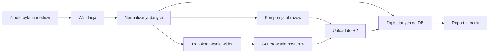

# Import Pipeline

## 1. Cel dokumentu

Ten dokument opisuje kanoniczny pipeline importu pytan i mediow do systemu.

Jego celem jest:

- uporzadkowac sposob dostarczania tresci do produktu,
- zminimalizowac ryzyko balaganu w assetach i metadanych,
- zapewnic powtarzalny i audytowalny import,
- rozdzielic dane zrodlowe od danych produkcyjnych.

## 2. Zakres

Pipeline obejmuje:

- import kategorii,
- import pytan,
- walidacje danych,
- preprocessing obrazow,
- preprocessing wideo,
- generowanie posterow i miniatur,
- upload do R2,
- zapis metadanych do PostgreSQL,
- raport z sukcesow i bledow.

Nie obejmuje:

- edycji tresci pytan w runtime przez zwykly frontend usera,
- transkodowania mediow na zywo,
- masowego importu bez walidacji.

## 3. Zasady nadrzedne

1. Import ma byc powtarzalny.
2. Import ma byc idempotentny w zakresie praktycznie mozliwym.
3. Zadna binarka nie trafia do PostgreSQL.
4. Zadne media nie trafiaja na produkcyjny dysk VPS jako glowny storage.
5. Produkcyjny asset musi przejsc walidacje przed publikacja.
6. Nie publikujemy assetu, jesli nie ma kompletu metadanych.

## 4. Model operacyjny

Docelowy przeplyw:



## 5. Rodzaje danych wejsciowych

Pipeline powinien wspierac:

- dane tekstowe pytan,
- odpowiedzi,
- metadane kategorii i subkategorii,
- obrazy,
- wideo,
- opcjonalnie manifest importu.

Preferowany format wejsciowy dla danych strukturalnych:

- `CSV` albo `JSON`

Preferowany format dla assetow:

- obrazy wejciowe: `PNG`, `JPG`
- wideo wejsciowe: `MP4`, `MOV`

## 6. Struktura robocza importu

Przyklad katalogu roboczego:

```text
import/
  batch-2026-03-18/
    manifest.json
    questions.csv
    media/
      B/
        000001/
          image.png
        000002/
          clip.mp4
```

Ta struktura nie jest storage produkcyjnym. To tylko staging.

## 7. Manifest importu

Preferowany jest jawny manifest.

Przyklad:

```json
{
  "batch_id": "batch-2026-03-18",
  "category_id": "B",
  "source": "official-curated-import",
  "questions_file": "questions.csv",
  "media_root": "media/",
  "dry_run": false
}
```

## 8. Model rekordu pytania w imporcie

Minimalny rekord importowy powinien zawierac:

- `external_id`
- `category_id`
- `subcategory`
- `scope`
- `points`
- `question_text`
- `answer_a`
- `answer_b`
- `answer_c`
- `correct_answer`
- `explanation`
- `legal_basis`

Opcjonalnie:

- `image_path`
- `video_path`
- `sort_order`

Przyklad CSV:

```text
external_id,category_id,subcategory,scope,points,question_text,answer_a,answer_b,answer_c,correct_answer,explanation,legal_basis,image_path,video_path
B-000001,B,pierwszenstwo,basic,3,"Czy w tej sytuacji masz pierwszenstwo?","Tak","Nie","Tylko warunkowo","A","Wyjasnienie...","Art. ...","media/B/000001/image.png",
```

## 9. Etapy pipeline

## 9.1. Walidacja wejscia

Na tym etapie sprawdzamy:

- czy pliki istnieja,
- czy rekord ma wszystkie wymagane pola,
- czy `category_id` jest poprawne,
- czy `scope` i `points` sa poprawne,
- czy `correct_answer` jest w zakresie `A/B/C`,
- czy pliki mediow maja dozwolone rozszerzenia,
- czy rozmiary plikow nie przekraczaja limitow.

Jesli walidacja pada:

- import nie powinien publikowac niepelnego rekordu,
- blad trafia do raportu.

## 9.2. Normalizacja

Normalizujemy:

- whitespace,
- kodowanie tekstu,
- nazwy plikow,
- identyfikatory zewnetrzne,
- strukture kategorii i subkategorii.

Na tym etapie:

- nie zmieniamy sensu pytania,
- nie poprawiamy recznie tresci na slepo,
- tylko porzadkujemy dane.

## 9.3. Przetwarzanie obrazow

Docelowe wyjscie:

- `full.webp`
- `thumb.webp`

Zasady:

- strip metadata,
- resize do limitu produkcyjnego,
- utrzymanie proporcji,
- sensowna kompresja.

## 9.4. Przetwarzanie wideo

Docelowe wyjscie:

- `clip.mp4`
- `poster.webp`

Zasady:

- H.264 + AAC,
- `+faststart`,
- 720p max na MVP,
- brak transkodowania on-demand na serwerze.

## 9.5. Upload do R2

Upload obejmuje:

- pliki finalne tylko po pomyslnej walidacji,
- wersjonowane nazwy z hashem,
- zapis `object_key`,
- brak uploadu przez publiczny frontend bez kontroli.

Przyklad klucza:

```text
media/questions/B/000001/image/full.abcd1234.webp
```

## 9.6. Zapis do PostgreSQL

Po udanym uploadzie zapisujemy:

- pytanie,
- powiazania kategorii,
- metadane assetow w `media_assets`,
- mapowanie `external_id -> question_id`,
- log importu.

Kolejnosc ma znaczenie:

1. najpierw pytanie,
2. potem assety,
3. potem oznaczenie importu jako zakonczonego.

## 10. Idempotencja

Import powinien byc bezpieczny przy powtorzeniu.

To oznacza:

- rekord identyfikujemy po `external_id` albo innym stabilnym kluczu,
- asset mozna rozpoznac po `sha256` lub nazwie wersjonowanej,
- ponowny import tego samego batcha nie powinien tworzyc chaosu.

Najlepszy model:

- `upsert` dla pytan po kluczu zewnetrznym,
- nowe assety publikowane po hashach,
- stare assety oznaczane jako nieaktywne tylko po jawnej decyzji.

## 11. Tryby uruchomienia

Pipeline powinien wspierac co najmniej dwa tryby:

### Dry run

Sprawdza:

- poprawnosc danych,
- komplet plikow,
- plan zmian,
- szacowany wynik importu.

Nie wykonuje:

- uploadu,
- zapisu do produkcyjnej bazy.

### Real import

Wykonuje:

- preprocessing,
- upload,
- zapis danych,
- raport koncowy.

## 11.1. Obecna implementacja MVP

W obecnym kodzie aplikacja wspiera juz praktyczny wariant stagingowego importu:

- `catalog:import-json` dla ustrukturyzowanego payloadu katalogu,
- `catalog:import-manifest` dla batcha opartego o `manifest.json` + `questions.csv|json` + lokalny katalog mediow.

To oznacza, ze MVP umie juz:

- walidowac batch i pola pytan,
- sprawdzic istnienie plikow mediow w stagingu,
- wyliczyc deterministyczne sciezki assetow po hashu,
- uploadowac gotowe assety na docelowy disk mediow,
- zapisac pytania i media do bazy,
- zapisac raport JSON z importu.

To czego obecna implementacja jeszcze swiadomie nie robi:

- kompresji obrazow wewnatrz aplikacji,
- transkodowania wideo wewnatrz aplikacji,
- generowania posterow i thumbnaili z surowych plikow.

Te kroki nadal powinny byc wykonywane offline przed importem albo przez osobny pipeline operatorski.

## 12. Raport importu

Kazdy import musi generowac raport.

Minimalny raport powinien zawierac:

- `batch_id`,
- czas startu i konca,
- liczbe rekordow,
- liczbe sukcesow,
- liczbe bledow,
- liste odrzuconych rekordow,
- liste utworzonych assetow,
- liste zaktualizowanych rekordow.

W obecnym MVP raporty sa dodatkowo rejestrowane w tabeli `content_import_runs`, co daje:

- historie runow importu i stagingu,
- szybki podglad statusu, licznikow i bledow,
- adminowy wglad do pipeline bez otwierania plikow JSON recznie.

W obecnym MVP raport z `catalog:import-manifest` zawiera dodatkowo:

- `rows_total`,
- `asset_plan_total`,
- `uploaded_assets_total`,
- liste zaplanowanych assetow,
- liste faktycznie uploadowanych assetow.

W przypadku pelnego `catalog:import-manifest-series` zakonczonego bez bledow aplikacja uruchamia dodatkowo audit integralnosci oficjalnego katalogu i dopisuje skrot wyniku do:

- `content_import_runs.summary.integrity_audit`

Pelny opis tej bramki jest w [QUESTION-INTEGRITY-AUDIT.md](C:/Users/xxx/Desktop/serwistestyprawojazdy/docs/QUESTION-INTEGRITY-AUDIT.md).

Przyklad:

```json
{
  "batch_id": "batch-2026-03-18",
  "started_at": "2026-03-18T18:00:00Z",
  "completed_at": "2026-03-18T18:03:32Z",
  "questions_total": 120,
  "questions_created": 118,
  "questions_updated": 2,
  "errors_count": 3
}
```

## 13. Limity i walidacje

Minimalne limity MVP:

- obrazy:
  - tylko `png`, `jpg`, `jpeg`
  - limit rozmiaru pliku wejsciowego
- wideo:
  - tylko kontrolowane formaty
  - limit rozmiaru pliku wejsciowego

Dokladne limity techniczne powinny byc utrzymywane w konfiguracji pipeline, a nie recznie zaszywane w wielu miejscach.

## 14. Bledy i obsluga awarii

Pipeline powinien rozrozniac:

- bledy danych,
- bledy assetow,
- bledy uploadu,
- bledy bazy,
- bledy konfiguracji.

Zasada:

- jeden uszkodzony rekord nie powinien rozwalic calego wsadu, jesli nie ma ku temu powodu krytycznego,
- ale publikacja niepelnych danych tez nie jest akceptowalna.

## 15. Bezpieczenstwo importu

Import jest operacja uprzywilejowana.

Dlatego:

- nie uruchamiamy go z publicznego endpointu dla zwyklego usera,
- nie przyjmujemy arbitralnych plikow bez walidacji,
- nie publikujemy assetu bez kontroli MIME i rozmiaru,
- nie trzymamy sekretow importu w kodzie.

## 16. Obowiazki zespolu

Za pipeline odpowiadaja trzy obszary:

- `content`
  - jakosc tresci pytan
- `ops/tech`
  - poprawne przetwarzanie i publikacja
- `product`
  - zgodnosc z docelowym standardem nauki i UX

## 17. Finalna rekomendacja

Profesjonalny import pipeline dla tego projektu powinien byc:

- przewidywalny,
- wersjonowany,
- idempotentny,
- raportowalny,
- bezpieczny,
- calkowicie odseparowany od runtime usera.

To oznacza tez, ze po kazdym nowym wsadzie `gov.pl` nie konczymy na samym imporcie. Minimalny kanoniczny przebieg to:

`staging -> import -> klasyfikacja -> audit integralnosci -> audit delivery readiness -> QA`
