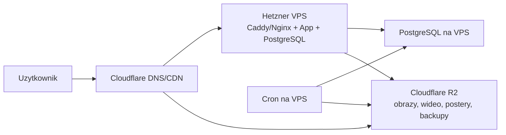

# Infrastruktura MVP: Hetzner VPS + Cloudflare R2 Free

> Status: dokument historyczny. Aktualnym, kanonicznym targetem budzetowego wdrozenia jest [INFRA-MVP-MIKRUS-3.5-R2.md](C:/Users/xxx/Desktop/serwistestyprawojazdy/docs/INFRA-MVP-MIKRUS-3.5-R2.md).

## 1. Cel dokumentu

Ten dokument definiuje najtanszy sensowny setup produkcyjny dla platformy egzaminacyjnej z obrazami i wideo, przy zalozeniu:

- budzet ma byc bardzo niski,
- produkt ma byc dostepny dla prawdziwych uzytkownikow,
- multimedia nie moga zabic ani bazy, ani dysku VPS,
- architektura ma wycisnac z malego serwera maksymalnie duzo,
- startujemy bez zbednych uslug platnych, ale bez prowizorki.

To nie jest setup "idealny". To jest setup "najlepszy stosunek kosztu do sensu".

## 2. Decyzja architektoniczna

Docelowa decyzja na MVP:

- aplikacja i API dzialaja na jednym tanim VPS w Hetznerze,
- baza danych dziala na tym samym VPS,
- wszystkie multimedia i backupy trafiaja poza VPS do Cloudflare R2,
- pliki nie sa przechowywane w PostgreSQL,
- pliki nie sa serwowane z lokalnego dysku serwera,
- wszystkie media sa przygotowywane przed uploadem,
- publiczne assety sa cachowane przez Cloudflare.

Ta architektura minimalizuje:

- koszt miesieczny,
- zuzycie RAM na VPS,
- zuzycie SSD na VPS,
- ryzyko awarii przez zapelniony dysk,
- ryzyko zabicia CPU przez transkodowanie na zywo,
- ryzyko przeciagania kazdego pobrania przez aplikacje.

## 3. Finalna topologia



## 4. Co trzymamy gdzie

### 4.1. VPS

Na VPS trzymamy tylko rzeczy, ktore musza byc blisko logiki aplikacji:

- reverse proxy: `Caddy` albo `Nginx`,
- aplikacja webowa i API,
- `PostgreSQL`,
- proste cron joby,
- logi rotowane lokalnie,
- tymczasowe pliki importu, ale tylko krotkoterminowo.

### 4.2. Cloudflare R2

W R2 trzymamy:

- obrazy pytan,
- wideo pytan,
- postery do wideo,
- miniatury,
- eksporty/importy mediow,
- backupy bazy.

### 4.3. PostgreSQL

W PostgreSQL trzymamy wyłącznie:

- dane aplikacyjne,
- metadane pytan,
- metadane mediow,
- statystyki,
- logike postepu uzytkownika,
- indeksy i agregaty.

W PostgreSQL nie trzymamy:

- `bytea`,
- base64 obrazow,
- base64 wideo,
- duzych blobow,
- archiwow zip z mediami.

## 5. Dlaczego ten setup jest najtanszy sensowny

### 5.1. Co zabija maly VPS

Maly VPS najczesciej zabijaja:

- za malo RAM,
- zapelniony dysk przez media i backupy,
- za duzo procesow i kontenerow,
- za duzo polaczen do bazy,
- transkodowanie wideo na serwerze,
- wysylka duzych plikow przez aplikacje zamiast przez storage/CDN,
- zle cache'owanie assetow,
- logi i temporary files zostawione bez kontroli.

### 5.2. Co ten setup optymalizuje

- SSD VPS zostaje dla systemu, aplikacji i bazy.
- RAM nie jest marnowany na dodatkowe uslugi.
- multimedia nie zajmuja miejsca na serwerze.
- aplikacja nie streamuje kazdego pliku z dysku lokalnego.
- Cloudflare cache przejmuje znaczna czesc ruchu.
- R2 Free daje start z bardzo niskim kosztem i bez egress fee.

## 6. Koszt i limity

## 6.1. Hetzner

Na dzien `18 marca 2026` oficjalny dokument Hetznera o zmianie cen pokazuje, ze od `1 kwietnia 2026` plan `CX23` w lokalizacjach DE/FI bedzie kosztowal `EUR 3.99 netto / mies.`. Wcześniejsza cena wskazana przez Hetznera to `EUR 2.99 netto / mies.`.

W praktyce dla MVP zakladamy:

- 1 maly VPS w Hetznerze,
- bez load balancera,
- bez drugiego serwera,
- bez managed DB,
- bez dodatkowych platnych uslug monitoringu.

Zrodlo:

- https://docs.hetzner.com/general/infrastructure-and-availability/price-adjustment/

## 6.2. Cloudflare R2 Free

Oficjalny cennik Cloudflare R2 podaje darmowy limit:

- `10 GB-month` storage / miesiac,
- `1 000 000` operacji Class A / miesiac,
- `10 000 000` operacji Class B / miesiac,
- `free egress`.

To jest bardzo dobra oferta na start dla MVP z kontrolowanym zbiorem mediow.

Zrodlo:

- https://developers.cloudflare.com/r2/pricing/

## 6.3. Wniosek kosztowy

Najtanszy sensowny setup:

- `Hetzner VPS`: okolo `EUR 3.99 netto / mies.` po zmianie cen,
- `Cloudflare`: plan free,
- `Cloudflare R2`: startowo free,
- `domena`: osobno.

W praktyce daje to infrastrukture aplikacyjną blisko kosztu jednego malego VPS, o ile miescimy sie w darmowym limicie R2.

## 7. Kiedy darmowe R2 wystarczy, a kiedy nie

R2 Free wystarczy, jezeli:

- startujemy od jednej kategorii albo waskiego zakresu,
- obrazy sa agresywnie skompresowane,
- klipy wideo sa krotkie,
- nie przechowujemy oryginalow produkcyjnych w bucketach publicznych,
- trzymamy tylko warianty finalne.

R2 Free przestaje byc komfortowe, jezeli:

- wrzucimy wszystkie kategorie naraz,
- kazdy klip ma po kilkanascie lub kilkadziesiat MB,
- przechowujemy kilka wariantow tego samego pliku bez potrzeby,
- trzymamy i source, i output, i backup source w tym samym bucketcie,
- mamy bardzo duzo nowych uploadow lub przepisywania plikow.

## 8. Twarde zasady oszczedzania zasobow

To sa zasady bezdyskusyjne dla tego setupu:

1. Zero blobow w bazie.
2. Zero filmow na dysku VPS.
3. Zero transkodowania on-demand na VPS.
4. Zero serwowania uploadow przez backend, jesli plik moze isc bezposrednio z R2.
5. Zero przechowywania oryginalow w produkcyjnej sciezce, jesli nie sa potrzebne.
6. Zero dodatkowych uslug typu Redis, MinIO, Elasticsearch, Grafana, Prometheus na tym samym malym VPS, dopoki nie ma twardej potrzeby.
7. Zero Dockerowego "zalozmy wszystko w 8 kontenerach", jesli nie ma realnej korzysci.

## 9. Rekomendowany software stack na VPS

## 9.1. System

Polecany system:

- `Debian 12 minimal` albo `Ubuntu 24.04 LTS minimal`.

Preferencja:

- `Debian 12 minimal`, jesli priorytetem jest lekki system i przewidywalnosc.

## 9.2. Reverse proxy

Preferowany:

- `Caddy`

Dlaczego:

- prostsza konfiguracja TLS,
- mniej czasu administracyjnego,
- mniejsze ryzyko blednej konfiguracji,
- szybkie wdrozenie.

Alternatywa:

- `Nginx`, jesli zespół zna go lepiej.

## 9.3. Aplikacja

Jesli stos pozostaje zgodny z koncepcja:

- `Laravel`,
- `Inertia.js + Vue 3 + TypeScript`,
- `PHP-FPM` jako runtime aplikacji,
- `Vite` do build-time assetow frontendowych,
- bez stalego runtime `Node.js` w produkcji,
- `Filament` dla panelu admina i backoffice.

## 9.4. ORM / dostep do bazy

Preferowane:

- `Eloquent ORM`,
- `Laravel Query Builder`,
- albo jawne SQL dla ciezszych zapytan i raportow.

Mniej preferowane na najmniejszym VPS:

- zbyt gleboka abstrakcja nad zapytaniami, jesli utrudnia wydajnosc i diagnoze.

## 9.5. Baza

- `PostgreSQL 16`

## 9.6. Proces manager

- `systemd`

Powod:

- jest juz w systemie,
- nie wymaga dodatkowej warstwy,
- dobrze integruje restart, logi i autostart.

## 10. Dlaczego nie Docker jako domysl

Docker nie jest zly, ale na najmniejszym VPS:

- doklada warstwe administracyjna,
- doklada logi i overlay filesystem,
- zajmuje RAM i dysk,
- utrudnia poczatkowe debugowanie mniej doswiadczonemu zespolowi.

Jesli priorytetem jest wycisniecie kazdego centa z malego serwera, to preferowany jest:

- `system package manager + systemd + lokalny PostgreSQL`

Docker ma sens, gdy:

- zespół juz go bardzo dobrze zna,
- wdrozenia sa stale powtarzalne,
- potrzeba separacji uslug przewaza nad kosztem zasobowym.

## 11. Model danych dla mediow

Najlepiej rozdzielic dane pytania od danych plikow.

Minimalny model:

```sql
CREATE TABLE media_assets (
  id               UUID PRIMARY KEY,
  question_id      UUID NOT NULL REFERENCES questions(id) ON DELETE CASCADE,
  kind             TEXT NOT NULL CHECK (kind IN ('image', 'video', 'poster', 'thumb')),
  object_key       TEXT NOT NULL UNIQUE,
  public_url       TEXT NOT NULL,
  mime_type        TEXT NOT NULL,
  bytes            BIGINT NOT NULL,
  width            INT,
  height           INT,
  duration_ms      INT,
  sha256           TEXT,
  variant          TEXT,
  is_active        BOOLEAN NOT NULL DEFAULT TRUE,
  created_at       TIMESTAMPTZ NOT NULL DEFAULT now()
);

CREATE INDEX idx_media_assets_question_id ON media_assets(question_id);
CREATE INDEX idx_media_assets_kind ON media_assets(kind);
```

W tabeli `questions` warto trzymac tylko referencje logiczne lub zapytania po `question_id`, a nie wielkie pola tekstowe z danymi pliku.

## 12. Struktura bucketow i kluczy w R2

Polecana struktura:

```text
media/
  questions/
    B/
      000001/
        image/
          full.webp
          thumb.webp
        video/
          clip.mp4
          poster.webp
    C/
    D/

private/
  imports/
  admin/

backups/
  postgres/
    2026/
      03/
        2026-03-18T02-00-00Z.sql.gz
```

Lepsza wersja produkcyjna:

```text
media/questions/B/000001/image/full.abcd1234.webp
media/questions/B/000001/image/thumb.abcd1234.webp
media/questions/B/000001/video/clip.abcd1234.mp4
media/questions/B/000001/video/poster.abcd1234.webp
```

Dlaczego hash w nazwie:

- bezpieczny długi cache,
- proste invalidation przez zmianę nazwy,
- brak problemu ze "stary plik zostal w cache".

## 13. Strategia dla obrazow

## 13.1. Format

Domyslnie:

- `WebP`

Opcjonalnie pozniej:

- `AVIF`, jesli realnie poprawi wage i nie skomplikuje pipeline'u za bardzo.

## 13.2. Warianty

Na MVP wystarcza:

- `full`
- `thumb`

Nie robimy 8 wariantow responsywnych, jesli nie ma twardego uzasadnienia.

## 13.3. Zalecane limity

- `thumb`: szerokosc `320-480 px`
- `full`: szerokosc maksymalnie `1280 px`
- brak zachowywania metadanych EXIF,
- agresywne `strip metadata`.

## 13.4. Docelowa waga

Cel na MVP:

- `thumb.webp`: `20-60 KB`
- `full.webp`: `80-220 KB`

Jesli obraz przekracza te liczby bez dobrej przyczyny, trzeba go przebadac.

## 13.5. Przykladowa komenda

```bash
magick input.png -resize "1280x1280>" -strip -quality 82 output-full.webp
magick input.png -resize "480x480>" -strip -quality 75 output-thumb.webp
```

## 14. Strategia dla wideo

## 14.1. Format

Na MVP:

- `MP4`
- kodek wideo: `H.264`
- audio: `AAC`
- `yuv420p`

To daje najszersza zgodnosc i najmniej problemow z odtwarzaniem.

## 14.2. Rozdzielczosc

Domyslnie:

- `720p`

Nie idziemy od razu w `1080p`, jesli nie ma mocnego uzasadnienia.

## 14.3. Bitrate i cel wagowy

Cel dla krotkich klipow edukacyjnych:

- `2-6 MB` na klip jako bezpieczny zakres MVP

Jesli klipy sa dluzsze lub bardziej dynamiczne:

- do `8 MB`, ale traktowac to jako gorna granice robocza.

## 14.4. Fast start

Kazdy plik MP4 musi miec:

- `+faststart`

To przesuwa metadane MP4 na poczatek pliku i poprawia start odtwarzania.

## 14.5. Poster

Kazdy film powinien miec:

- `poster.webp`

Po co:

- szybszy perceived performance,
- brak potrzeby natychmiastowego pobierania wideo,
- ladniejszy UX na listach i mobile.

## 14.6. Przykladowa komenda ffmpeg

```bash
ffmpeg -i input.mp4 \
  -vf "scale='min(1280,iw)':-2" \
  -c:v libx264 \
  -preset veryfast \
  -crf 28 \
  -movflags +faststart \
  -pix_fmt yuv420p \
  -c:a aac \
  -b:a 96k \
  output.mp4
```

Poster:

```bash
ffmpeg -ss 00:00:01 -i output.mp4 -frames:v 1 -vf "scale=1280:-2" poster.png
magick poster.png -strip -quality 80 poster.webp
```

## 15. Zasada najwazniejsza: preprocessing zamiast transkodowania na zywo

Na tym VPS nie wolno:

- transkodowac kazdego pliku po stronie produkcyjnej pod ruchem,
- generowac thumbnaili on-demand,
- kompresowac obrazow podczas pierwszego requestu.

Zamiast tego:

- operator albo skrypt przygotowuje assety offline,
- gotowe assety sa uploadowane do R2,
- uzytkownik pobiera juz wersje finalna.

To jedna z najwazniejszych decyzji kosztowych w calym projekcie.

## 16. Upload pipeline

## 16.1. Dla panelu admina

Najlepsza wersja:

1. panel admina prosi backend o `presigned URL`,
2. backend tworzy limitowany czasowo upload URL do R2,
3. przegladarka albo skrypt wysyla plik bezposrednio do R2,
4. backend zapisuje metadane pliku w PostgreSQL.

To odciaza VPS z przesylania duzych plikow.

Wazny detal:

- `presigned URLs` dzialaja z domena API R2 typu `*.r2.cloudflarestorage.com`,
- nie uzywa sie ich z publicznym custom domain do czytania assetow.

Zrodlo:

- https://developers.cloudflare.com/r2/api/s3/presigned-urls/

## 16.2. Dla masowego importu

Najpraktyczniej:

- lokalny skrypt importowy,
- walidacja plikow,
- kompresja,
- generowanie posterow i thumbnaili,
- upload do R2,
- zapis metadanych do PostgreSQL,
- raport z bledow.

## 17. Serwowanie mediow

## 17.1. Publiczne media

Media produkcyjne powinny byc dostepne pod:

- `media.twojadomena.pl`

Nie przez:

- lokalny katalog serwera,
- endpoint API typu `/api/file?id=...`,
- `r2.dev` jako glowny adres produkcyjny.

Cloudflare dokumentuje bucket publiczny i custom domains. Dla produkcji wybieramy custom domain.

Powod:

- `r2.dev` jest przeznaczone do developmentu,
- `r2.dev` ma zmienne rate limiting i nie powinno byc glowna sciezka produkcyjna,
- custom domain pozwala sensownie uzyc cache i reguly bezpieczenstwa.

Zrodlo:

- https://developers.cloudflare.com/r2/data-access/public-buckets/
- https://developers.cloudflare.com/r2/platform/limits/

## 17.2. Cache headers

Dla plikow wersjonowanych hashem:

```text
Cache-Control: public, max-age=31536000, immutable
```

Dodatkowo:

- dla bucketa za custom domain trzeba jawnie ustawic cache rules tak, by Cloudflare rzeczywiscie cachowalo pliki, a nie tylko czesc typow,
- dla mediow produkcyjnych warto ustawic regule typu `Cache Everything`.

Dla plikow, ktore potencjalnie beda podmieniane bez zmiany nazwy, ten setup nie jest zalecany.

Wniosek:

- zmieniaj nazwe pliku przy zmianie assetu,
- nie walcz z cache recznym purge za kazdym razem.

Zrodlo:

- https://developers.cloudflare.com/cache/interaction-cloudflare-products/r2/

## 18. Frontend: jak nie zniszczyc transferu i UX

## 18.1. Listy pytan

Na listach i dashboardach:

- pokazywac tylko miniatury,
- nie preloadowac pelnych obrazow i filmow,
- lazy-loadowac multimedia,
- nie renderowac `video` tam, gdzie wystarczy `poster`.

## 18.2. Widok pytania

W widoku pytania:

- obraz laduje sie dopiero, gdy pytanie jest widoczne,
- wideo laduje sie dopiero, gdy pytanie jest otwarte,
- `preload="metadata"` albo `preload="none"` dla wideo,
- autoplay tylko jesli to bezwzglednie potrzebne dla logiki pytania.

## 18.3. Nie generowac obrazow runtime bez potrzeby

Jesli obrazy sa juz wstepnie zoptymalizowane i wersjonowane:

- zwykly `img` albo lekki komponent obrazu po stronie `Vue` bywa tanszy i prostszy niz dodatkowe przetwarzanie runtime po stronie aplikacji.

Klucz:

- nie generowac obrazow runtime, jesli pliki sa gotowe.

## 19. PostgreSQL: jak nie zabic serwera

Najwiekszym zagrozeniem dla bazy nie sa multimedia, tylko:

- `answer_events`,
- duze logi sesji,
- slabe indeksy,
- zbyt wiele polaczen,
- brak retencji danych pomocniczych.

## 19.1. Zasady

- indeksowac tylko to, co faktycznie jest filtrowane,
- nie przechowywac wszystkiego wiecznie bez retencji,
- ograniczyc liczbe polaczen z aplikacji,
- pilnowac autovacuum,
- regularnie robic backup i restore test.

## 19.2. Ustawienia startowe PostgreSQL dla malego VPS

To sa bezpieczne wartosci startowe, nie prawdy objawione:

- `shared_buffers = 256MB`
- `effective_cache_size = 1GB`
- `work_mem = 8MB`
- `maintenance_work_mem = 64MB`
- `max_connections = 40`
- `wal_compression = on`
- `random_page_cost = 1.1`

Uwagi:

- jesli aplikacja i baza sa na tym samym VPS, nie pompuj `shared_buffers` za wysoko,
- lepiej miec mniejsze ustawienia i stabilnosc niz agresywny tuning i swap.

## 19.3. Polaczenia do bazy

Przy malym VPS:

- pool aplikacji powinien byc maly,
- nie otwierac po 20-30 polaczen z kazdej instancji aplikacji.

Bezpieczny punkt startowy:

- `pool size 5`

## 20. Co logowac, a czego nie logowac

Logowac:

- bledy aplikacji,
- wolne zapytania,
- bledy importu,
- bledy uploadu,
- status backupu.

Nie logowac bez konca:

- cale request/response body,
- surowe payloady mediow,
- debug trace wszystkiego w produkcji.

Obowiazkowo:

- `logrotate`
- limit wielkosci logow

## 21. Backup

## 21.1. Co backupujemy

- baze PostgreSQL,
- najwazniejsze pliki konfiguracyjne,
- ewentualnie liste metadanych mediow.

Nie ma sensu backupowac mediow lokalnie na VPS, skoro i tak sa w R2.

## 21.2. Jak

Minimalny bezpieczny setup:

1. nocny `pg_dump`,
2. kompresja `gzip`,
3. upload do R2,
4. retencja:
   - 7 backupow dziennych,
   - 4 backupy tygodniowe,
   - 3 backupy miesieczne.

Przykladowa komenda:

```bash
pg_dump -Fc app_db > backup.dump
gzip -9 backup.dump
```

## 22. Monitoring bez placenia za za duzo

Na MVP nie stawiamy calego stosu observability.

Minimalne sensowne rzeczy:

- prosty zewnetrzny uptime check,
- alarm na brak miejsca na dysku,
- alarm na brak RAM,
- alarm na brak udanego backupu,
- lekki error tracking, jesli kosztowo ma sens.

Jesli trzeba oszczedzac maksymalnie:

- priorytet maja backup, uptime i miejsce na dysku.

## 23. Bezpieczenstwo

Minimalny poziom produkcyjny:

- SSH keys only,
- wylaczone logowanie haslem do SSH,
- fail2ban albo rownowazny mechanizm,
- firewall: tylko `80`, `443`, `22`,
- PostgreSQL niedostepny publicznie z Internetu,
- osobny user aplikacyjny bez sudo,
- regularne aktualizacje security.

Dla storage:

- publiczne tylko te bucket paths, ktore maja byc publiczne,
- uploady prywatne przez podpisane URL lub backend,
- brak sekretow Cloudflare po stronie klienta.

## 24. Oryginaly mediow

Na MVP nie przechowujemy wszystkiego dwa razy bez potrzeby.

Polityka:

- w produkcyjnym storage trzymamy tylko warianty finalne,
- oryginaly trzymamy poza glownego runtime, jesli sa naprawde potrzebne,
- jesli nie ma potrzeby archiwalnej, po weryfikacji mozna je usunac.

To oszczedza:

- storage,
- transfer,
- zamieszanie operacyjne.

## 25. Szacunki pojemnosci

Przykladowe srednie:

- `thumb.webp`: `40 KB`
- `full.webp`: `150 KB`
- `poster.webp`: `80 KB`
- `video.mp4`: `4 MB`

### 25.1. Scenariusz lekki

- 500 pytan z obrazem
- 100 pytan z wideo

Szacunek:

- obrazy: `500 x 190 KB` ~= `95 MB`
- wideo + poster: `100 x 4.08 MB` ~= `408 MB`
- razem: okolo `503 MB`

### 25.2. Scenariusz sredni

- 1000 pytan z obrazem
- 300 pytan z wideo

Szacunek:

- obrazy: `1000 x 190 KB` ~= `190 MB`
- wideo + poster: `300 x 4.08 MB` ~= `1224 MB`
- razem: okolo `1.4 GB`

### 25.3. Scenariusz agresywny

- 1000 pytan z obrazem
- 1000 pytan z wideo

Szacunek:

- obrazy: `190 MB`
- wideo + poster: `4080 MB`
- razem: okolo `4.3 GB`

Wniosek:

- przy dobrze skompresowanych materialach `R2 Free 10 GB` moze wystarczyc na sensowne MVP,
- ale tylko pod warunkiem dyscypliny formatow i braku duzych oryginalow.

## 26. Plan wdrozenia krok po kroku

## Etap 1: Serwer

1. Kupic najmniejszy sensowny VPS w Hetznerze.
2. Zainstalowac `Debian 12 minimal`.
3. Dodac klucze SSH.
4. Wlaczyc firewall.
5. Zainstalowac `Caddy`, `PHP-FPM`, `Composer`, `PostgreSQL`.
6. Skonfigurowac aplikacje jako usluge `systemd`.

## Etap 2: Cloudflare

1. Dodac domene do Cloudflare.
2. Skonfigurowac DNS dla aplikacji.
3. Utworzyc bucket w R2.
4. Podlaczyc custom domain do bucketu.
5. Ustawic polityke publicznego dostepu tylko dla produkcyjnych assetow.

## Etap 3: Media pipeline

1. Przygotowac skrypt kompresji obrazow.
2. Przygotowac skrypt transkodowania wideo.
3. Generowac postery.
4. Dodac nazewnictwo z hashem.
5. Wysylac assety do R2.
6. Zapisywac metadane do PostgreSQL.

## Etap 4: Aplikacja

1. W widokach list uzywac tylko miniatur.
2. W pytaniu lazy-loadowac pelne media.
3. Dla wideo ustawic `preload="metadata"` lub `none`.
4. Korzystac z gotowych URL mediow, nie przez backend proxy.

## Etap 5: Operacje

1. Dodac nocny backup PostgreSQL do R2.
2. Dodac rotacje logow.
3. Dodac uptime checks.
4. Dodac alarm na niski wolny dysk i wysoki RAM.

## 27. Rzeczy, ktore celowo odkladamy

Na MVP odkladamy:

- drugi serwer,
- oddzielna baze,
- Redis,
- kolejki,
- automatyczne transkodowanie w chmurze,
- wiele wariantow wideo,
- HLS/DASH,
- self-hostowany object storage,
- pelny observability stack,
- skomplikowany CI/CD z wieloma srodowiskami.

To nie dlatego, ze sa zle. Tylko dlatego, ze na tym etapie kosztuja wiecej niz daja.

## 28. Moment, w ktorym trzeba skalowac

Skalowanie rozwazamy, gdy pojawi sie jeden z sygnalow:

- VPS regularnie dobija do limitu RAM,
- baza zaczyna cierpiec przez wspoldzielenie zasobow z aplikacja,
- liczba mediow przekracza komfort darmowego R2,
- uploady i importy robia sie zbyt czeste,
- ruch powoduje zauwazalne opoznienia backendu,
- trzeba wprowadzic wiele rownoleglych workerow.

Pierwsza sensowna sciezka skalowania:

1. zwiekszyc VPS,
2. zostawic media w R2,
3. dopiero potem wydzielic baze albo worker.

## 29. Finalna rekomendacja

Najtanszy sensowny setup dla tego projektu to:

- `1x maly Hetzner VPS`
- `Cloudflare Free`
- `Cloudflare R2 Free`
- `PostgreSQL na VPS`
- `media i backupy w R2`
- `preprocessing mediow przed uploadem`
- `publiczne assety po custom domain z dlugim cache`

To jest setup, ktory:

- minimalizuje miesieczny koszt,
- chroni dysk VPS,
- nie wysadza bazy przez multimedia,
- pozwala realnie obslugiwac ludzi,
- daje najprostsza sciezke wzrostu bez bolesnej migracji.

## 30. Zrodla

- Hetzner price adjustment: https://docs.hetzner.com/general/infrastructure-and-availability/price-adjustment/
- Hetzner Cloud overview: https://www.hetzner.com/cloud
- Cloudflare R2 pricing: https://developers.cloudflare.com/r2/pricing/
- Cloudflare R2 public buckets and custom domains: https://developers.cloudflare.com/r2/data-access/public-buckets/
- Cloudflare R2 limits: https://developers.cloudflare.com/r2/platform/limits/
- Cloudflare cache with R2: https://developers.cloudflare.com/cache/interaction-cloudflare-products/r2/
- Cloudflare R2 presigned URLs: https://developers.cloudflare.com/r2/api/s3/presigned-urls/
