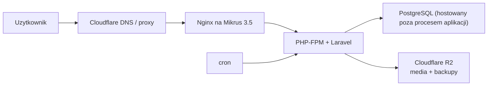

# Infrastruktura MVP: Mikrus 3.5 + Cloudflare R2

## 1. Cel dokumentu

Ten dokument definiuje aktualny, budzetowy target produkcyjny projektu.

Zakladamy:

- jedna maszyna `Mikrus 3.5`,
- bardzo niski koszt roczny,
- brak Dockera w produkcji,
- brak osobnych runtime'ow dla kazdej uslugi,
- media i backupy poza serwerem,
- mozliwosc pozniejszej migracji na mocniejszy VPS bez przebudowy aplikacji.

To jest dokument kanoniczny dla pierwszego wdrozenia produkcyjnego po wyborze `Mikrus 3.5`.

## 2. Decyzja architektoniczna

Aktualna decyzja MVP:

- aplikacja dziala na jednej instancji `Mikrus 3.5`,
- reverse proxy i runtime aplikacji sa uruchomione natywnie na systemie,
- baza danych nie jest uruchamiana jako osobny lokalny proces, tylko korzysta z `PostgreSQL` udostepnionego przez platforme,
- multimedia pytan i backupy trafiaja do `Cloudflare R2`,
- cache aplikacji dziala przez lokalny `Redis`,
- scheduler dziala przez systemowy `cron`,
- kolejki asynchroniczne nie sa uruchamiane jako osobny worker; na tym etapie zostajemy przy `QUEUE_CONNECTION=sync`,
- produkcja nie utrzymuje stalego procesu `Node.js`; frontend jest build-time only.

## 3. Dlaczego ten setup ma sens na Mikrus 3.5

`Mikrus 3.5` daje:

- `4 GB RAM`,
- `40 GB` dysku,
- pelny root access,
- bardzo niski koszt roczny,
- ale nadal jest to mala maszyna, wiec trzeba chronic RAM, dysk i liczbe stale uruchomionych procesow.

Najwieksze ryzyka dla tej maszyny to:

- lokalna baza danych zabierajaca stale RAM,
- osobny serwer mediow,
- osobny loop scheduler,
- osobny worker queue,
- media i backupy zapychajace `40 GB` dysku,
- runtime `Node/Vite`,
- zbyt wierne przeniesienie lokalnego `docker-compose` 1:1 do produkcji.

## 4. Finalna topologia MVP

## 5. Co zostaje, a co wycinamy wzgledem lokalnego Dockera

### 5.1. Zostaje

- `Laravel 12`
- `Inertia + Vue + TypeScript`
- `Filament`
- `Pest`
- `Cloudflare R2` jako storage dla mediow i backupow
- `cron` jako scheduler

### 5.2. Wycinamy lub upraszczamy

Nie przenosimy do produkcji 1:1 tego, co lokalnie jest wygodne tylko developersko:

1. Osobnego kontenera `app`
2. Osobnego kontenera `scheduler`
3. Osobnego kontenera `web`
4. Osobnego kontenera `media`
5. Lokalne `sqlite` jako baze produkcyjna
6. Stalego runtime `npm run dev` / `vite`
7. Osobnego queue workera
8. Lokalnych backupow trzymanych na tym samym serwerze jako glowna strategia bezpieczeństwa

## 6. Docelowy minimalny stack na serwerze

- `Debian 12`
- `Nginx`
- `PHP 8.3 + PHP-FPM`
- `Composer`
- `cron`
- `Node.js` tylko do build-time, jesli build robimy na serwerze
- aplikacja Laravel w jednym katalogu deployowym

Od pierwszego deployu dokladamy:

- `Redis` jako lokalny cache

## 7. Profil produkcyjny aplikacji dla Mikrus 3.5

### 7.1. Baza danych

Docelowo na tej maszynie nie odpalamy osobnego lokalnego PostgreSQL.

Powod:

- oszczedzamy RAM,
- upraszczamy maintenance,
- lepiej miescimy sie w `4 GB`,
- nie walczymy o I/O miedzy baza, logami, backupami i mediami.

W aplikacji ustawiamy:

- `DB_CONNECTION=pgsql`
- host i dane dostepowe do wspoldzielonej bazy `PostgreSQL`

### 7.2. Sesje

Od pierwszego deployu spinamy sesje przez lokalny Redis:

- `SESSION_DRIVER=redis`
- `SESSION_CONNECTION=default`

Powod:

- nie chcemy wracac do drugiej migracji runtime po starcie projektu,
- mamy spojny model `PostgreSQL + Redis`,
- jeden node nadal pozostaje prosty, ale sesje nie wisza juz na lokalnym filesystemie.

### 7.3. Cache

Profil startowy:

- `CACHE_STORE=redis`

Powod:

- chcemy od razu wejsc w docelowy model pod `Trenera pamieci`, analityke i ciezsze payloady,
- nie wracac do osobnej migracji cache po pierwszych wdrozeniach,
- odciazyc PHP i baze juz na etapie MVP.

### 7.4. Queue

Na MVP zostajemy przy:

- `QUEUE_CONNECTION=sync`

Powod:

- brak osobnego workera,
- mniej procesow stalych,
- prostszy deploy,
- dzisiejszy workload aplikacji nie wymaga jeszcze stalego background process.

### 7.5. Media

Na `Mikrus 3.5` nie chcemy trzymac wszystkich mediow pytan lokalnie.

Docelowa konfiguracja:

- `MEDIA_DISK=r2`
- `MEDIA_PUBLIC_DISK=r2`
- `MEDIA_UPLOAD_DISK=r2`
- `MEDIA_PUBLIC_BASE_URL` wskazuje na publiczny/custom domain dla bucketu

To chroni:

- dysk `40 GB`,
- lokalny I/O,
- transfer przez PHP.

### 7.6. Backupy

Backupy nie powinny byc glownie trzymane tylko na tej samej maszynie.

Docelowa konfiguracja:

- `BACKUP_DISK=r2`

Lokalny backup mozna traktowac co najwyzej jako awaryjny lub przejsciowy.

## 8. Lean deploy policy

### 8.1. Czego nie robimy

- nie odpalamy `docker compose` w produkcji,
- nie utrzymujemy osobnego procesu scheduler loop,
- nie utrzymujemy osobnego `media` hosta na tym samym serwerze,
- nie budujemy frontu w trybie dev,
- nie uruchamiamy test suite na kazdym requestcie deployowym,
- nie trzymamy importowych wsadow mediow na stale na tej maszynie.

### 8.2. Co robimy

- deployujemy jedna aplikacje Laravel,
- scheduler uruchamia `cron`,
- Nginx serwuje `public/`,
- PHP-FPM obsluguje requesty,
- assety Vite sa buildowane przed lub w trakcie deployu,
- po deployu odswiezamy cache aplikacji.

## 9. Kolejnosc wdrozenia na Mikrus 3.5

### Faza 1. Przygotowanie repo

- dodac profil `.env` pod Mikrus,
- dodac sample config dla `nginx`,
- dodac sample `cron`,
- dodac skrypt deployowy,
- ustawic dokumentacje jako kanoniczna dla tego targetu.

### Faza 2. Przygotowanie storage

- skonfigurowac `Cloudflare R2`,
- ustawic `MEDIA_*` i `BACKUP_*`,
- potwierdzic, ze publiczne media ida poza serwer.

### Faza 3. Pierwszy deploy

- wrzucic kod aplikacji,
- wykonac `composer install --no-dev`,
- uruchomic migracje,
- zbudowac lub dostarczyc assety,
- ustawic `cron`,
- sprawdzic health-check i smoke test.

### Faza 4. Twardnienie

- wlaczyc HTTPS przez Cloudflare,
- ustawic rotacje logow,
- dodac monitoring prostych awarii,
- pilnowac zuzycia RAM przez lokalny `Redis`.

## 10. Kiedy Mikrus 3.5 przestaje byc wygodny

Ten target przestaje byc komfortowy, gdy:

- stale rosnacy ruch wymaga wiecej jednoczesnych procesow PHP,
- analytics i trener pamieci zaczynaja potrzebowac stalego cache lub workerow,
- liczba mediow i backupow wymaga bardziej rozbudowanej infrastruktury,
- potrzebujemy wiecej niz jednej maszyny,
- rosnace workloady background zaczynaja zjadac czas odpowiedzi weba.

Wtedy nastepny naturalny krok to:

- mocniejszy VPS albo klasyczny cloud,
- lokalny `Redis`,
- ewentualnie osobny host dla bazy lub cache.

## 11. Definition of Done dla przygotowania repo pod Mikrus

Repo jest gotowe do pierwszego deployu na `Mikrus 3.5`, gdy:

1. mamy osobny profil `.env` pod ten target,
2. mamy sample config dla `nginx`,
3. mamy sample `cron` dla scheduler,
4. media i backupy sa ustawione poza serwerem,
5. dokumentacja nie przeczy juz staremu targetowi `Hetzner VPS`,
6. deploy nie wymaga Dockera do uruchomienia produkcji.
