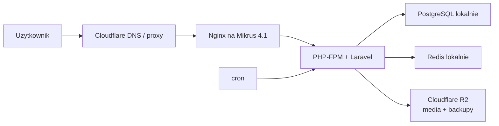

# Plan wdrozenia MVP: Mikrus 4.1 PRO + lokalny PostgreSQL + Cloudflare R2

## 1. Cel dokumentu

Ten dokument opisuje praktyczny plan pierwszego wdrozenia produkcyjnego projektu na `Mikrus 4.1 PRO`.

Aktualna docelowa domena projektu po decyzji klienta: `prawkonaraz.pl`.

Uwaga operacyjna: `prawkobit.pl` bylo blednym tropem domenowym, a
`prawkoapp.pl` bylo poprzednia domena robocza. Docelowo nie uzywamy ich w DNS,
Nginx, `APP_URL`, mailach ani OAuth.

Docelowy adres produkcji: `https://prawkonaraz.pl`.
Aktualny adres produkcji: `https://prawkonaraz.pl`.
Adres tymczasowy z pierwszego wdrozenia: `https://wild-bison5536.byst.re`.

Docelowy login administratora aplikacji po przepieciu domeny:
`admin@prawkonaraz.pl`.
Poprzedni login roboczy przed przepieciem: `admin@prawkoapp.pl`.
Hasla administratora nie zapisujemy w dokumentacji.

Status DNS dla `prawkonaraz.pl` z 2026-05-25:

- domena jest podpieta w Cloudflare jako `DNS Setup: Full`,
- rekord `AAAA @ -> 2a01:4f9:3a:3f89::153` jest `Proxied`,
- rekord `CNAME www -> prawkonaraz.pl` jest `Proxied`,
- parkingowe rekordy `A -> 213.186.33.5` zostaly usuniete,
- Nginx na VPS odpowiada lokalnie dla `Host: prawkonaraz.pl` jako `200 OK`,
- Nginx na VPS odpowiada lokalnie dla `Host: www.prawkonaraz.pl` jako `301`
  do `https://prawkonaraz.pl`,
- produkcyjny `APP_URL` zostal ustawiony na `https://prawkonaraz.pl`,
- produkcyjny `SESSION_DOMAIN` zostal ustawiony na `.prawkonaraz.pl`,
- produkcyjne `MAIL_FROM_ADDRESS` zostalo ustawione na
  `kontakt@prawkonaraz.pl`,
- produkcyjne `MAIL_FROM_NAME` zostalo ustawione na `prawkonaraz.pl`,
- produkcyjne `CONTENT_CONTACT_EMAIL` zostalo ustawione na
  `kontakt@prawkonaraz.pl`,
- `prawkonaraz.pl` zostala uwierzytelniona w Brevo: publiczne DNS pokazuje
  Brevo code, DKIM 1, DKIM 2 i DMARC,
- produkcyjny Laravel wyslal mail testowy przez Brevo na
  `tomaszkulewicz@gmail.com` z tematem `Test SMTP prawkonaraz.pl -> Gmail`,
- Cloudflare SSL/TLS ustawiono na `Flexible`,
- `Always Use HTTPS` jest wlaczone,
- publiczny test `https://prawkonaraz.pl` zwraca `200 OK`,
- `https://www.prawkonaraz.pl` zwraca `301` do `https://prawkonaraz.pl/`,
- `http://prawkonaraz.pl` zwraca `301` do `https://prawkonaraz.pl/`,
- `https://prawkonaraz.pl/api/v1/health` zwraca `status: ok`,
- publiczny HTML ma canonical, assety, formularze i stopke na
  `prawkonaraz.pl`.

Plan przepiecia `prawkonaraz.pl`:

1. Wrocic do OAuth i utworzyc redirect URI dla Google/Facebook
   na `https://prawkonaraz.pl/auth/.../callback`.
2. Docelowo przejsc z Cloudflare `Flexible` na `Full (strict)` po
   skonfigurowaniu certyfikatu origin i portu 443 na Nginx.

Status historyczny dla `prawkoapp.pl` z 2026-05-25:

- nameservery w OVH zostaly przestawione na Cloudflare: `morgan.ns.cloudflare.com` i `pat.ns.cloudflare.com`,
- w Cloudflare usunieto/importowane rekordy OVH dla `@` i `www`, ktore wskazywaly na parking/przekierowania OVH,
- publiczny IPv6 VPS-a Mikrus: `2a01:4f9:3a:3f89::153`,
- rekord `@` ustawiono jako `AAAA`, proxied/orange cloud,
- rekord `www` ustawiono jako `CNAME` do `prawkoapp.pl`, proxied/orange cloud,
- tryb SSL/TLS w Cloudflare: `Flexible`,
- `Always Use HTTPS` w Cloudflare zostalo wlaczone,
- `APP_URL` zostal przelaczony na `https://prawkoapp.pl`,
- `http://prawkoapp.pl` przekierowuje `301` na HTTPS,
- `www.prawkoapp.pl` przekierowuje `301` na kanoniczny adres `https://prawkoapp.pl`,
- `https://prawkoapp.pl`, `api/v1/health`, `ops:health-report` i `ops:smoke-test` przechodza poprawnie.

Status produkcji z 2026-05-25:

- aplikacja dziala na VPS `henryk153` w katalogu `/var/www/prawkobit/current`,
- Nginx + PHP-FPM + PostgreSQL + Redis sa uruchomione na jednej maszynie,
- produkcyjna baza zawiera `19` uzytkownikow, `12` kategorii i `17044` pytania,
- docelowy admin aplikacji po przepieciu domeny: `admin@prawkonaraz.pl`,
- aktualny `APP_URL`: `https://prawkonaraz.pl`,
- aktualny `SESSION_DOMAIN`: `.prawkonaraz.pl`,
- media sa jeszcze serwowane z lokalnego `storage-bulk` na VPS jako etap pomostowy,
- R2 dla mediow i backupow zostaje nastepnym krokiem po domknieciu domeny.

Zakladamy:

- jedna maszyna `Mikrus 4.1 PRO`,
- lokalny `PostgreSQL` na tym samym VPS,
- lokalny `Redis` dla cache i sesji,
- `Cloudflare R2` dla obrazow, wideo i backupow,
- `Nginx + PHP-FPM` bez Dockera w produkcji,
- `cron` dla Laravel scheduler,
- brak stalego procesu `Node.js` po deployu.

To jest rekomendowany wariant, jesli budzet pozwala wejsc wyzej niz `Mikrus 3.5`.

## 2. Dlaczego 4.1 zamiast 3.5

`Mikrus 4.1 PRO` ma wedlug oferty Mikrusa:

- `8 GB RAM`,
- `80 GB` dysku,
- `2x CPU + 2x IOPS`,
- lokalizacje `Finlandia`,
- roczna oplate `395 zl`.

Zrodlo parametrow: https://mikr.us/ oraz https://mikr.us/product/mikrus-4-1/#proddesc

Dla tego projektu to zmienia decyzje o bazie danych:

- na `Mikrus 3.5` lepiej uzywac PostgreSQL poza VPS, bo `4 GB RAM` i `40 GB` dysku sa ciasniejsze,
- na `Mikrus 4.1` mozemy uruchomic lokalny PostgreSQL bez natychmiastowego stresu o RAM i I/O,
- nadal nie trzymamy mediow pytan lokalnie, bo obrazy i wideo sa naturalnym kandydatem do R2/CDN.

## 3. Finalna topologia MVP



## 4. Co uruchamiamy na Mikrusie

Na VPS instalujemy i utrzymujemy:

- `Nginx`,
- `PHP 8.3 FPM`,
- `Composer`,
- `PostgreSQL`,
- `Redis`,
- `cron`,
- `git`,
- `ffmpeg`,
- `Node.js` tylko do build-time, jesli build robimy na serwerze.

Nie uruchamiamy w produkcji:

- `docker compose`,
- kontenera `vite`,
- osobnego kontenera `media`,
- osobnego loop schedulera,
- osobnego queue workera na starcie,
- lokalnego magazynu mediow jako glownej strategii.

## 5. Produkcyjny profil `.env`

Najwazniejsze wartosci:

```env
APP_ENV=production
APP_DEBUG=false
APP_URL=https://prawkonaraz.pl
APP_TIMEZONE=Europe/Warsaw

DB_CONNECTION=pgsql
DB_HOST=127.0.0.1
DB_PORT=5432
DB_DATABASE=prawkobit
DB_USERNAME=prawkobit
DB_PASSWORD=dlugie-losowe-haslo
DB_SSLMODE=prefer

SESSION_DRIVER=redis
SESSION_CONNECTION=default
CACHE_STORE=redis
REDIS_CLIENT=phpredis
REDIS_HOST=127.0.0.1
REDIS_PORT=6379

QUEUE_CONNECTION=sync

MEDIA_DISK=r2
MEDIA_PUBLIC_DISK=r2
MEDIA_UPLOAD_DISK=r2
MEDIA_PUBLIC_BASE_URL=https://media.prawkonaraz.pl

BACKUP_DISK=r2
R2_ACCESS_KEY_ID=...
R2_SECRET_ACCESS_KEY=...
R2_REGION=auto
R2_BUCKET=...
R2_ENDPOINT=https://ACCOUNT_ID.r2.cloudflarestorage.com
R2_URL=https://media.prawkonaraz.pl
R2_USE_PATH_STYLE_ENDPOINT=true
```

Uwaga historyczna: przed pierwszym przepieciem DNS/HTTPS VPS dzialal pod
`https://wild-bison5536.byst.re`, potem pod `https://prawkoapp.pl`. Po decyzji
klienta docelowy `APP_URL` ma zostac ustawiony na `https://prawkonaraz.pl`,
ale dopiero po Cloudflare/DNS i autoryzacji maili.

## 6. Kolejnosc wdrozenia

### Faza 0. Decyzje przed zakupem

1. Kup `Mikrus 4.1 PRO`.
2. Podepnij domeny przez Cloudflare:
   - `prawkonaraz.pl`,
   - `www.prawkonaraz.pl` jako redirect 301 do `prawkonaraz.pl`,
   - osobno `media.prawkonaraz.pl` pod R2.
3. Utworz bucket Cloudflare R2 na media i backupy.
4. Zapisz dane R2:
   - account id,
   - access key,
   - secret,
   - bucket,
   - endpoint,
   - public/custom URL.

### Faza 1. Przygotowanie serwera

Po otrzymaniu danych SSH zaloguj sie:

```bash
ssh root@ADRES_SERWERA -p PORT_SSH
```

Zaktualizuj system:

```bash
apt update
apt upgrade -y
```

Zainstaluj podstawy:

```bash
apt install -y nginx redis-server postgresql postgresql-contrib postgresql-client git unzip curl ffmpeg cron
```

Zainstaluj PHP 8.3 i rozszerzenia wymagane przez projekt:

```bash
apt install -y php8.3-fpm php8.3-cli php8.3-pgsql php8.3-redis php8.3-bcmath php8.3-gd php8.3-intl php8.3-zip php8.3-mbstring php8.3-xml php8.3-curl
```

Jesli `php8.3-*` nie jest dostepne w bazowym repo systemu, trzeba najpierw dodac zaufane repozytorium PHP dla danej dystrybucji albo wybrac obraz systemu, ktory ma PHP 8.3.

### Faza 2. Przygotowanie PostgreSQL

Utworz uzytkownika i baze:

```bash
sudo -u postgres psql
```

W konsoli PostgreSQL:

```sql
CREATE USER prawkobit WITH PASSWORD 'dlugie-losowe-haslo';
CREATE DATABASE prawkobit OWNER prawkobit;
\q
```

Sprawdz polaczenie:

```bash
psql -h 127.0.0.1 -U prawkobit -d prawkobit
```

### Faza 3. Przygotowanie katalogu aplikacji

```bash
mkdir -p /var/www/prawkobit/current
chown -R www-data:www-data /var/www/prawkobit
cd /var/www/prawkobit/current
```

Najprosciej wdrazac przez `git`:

```bash
git clone ADRES_REPOZYTORIUM .
```

Po stronie lokalnej trzeba wczesniej wypchnac aktualny `main`:

```bash
git push origin main
```

### Faza 4. Instalacja zaleznosci aplikacji

W katalogu aplikacji:

```bash
composer install --no-dev --prefer-dist --optimize-autoloader --no-interaction
```

Jesli frontend budujemy na serwerze:

```bash
npm ci
npm run build
```

Po buildzie musi istniec:

```text
public/build/manifest.json
```

Alternatywnie mozna budowac lokalnie i dostarczac gotowy `public/build`.

### Faza 5. Konfiguracja `.env`

```bash
cp .env.mikrus.example .env
php artisan key:generate
nano .env
```

Ustaw:

- `APP_URL`,
- dane `DB_*`,
- dane `R2_*`,
- `MEDIA_*`,
- `BACKUP_DISK=r2`,
- `SESSION_DRIVER=redis`,
- `CACHE_STORE=redis`,
- `APP_DEBUG=false`.

Na produkcji plik `.env` nie trafia do repo i nie powinien byc publicznie czytelny.

### Faza 6. Migracje i cache Laravel

```bash
php artisan migrate --force
php artisan storage:link
php artisan optimize:clear
php artisan config:cache
php artisan view:cache
```

Jesli importujesz istniejaca baze danych, najpierw wykonaj restore dumpa PostgreSQL, a dopiero potem uruchom migracje.

### Faza 6.1. Statyczne sitemap SEO

Po migracjach, cache konfiguracji i upewnieniu sie, ze `APP_URL=https://prawkonaraz.pl`, wygeneruj statyczne sitemap:

```bash
php artisan seo:refresh-sitemaps
```

Te pliki trafiaja do:

- `public/sitemap.xml`,
- `public/sitemaps/*.xml`.

`seo:refresh-sitemaps` najpierw generuje pliki, a potem uruchamia audyt. Nizsze komendy nadal sa dostepne do diagnostyki:

```bash
php artisan seo:generate-sitemaps
php artisan seo:audit-sitemaps
```

Nie commitujemy wygenerowanych XML-i do repo. Sa artefaktem produkcyjnym generowanym po deployu na aktualnej bazie danych. Jesli `seo:audit-sitemaps` zglasza `http://localhost:8000`, oznacza to zle `APP_URL` albo nieodswiezony cache konfiguracji.

Na produkcji Laravel scheduler codziennie odswieza i audytuje sitemap przez:

```bash
php artisan seo:refresh-sitemaps
```

Domyslnie dzieje sie to o `03:30`; godzine mozna zmienic przez `SEO_SITEMAP_REFRESH_AT`. Importy katalogu pytan i manifestow po udanym zapisie rowniez uruchamiaja `seo:refresh-sitemaps`, z pominieciem trybu `--dry-run` i importow zakonczonych bledami.

### Faza 7. Nginx

Uzyj gotowego pliku:

```bash
cp deploy/mikrus/nginx/prawkobit.conf.example /etc/nginx/sites-available/prawkobit
nano /etc/nginx/sites-available/prawkobit
```

Zmien nazwy domen. W konfiguracji produkcyjnej `www` przekierowujemy na domene bez `www`:

```nginx
server {
    listen 80;
    listen [::]:80;
    server_name www.twoja-domena.pl;

    return 301 https://twoja-domena.pl$request_uri;
}

server {
    listen 80;
    listen [::]:80;
    server_name twoja-domena.pl;

    root /var/www/prawkobit/current/public;
}
```

Aktywuj konfiguracje:

```bash
ln -s /etc/nginx/sites-available/prawkobit /etc/nginx/sites-enabled/prawkobit
nginx -t
systemctl reload nginx
```

### Faza 8. Cron

Laravel scheduler:

```bash
crontab -e
```

Dodaj:

```cron
* * * * * cd /var/www/prawkobit/current && php artisan schedule:run >> /var/log/prawkobit-scheduler.log 2>&1
```

### Faza 9. Cloudflare i HTTPS

1. W Cloudflare ustaw rekordy DNS na IP Mikrusa.
2. Dla Mikrusa z wlasna domena uzyj IPv6:

   ```text
   Type: AAAA
   Name: @
   IPv6: 2a01:4f9:3a:3f89::153
   Proxy status: Proxied / orange cloud
   ```

3. Dodaj `www` jako `CNAME` do `prawkonaraz.pl`, tez z orange cloud. W Nginx `www` przekierowuje `301` na kanoniczne `https://prawkonaraz.pl`.
4. Usun rekordy `A` importowane z OVH dla `@`/`www`, szczegolnie jesli wskazuja na `213.186.33.5` albo parking OVH.
5. W Cloudflare ustaw `SSL/TLS` -> `Overview` -> `Flexible`.
6. Wlacz `Always Use HTTPS`.
7. Po udanym tescie `https://prawkonaraz.pl` zmien produkcyjny `APP_URL` na `https://prawkonaraz.pl` i `SESSION_DOMAIN` na `.prawkonaraz.pl`.
8. Docelowo mozna przejsc na `Full`/`Full (strict)`, ale dopiero po skonfigurowaniu HTTPS/certyfikatu origin na serwerze.

### Faza 10. Pierwszy smoke test

Po deployu:

```bash
php artisan ops:health-report
php artisan seo:audit-sitemaps
php artisan ops:seed-smoke-data
php artisan ops:smoke-test --require-media
php artisan ops:backup-db --label=first-production
php artisan ops:assert-backup-fresh
```

Jesli smoke test z `--require-media` nie przejdzie, najpierw sprawdz R2 i `MEDIA_PUBLIC_BASE_URL`.

## 7. Import danych produkcyjnych

Dane aplikacji trzymamy w PostgreSQL.

Sciezka bezpieczna:

1. Na lokalnym srodowisku wykonaj dump:

   ```bash
   pg_dump -Fc -h localhost -U prawkobit -d prawkobit -f prawkobit.dump
   ```

2. Przeslij dump na serwer:

   ```bash
   scp -P PORT_SSH prawkobit.dump root@ADRES_SERWERA:/root/
   ```

3. Na serwerze przywroc:

   ```bash
   pg_restore --clean --if-exists -h 127.0.0.1 -U prawkobit -d prawkobit /root/prawkobit.dump
   ```

4. Uruchom migracje:

   ```bash
   php artisan migrate --force
   ```

5. Wykonaj backup do R2:

   ```bash
   php artisan ops:backup-db --label=after-initial-import
   ```

## 8. Media

Mediow pytan nie trzymamy docelowo na dysku Mikrusa.

Powody:

- wideo i obrazy szybko zuzyja `80 GB`,
- R2 lepiej nadaje sie do publicznego dostarczania statycznych plikow,
- latwiej zmienic VPS w przyszlosci,
- backup aplikacji nie musi kopiowac calego katalogu mediow.

Docelowo:

- nowe media uploadujemy na `r2`,
- publiczne URL-e ida przez `MEDIA_PUBLIC_BASE_URL`,
- lokalny dysk Mikrusa sluzy na kod, cache, logi, tymczasowe pliki i PostgreSQL.

Stan aktualny po pierwszym wdrozeniu:

- media zostaly skopiowane na VPS i sa wystawione przez `public/storage-bulk`,
- `ops:smoke-test` potwierdza, ze assety publiczne odpowiadaja,
- to jest akceptowalny etap przejsciowy, ale nie stan docelowy,
- przed wiekszym ruchem produkcyjnym media przenosimy do R2 i ustawiamy `MEDIA_PUBLIC_BASE_URL=https://media.prawkonaraz.pl`.

## 9. Backupy

Minimalny standard:

- backup bazy do R2,
- backup po pierwszym imporcie,
- backup przed wiekszym deployem z migracjami,
- scheduler backupow przez Laravel `schedule:run`,
- regularne sprawdzanie `ops:assert-backup-fresh`.

Komendy:

```bash
php artisan ops:backup-db --label=manual-before-deploy
php artisan ops:list-db-backups --limit=10
php artisan ops:assert-backup-fresh
```

Restore awaryjny:

```bash
php artisan ops:restore-db backups/database-manifests/YYYY/MM/manifest.json --force --backup-current
```

Stan aktualny po pierwszym wdrozeniu:

- backup health check jest zielony,
- backup jest jeszcze skonfigurowany lokalnie na VPS,
- po konfiguracji R2 trzeba przelaczyc `BACKUP_DISK=r2`, wykonac reczny backup i przetestowac restore.

## 10. Monitoring startowy

Na MVP wystarczy:

- `php artisan ops:health-report`,
- `php artisan ops:smoke-test`,
- `php artisan ops:perf-smoke --assert`,
- kontrola logow:

```bash
tail -f storage/logs/laravel.log
tail -f /var/log/nginx/error.log
tail -f /var/log/prawkobit-scheduler.log
```

Praktyczny minimum monitoring z zewnatrz:

- ping HTTP do `/api/v1/health`,
- alert, jesli endpoint nie odpowiada,
- alert, jesli backup nie jest swiezy.

## 11. Twardnienie po pierwszym uruchomieniu

Po pierwszym zielonym deployu zabezpieczenia robimy etapami. Najpierw zamykamy najwieksze ryzyka dostepu do VPS, potem porzadkujemy konto deployowe i operacje.

Aktualny status dla VPS `henryk153` po pierwszym wdrozeniu:

- [x] dodano logowanie kluczem SSH z lokalnej maszyny,
- [x] zmieniono startowe haslo `root` otrzymane od Mikrusa,
- [ ] wylaczyc logowanie haslem przez SSH i zostawic tylko klucze,
- [ ] utworzyc osobnego uzytkownika deployowego zamiast codziennej pracy na `root`.

Czy wylaczenie logowania haslem jest krytyczne natychmiast?

- Po zmianie hasla ryzyko jest wyraznie mniejsze, wiec nie blokuje to dalszej pracy developerskiej.
- Nadal jest to wazny krok przed docelowym ruchem produkcyjnym, podpieciem glownej domeny i platnosciami.
- Powod: jesli SSH pozwala na haslo, serwer ma dodatkowa powierzchnie ataku brute-force oraz ryzyko wycieku/ponownego uzycia hasla. Klucze SSH sa odporniejsze i powinny byc docelowym sposobem logowania.

Docelowa checklista po pierwszym zielonym deployu:

1. Wylacz logowanie root haslem i przejdz na klucze SSH.
2. Utworz osobnego uzytkownika deployowego.
3. Ogranicz publiczne porty do HTTP/HTTPS i SSH.
4. Ustaw firewall, jesli Mikrus i system na to pozwalaja.
5. Ustaw `LOG_LEVEL=warning`.
6. Ustaw prawdziwy mailer.
7. Wykonaj test restore backupu na osobnej bazie testowej.
8. Sprawdz zuzycie RAM i dysku po imporcie danych:

   ```bash
   free -h
   df -h
   du -sh /var/lib/postgresql
   ```

## 12. Definition of Done

Wdrozenie na `Mikrus 4.1 PRO` uznajemy za gotowe, gdy:

1. domena kieruje na Nginx,
2. Laravel odpowiada pod `APP_URL`,
3. `php artisan migrate --force` przeszlo,
4. frontend ma `public/build/manifest.json`,
5. Redis dziala dla sesji i cache,
6. PostgreSQL dziala lokalnie i ma backup do R2,
7. media publiczne laduja sie z R2,
8. `ops:health-report` jest zielony albo wyjasnialnie `degraded`,
9. `ops:smoke-test --require-media` przechodzi,
10. `ops:backup-db --label=first-production` tworzy backup w R2,
11. cron odpala scheduler,
12. panel `/admin` dziala dla administratora.

Aktualny status tej checklisty po 2026-05-25:

- punkty 1-5, 8-9, 11-12 sa wykonane,
- punkt 6 jest wykonany dla lokalnego PostgreSQL, ale backup docelowy do R2 jest jeszcze do dopiecia,
- punkt 7 jest wykonany funkcjonalnie przez lokalny `storage-bulk`, ale docelowe R2 dla mediow jest jeszcze do dopiecia,
- przed publicznym ruchem trzeba domknac R2, SMTP oraz twardnienie SSH.

## 13. Kiedy przejsc dalej

`Mikrus 4.1` przestaje byc wygodny, gdy:

- PostgreSQL zaczyna zajmowac duza czesc RAM,
- dysk zbliza sie do `70%`,
- backupy i restore trwaja zbyt dlugo,
- ruch wymaga wiecej procesow PHP-FPM,
- pojawia sie potrzeba stalego queue workera,
- analityka lub trener pamieci zaczynaja wymagac wiecej background work.

Naturalny nastepny krok:

- mocniejszy VPS,
- osobny managed PostgreSQL,
- osobny worker queue,
- ewentualnie CDN/R2 zostaje bez zmian.
