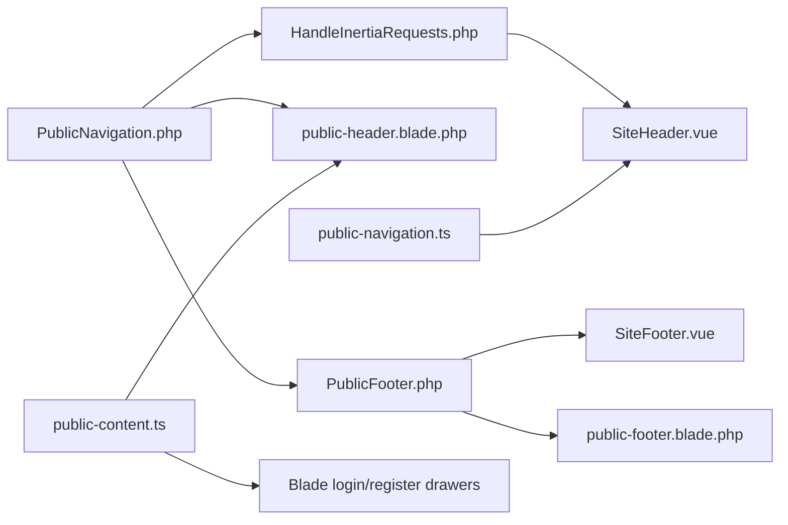
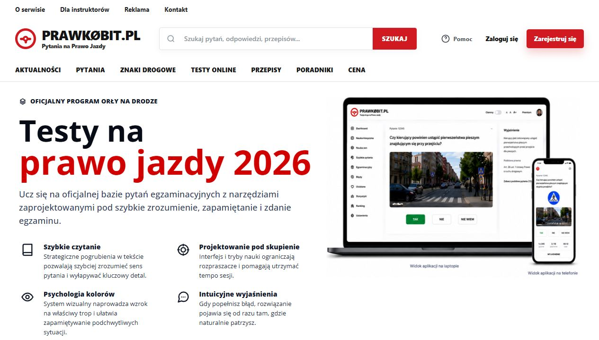
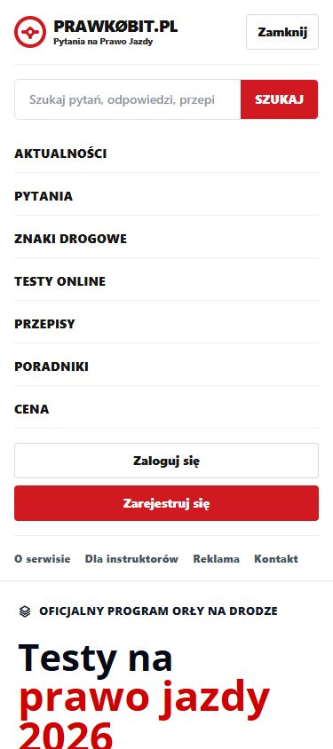
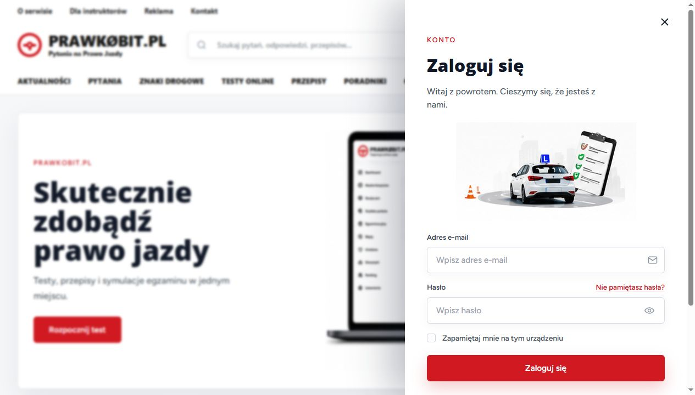
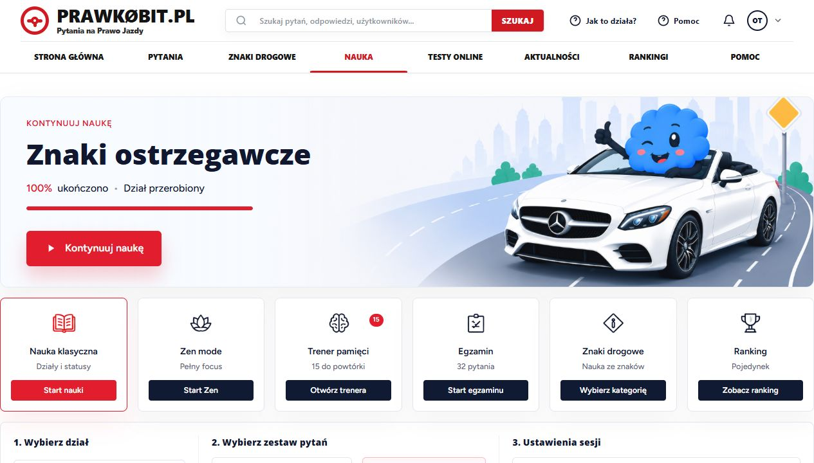
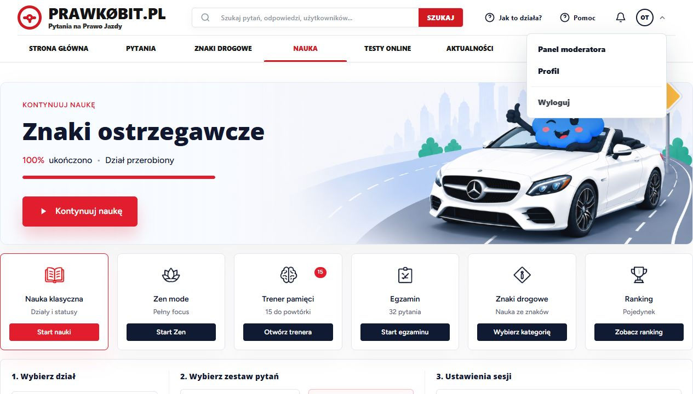
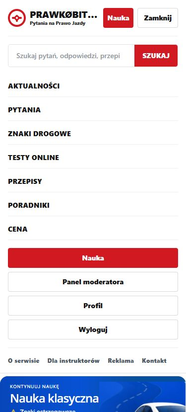
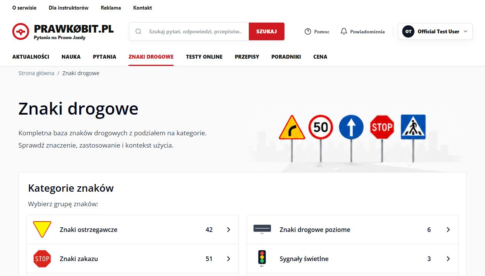

# Menu system reference

Status: stan aktualny z lokalnego projektu, zaktualizowany 2026-06-04.

Ten dokument opisuje publiczne menu `prawkonaraz.pl`: skad bierze dane, jak rozni sie w Vue/Inertia i Blade, jakie ma stany zalogowania, jak dziala mobile, wyszukiwarka, menu konta, drawery logowania/rejestracji oraz footer. Ma sluzyc jako punkt odniesienia przed kazda zmiana w nawigacji.

## 1. Najwazniejsza zasada

Menu ma jedno glowne zrodlo danych na backendzie:

- `app/Support/PublicNavigation.php` buduje linki, akcje konta, footer groups, `learning_href` i `logout_href`.
- `app/Support/PublicFooter.php` buduje dane footera na podstawie `PublicNavigation`.
- `app/Http/Middleware/HandleInertiaRequests.php` przekazuje te dane do Inertia jako `page.props.navigation` i `page.props.footer`.

Sa jednak dwa renderery:

- Vue/Inertia: `resources/js/Components/SiteHeader.vue` i `resources/js/Components/SiteFooter.vue`.
- Blade/SEO: `resources/views/components/site/public-header.blade.php` i `resources/views/components/site/public-footer.blade.php`.

W praktyce oznacza to: zmiana linkow zwykle zaczyna sie w `PublicNavigation`, ale zmiana wygladu albo zachowania menu musi byc sprawdzona w obu rendererach.



## 2. Mapa plikow

| Obszar | Plik | Rola |
| --- | --- | --- |
| Dane menu | `app/Support/PublicNavigation.php` | Kanoniczna lista linkow i akcji zaleznych od auth. |
| Dane footera | `app/Support/PublicFooter.php` | CTA footera, opis marki, grupy linkow. |
| Inertia share | `app/Http/Middleware/HandleInertiaRequests.php` | Udostepnia `navigation`, `footer`, `auth`, `authDrawers`. |
| Typy frontu | `resources/js/types/index.d.ts` | `NavigationLink`, `NavigationData`, `FooterData`. |
| Vue header | `resources/js/Components/SiteHeader.vue` | Desktop/mobile header dla stron Inertia. |
| Vue footer | `resources/js/Components/SiteFooter.vue` | Footer dla stron Inertia. |
| Helper Vue | `resources/js/support/public-navigation.ts` | Wybiera `<a>` vs Inertia `Link`, active state, parsowanie path. |
| Layout auth | `resources/js/Layouts/AuthenticatedLayout.vue` | Podaje `shellWidthClass`, wlacza `learningPanel` na `/nauka`, ukrywa header/footer w wybranych mobile shellach. |
| Layout guest | `resources/js/Layouts/GuestLayout.vue` | Uzywa `SiteHeader` i opcjonalnego `SiteFooter`. |
| Blade layout | `resources/views/layouts/public-content.blade.php` | Publiczne SEO strony, header, footer, drawery i `public-content.ts`. |
| Blade header | `resources/views/components/site/public-header.blade.php` | Blade odpowiednik publicznego menu. |
| Blade JS | `resources/js/public-content.ts` | Mobile menu i przechwytywanie linkow `/login` oraz `/register` na publicznych stronach Blade. |
| Drawery Vue | `resources/js/Components/Auth/LoginDrawer.vue`, `RegisterDrawer.vue` | Logowanie/rejestracja dla stron Inertia. |
| Drawery Blade | `resources/views/components/site/login-drawer.blade.php`, `register-drawer.blade.php` | Logowanie/rejestracja dla stron Blade. |
| Style wspolne | `resources/css/app.css` | Logo, footer, animacja drawerow, focus inputow auth. |

## 3. Kontrakt danych

`NavigationLink`:

| Pole | Znaczenie |
| --- | --- |
| `label` | Tekst widoczny w menu. |
| `href` | Docelowy URL, zwykle lokalny path. |
| `match` | Lista prefixow do active state. |
| `variant` | Opcjonalnie `text` albo `primary`; uzywane glownie w akcjach headera. |

`NavigationData`:

| Pole | Znaczenie |
| --- | --- |
| `utility` | Gorny pasek informacyjny desktop i dolny zestaw linkow w mobile. |
| `primary` | Glowne linki nawigacyjne. |
| `header_actions` | Akcje zalezne od auth: logowanie/rejestracja albo admin/moderator/profil. |
| `footer_groups` | Grupy linkow footera. |
| `learning_href` | `/login` dla goscia, `/nauka` dla zalogowanego. |
| `logout_href` | `null` dla goscia, `/logout` dla zalogowanego. |

## 4. Linki glowne

### Desktop canonical

| Label | Href | Active match | Route |
| --- | --- | --- | --- |
| Strona glowna | `/` | `/` | `home` |
| Aktualnosci | `/aktualnosci` | `/aktualnosci` | `public.news` |
| Nauka | `learning_href` | `/nauka`, `/study-sessions`, `/trener-pamieci` | `/login` dla goscia, `/nauka` dla zalogowanego |
| Pytania | `/oficjalna-baza-pytan-na-prawo-jazdy` | `/oficjalna-baza-pytan-na-prawo-jazdy`, `/pytanie` | `public.questions.hub` |
| Znaki drogowe | `/znaki-drogowe` | `/znaki-drogowe` | `traffic-signs.index` |
| Przepisy | `/przepisy` | `/przepisy` | `public.regulations` |
| Testy online | `/testy-na-prawo-jazdy` | `/testy-na-prawo-jazdy` | `public.tests` |
| Rankingi | `/nauka/ranking` | `/nauka/ranking` | `session.ranking` |

Desktopowe primary menu jest celowo takie samo w Vue i Blade. To jest uklad przejety z dawnego wariantu `/nauka` i stosowany globalnie.

### Mobile i footer

Backendowe `navigation.primary` nadal zawiera standardowy zestaw publicznych linkow (`Aktualnosci`, opcjonalnie `Nauka`, `Pytania`, `Znaki drogowe`, `Testy online`, `Przepisy`, `Poradniki`, `Cena`). Ten zestaw pozostaje uzywany w mobile menu i footerze, zeby nie przebudowywac tych powierzchni przy desktopowym ujednoliceniu.

### Dostep do nauki

`Nauka` jest widoczna dla zalogowanego uzytkownika takze wtedy, gdy nie ma jeszcze aktywnego planu. To jest swiadome CTA: klikniecie prowadzi na `/nauka`, a backend sprawdza dostep i w razie braku planu przekierowuje na `/aktywuj-dostep`. Widocznosc linku nie jest zabezpieczeniem dostepu; zabezpieczeniem pozostaje `ProductAccessResolver`, `PjmFreeAccessResolver` oraz middleware/kontrolery prywatnych tras nauki.

`Rankingi` prowadza do prywatnej trasy. Dla goscia lub uzytkownika bez dostepu backend zachowuje istniejace przekierowania.

## 5. Linki utility

Utility linki sa nadal budowane wspolnie dla Vue i Blade, ale po ujednoliceniu desktopu nie sa renderowane jako osobny gorny pasek. Pozostaja dostepne przede wszystkim w mobile menu oraz footerze:

| Label | Href | Active match |
| --- | --- | --- |
| O serwisie | `/o-serwisie` | `/o-serwisie`, `/autorzy` |
| Dla instruktorow | `/szkolenia-z-instruktorem` | `/szkolenia-z-instruktorem` |
| Reklama | `/reklama` | `/reklama` |
| Kontakt | `/kontakt` | `/kontakt` |

Na mobile te linki sa na dole rozwijanego panelu menu. Na desktopie ich dawna funkcje przejely linki `Strona glowna`, `Pomoc` oraz footer.

## 6. Akcje headera i auth

### Guest

`header_actions`:

| Label | Href | Variant | Zachowanie Vue | Zachowanie Blade |
| --- | --- | --- | --- | --- |
| Zaloguj sie | `/login` | `text` | Button otwiera `LoginDrawer`. | Link jest przechwycony przez `public-content.ts` i otwiera Blade drawer. |
| Zarejestruj sie | `/register` | `primary` | Button otwiera `RegisterDrawer`. | Link jest przechwycony przez `public-content.ts` i otwiera Blade drawer. |

Wejscie bezposrednio na `/login` lub `/register` renderuje osobne strony Inertia z drawerem otwartym nad przyciemnionym tlem.

### Authenticated

`header_actions` sa filtrowane wedlug roli:

| Warunek | Label | Href | Active match |
| --- | --- | --- | --- |
| `user->is_admin` | Admin | `/admin` | `/admin` |
| `user->isModerator()` | Panel moderatora | `/moderator/konta` | `/moderator` |
| kazdy zalogowany | Profil | `/profile` | `/profile` |

`logout_href` = `/logout` i jest renderowany jako formularz `POST` z CSRF. `GET /logout` nie istnieje jako fallback, wiec stare linki GET dostaja `405 Method Not Allowed` i nie wylogowuja uzytkownika.

## 7. Desktop header

Standardowy desktop wlacza sie od breakpointu `lg` (`1024px`).

Warstwy:

1. Kompaktowy glowny rzad: logo, wyszukiwarka, `Jak to dziala?`, `Pomoc`, auth/account.
2. Primary nav w siatce 8 pozycji z czerwonym active underline.

Wspolne cechy wizualne:

- header jest `sticky top-0`, bialy, z cienkim borderem `#e6e8ec`,
- font systemowy,
- kolor akcentu: `#d01921`,
- logo sklada sie z czerwonego okraglego znaku i tekstu `prawkonaraz.pl` z tagline `Pytania na Prawo Jazdy`,
- glowny rzad ma wysokosc ok. `64px`,
- primary nav uzywa `grid-cols-8`,
- kontener desktopowy ma docelowo `max-w-[90rem]`,
- link aktywny ma czerwony tekst i czerwony pasek `3px` przy dolnej krawedzi.

Wyszukiwarka:

- `method="GET"`,
- `action="/oficjalna-baza-pytan-na-prawo-jazdy"`,
- input `name="question"`,
- przycisk `SZUKAJ`.

Pomoc:

- zawsze linkuje do `/kontakt`,
- obok pojawia sie dodatkowe `Jak to dziala?` do `/o-serwisie`.

Powiadomienia:

- widoczne tylko dla zalogowanego,
- linkuja do `/profile`,
- `notificationCount` jest obecnie hardcoded `0`, wiec badge sie nie pokazuje.

## 8. Menu konta

Desktopowe menu konta jest widoczne tylko dla zalogowanego.

Trigger:

- inicjaly uzytkownika z pierwszych dwoch czlonow imienia,
- fallback `U`,
- chevron obraca sie po otwarciu,
- trigger pokazuje inicjaly i chevron bez nazwy uzytkownika.

Panel Vue:

- zawiera link `Nauka` nad `header_actions`,
- pozycje z `navigation.header_actions`,
- potem formularz `Wyloguj`,
- zamyka sie po kliknieciu linku lub zmianie sciezki.

Panel Blade:

- zawiera link `Nauka` nad `header_actions`,
- potem pozycje `header_actions`,
- potem formularz `Wyloguj`.

Dropdown konta jest celowo ujednolicony: w Vue i Blade pierwsza pozycja dla zalogowanego uzytkownika prowadzi do `Nauka`.

## 9. Mobile header

Mobile wlacza sie ponizej `lg`.

Widok zamkniety:

- logo po lewej,
- dla zalogowanego szybki czerwony przycisk `Nauka`,
- przycisk `Menu` / `Zamknij` po prawej.

Panel po otwarciu:

1. Wyszukiwarka `GET /oficjalna-baza-pytan-na-prawo-jazdy?question=...`.
2. Linki primary bez linku, ktory jest juz szybkim `mobileTopAction`.
3. Panel akcji:
   - zalogowany: czerwone `Nauka`, role actions, `Profil`, `Wyloguj`;
   - guest: `Zaloguj sie`, `Zarejestruj sie`.
4. Linki utility w sekcji `Informacje`.

Panel ma `max-h-[calc(100svh-72px)]` i `overflow-y-auto`, wiec przy dlugiej liscie nie powinien wychodzic poza ekran.

## 10. Footer

Footer ma wspolne dane z `PublicFooter` i renderery Vue/Blade.

CTA:

| Label | Href |
| --- | --- |
| Rozpocznij nauke | `navigation.learning_href` |
| Przejdz do bazy pytan | `/oficjalna-baza-pytan-na-prawo-jazdy` |

Grupy:

| Grupa | Linki guest/auth |
| --- | --- |
| Nauka | Rozpocznij nauke, Baza pytan, Kurs, Wyklady |
| Serwis | Znaki drogowe, Statystyki, Najtrudniejsze pytania, Cennik |
| Informacje | O serwisie, Kontakt, Metodologia |
| Konto | Guest: Logowanie, Rejestracja, Testy. Auth: Profil, ewentualnie Admin, ewentualnie Panel moderatora, Nauka. |

Footer jest ukrywany na mobile dla niektorych prywatnych shelli przez `AuthenticatedLayout`: review queue, `/nauka` i ranking maja wrapper `hidden md:block`.

Guest auth w footerze:

- Vue nie renderuje juz `learning_href=/login`, `Logowanie` ani `Rejestracja` jako zwyklych linkow.
- Te pozycje sa przyciskami i wysylaja event `prawko:open-auth-drawer`, ktory obsluguje `SiteHeader.vue`.
- Dzieki temu klik w stopce nie przenosi na bezposrednie `/login` lub `/register` i nie pokazuje osobnej strony auth z przyciemnionym/glassy tlem.
- Blade nadal uzywa zwyklych linkow, ale `public-content.ts` przechwytuje lokalne `/login` i `/register`.

Wyjatek bez headera:

- publiczne demo w `StudySessions/Show.vue` nie korzysta z `SiteHeader.vue`,
- CTA `Zaloz konto i kontynuuj` renderuje lokalny `RegisterDrawer`/`LoginDrawer`,
- dzieki temu rowniez po demo nie ma przejscia na bezposrednie `/register`.

## 11. Link routing: `<a>` vs Inertia `Link`

`resources/js/support/public-navigation.ts` wybiera komponent dla linku:

- jesli path pasuje do `documentNavigationPrefixes`, uzywa zwyklego `<a>`,
- w innym przypadku uzywa Inertia `Link`.

Prefixy dokumentowe obejmuja m.in. `/`, `/admin`, `/aktualnosci`, `/autorzy`, `/cennik`, `/kontakt`, `/oficjalna-baza-pytan-na-prawo-jazdy`, `/pytanie`, `/testy-na-prawo-jazdy`, `/znaki-drogowe`.

Konsekwencja: publiczne/SEO strony zwykle ida pelnym document navigation. Prywatne widoki aplikacyjne, np. `/nauka`, `/profile`, `/trener-pamieci`, ida przez Inertia, o ile nie sa dodane do prefixow dokumentowych.

Przy dodawaniu nowej publicznej strony Blade trzeba dopisac jej prefix do `documentNavigationPrefixes`, jesli link ma wymuszac pelne przejscie dokumentowe.

## 12. Active state

Vue:

- `currentPath` pochodzi z `page.url`,
- helper `matchesPath(currentPath, matchPaths)` robi exact match albo prefix match z `/`.

Blade:

- `currentPath` to `request()->path()`,
- lokalny `$matchesCurrentPath` stosuje te same zasady.

Przyklad: link `Pytania` jest aktywny na hubie `/oficjalna-baza-pytan-na-prawo-jazdy`, kategoriach pod tym prefixem i publicznych detailach `/pytanie/...`.

## 13. Drawery logowania i rejestracji

Vue:

- `SiteHeader.vue` trzyma `loginDrawerOpen` i `registerDrawerOpen`,
- klik `Zaloguj sie` / `Zarejestruj sie` otwiera odpowiedni drawer,
- drawery blokuja scroll body,
- `Escape` zamyka drawer,
- login i register moga przelaczac sie wzajemnie.

Blade:

- drawery sa zawsze obecne w `public-content.blade.php`,
- `public-content.ts` przechwytuje klikniecia w lokalne linki `/login` i `/register`,
- formularze Blade same otwieraja odpowiedni drawer po walidacji przez `old('_auth_panel')`,
- social register wymaga wybranej kategorii przed przekierowaniem.

## 14. Strony i layouty

### Inertia/Vue

| Layout/strona | Menu |
| --- | --- |
| `AuthenticatedLayout.vue` | `SiteHeader`; `learningPanel=true` tylko na `session.index`. |
| `GuestLayout.vue` | `SiteHeader` i zwykle `SiteFooter`. |
| `Auth/Login.vue`, `Auth/Register.vue` | Renderuja `SiteHeader` w tle i otwarty drawer na wierzchu. |
| `Checkout/*`, `Access/Activate.vue`, czesc publicznych Vue stron | Bezposrednio importuja `SiteHeader` i `SiteFooter`. |

### Blade/SEO

`resources/views/layouts/public-content.blade.php` obsluguje m.in.:

- home,
- publiczna baza pytan,
- publiczne strony pytan,
- znaki drogowe,
- kategorie znakow,
- autorow,
- cennik,
- strony `o-serwisie`, `kontakt`, `metodologia`.

Ten layout zawsze dolacza:

- `x-site.public-header`,
- `x-site.public-footer`,
- `x-site.login-drawer`,
- `x-site.register-drawer`,
- `@vite(['resources/js/public-content.ts'])`, jesli istnieje hot/manifest.

## 15. Wizualne referencje

Screenshoty sa zapisane w `docs/assets/menu/`.

### Guest, Blade public desktop



### Guest, Blade mobile menu



### Guest, direct login page with drawer



### Auth, Vue learning desktop



### Auth, Vue account menu



### Auth, Vue mobile menu



### Auth, Blade public desktop



## 16. Znane rozbieznosci i miejsca uwagi

1. Sa dwa renderery menu: Vue i Blade. Dane sa wspolne, ale markup i czesc zachowan sa zdublowane.
2. Desktopowy header jest ujednolicony, ale mobile nadal korzysta z backendowego `navigation.primary`.
3. `learningPanel` nadal moze byc przekazywany technicznie na `/nauka`, ale nie powinien juz oznaczac osobnego desktopowego menu.
4. `notificationCount` w Vue jest stale `0`; nie ma jeszcze realnego systemu powiadomien.
5. Guest auth actions w Vue sa buttonami i nie zmieniaja URL. W Blade sa linkami, ale JS przechwytuje je i otwiera drawer.
6. Jezeli Vite assets nie istnieja na publicznych stronach Blade, `public-content.ts` sie nie zaladuje, wiec mobile menu i drawer interception nie beda dzialac. W produkcji manifest musi byc obecny.
7. `documentNavigationPrefixes` musi byc aktualizowane przy nowych publicznych/SEO trasach, inaczej Vue moze wybrac Inertia `Link` tam, gdzie chcemy pelny document navigation.

## 17. Checklist zmiany menu

Przy dodaniu albo zmianie linku:

1. Zmien `app/Support/PublicNavigation.php`.
2. Sprawdz route w `routes/web.php` lub `routes/auth.php`.
3. Ustaw poprawne `match`, zeby active state dzialal na detailach i podstronach.
4. Jesli to publiczna strona dokumentowa, zaktualizuj `documentNavigationPrefixes`.
5. Jesli link ma byc w footerze, zaktualizuj `footer_groups`.
6. Sprawdz Vue desktop, Vue mobile, Blade desktop, Blade mobile.
7. Jesli zmiana dotyczy auth action, sprawdz guest, zwyklego usera, moderatora i admina.
8. Jesli zmiana dotyczy wygladu, porownaj `SiteHeader.vue` z `public-header.blade.php`.

Minimalny obchod reczny:

| Scenariusz | URL | Co sprawdzic |
| --- | --- | --- |
| Guest desktop | `/` | Linki primary, login/register, search, utility. |
| Guest mobile | `/` | Otwieranie/zamykanie menu, search, linki, auth actions. |
| Login direct | `/login` | Drawer, close, przejscie do rejestracji. |
| Auth learning desktop | `/nauka` | `learningPanel`, aktywne `Nauka`, search, konto. |
| Auth mobile | `/nauka` | Szybki przycisk `Nauka`, mobile panel, logout. |
| Blade public auth | `/znaki-drogowe` | Header Blade, account dropdown, active state. |
| Role | `/` albo `/nauka` | Admin/Moderator actions w headerze i footerze. |

## 18. Szybkie komendy pomocnicze

Szukaj wszystkich miejsc menu:

```powershell
rg -n "SiteHeader|public-header|PublicNavigation|PublicFooter|header_actions|learning_href|footer_groups|data-public-mobile-menu|login-drawer|register-drawer" app resources routes
```

Build frontendu po zmianie wygladu:

```powershell
npm run build
```

Sprawdzenie kontenerow lokalnych:

```powershell
docker ps --format "table {{.Names}}\t{{.Image}}\t{{.Ports}}"
```
