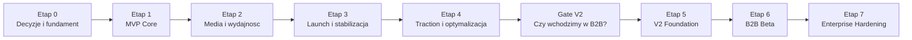

# Roadmapa Techniczna: od MVP do V2 Enterprise

## 1. Cel dokumentu

Ten dokument laczy dwa poprzednie opracowania:

- MVP na tanim setupie: `Hetzner VPS + Cloudflare R2 Free`
- V2 po sukcesie produktu: `Enterprise/B2B`

Celem jest ulozenie wszystkiego w jedna praktyczna kolejnosc:

- co robimy najpierw,
- co robimy dopiero po walidacji,
- czego nie budujemy za wczesnie,
- po jakich sygnalach przechodzimy do kolejnego etapu.

To nie jest roadmapa "na pokaz". To jest mapa dowozu produktu bez przepalania czasu i pieniedzy.

## 2. Zasady prowadzenia projektu

Calosc opiera sie na 7 zasadach:

1. Najpierw dowozimy wartosc edukacyjna, nie architektoniczny marketing.
2. Multimedia sa poza baza i poza dyskiem aplikacji.
3. Nie budujemy "enterprise" zanim nie mamy sygnalow z rynku.
4. Jedna dobra kategoria jest wazniejsza niz wiele srednich.
5. Wydajnosc i koszt kontrolujemy od pierwszego dnia.
6. Kazdy nowy element infrastruktury musi miec konkretne uzasadnienie.
7. Migracja do V2 ma byc ewolucja, nie przepisaniem systemu.

## 3. Ostateczna kolejnosc strategiczna

Najwlasciwsza kolejnosc dla tego projektu:

1. Uruchomic MVP dla kategorii `B`.
2. Zweryfikowac, czy ludzie naprawde korzystaja i wracaja.
3. Dopracowac pipeline mediow, wydajnosc i UX.
4. Dolozyc analityke, ktora poprawia nauke, a nie tylko wyglada dobrze.
5. Dopiero po trakcji wejsc w multi-tenancy i B2B.
6. Dopiero po pierwszych klientach B2B wzmacniac infrastrukture do `v2`.

## 4. Widok etapowy

## 5. Etap 0: Decyzje i fundament

### Cel

Zamknac najwazniejsze decyzje architektoniczne i produktowe, zanim zaczniemy kod.

### Zakres

- potwierdzic, ze startujemy od `kategorii B`,
- potwierdzic stack:
  - `Laravel`
  - `Inertia.js + Vue 3 + TypeScript`
  - `Filament`
- potwierdzic model storage:
  - `VPS dla app + DB`
  - `R2 dla mediow`
- przyjac formaty assetow,
- ustalic model pytan i mediow,
- ustalic co wchodzi do MVP, a co nie,
- rozpisac dane i API pod pierwszy przeplyw nauki.

### Deliverables

- architektura MVP,
- model tabel podstawowych,
- decyzje o mediach,
- lista endpointow MVP,
- plan importu pytan i assetow.

### Exit criteria

- jest jasne, co budujemy w wersji 1.0,
- nie ma niejasnosci, gdzie ida multimedia,
- nie ma pomyslu "wrzucmy wszystko na serwer i zobaczymy".

### Antycele

- brak B2B,
- brak wielu kategorii,
- brak premium paywalla,
- brak AI wyjasnien,
- brak zbednej gamifikacji.

## 6. Etap 1: MVP Core

### Cel

Dowozenie pierwszej wersji, z ktorej realny uzytkownik moze korzystac do nauki.

### Zakres funkcjonalny

- rejestracja i logowanie,
- wybor kategorii docelowej,
- bank pytan dla `B`,
- tryb `exam`,
- tryb `learn`,
- zapis odpowiedzi,
- podstawowe statystyki uzytkownika,
- prosty dashboard,
- podstawowy onboarding.

### Zakres techniczny

- 1 VPS,
- PostgreSQL na VPS,
- aplikacja uruchamiana przez `systemd`,
- reverse proxy,
- R2 jako storage mediow,
- upload/import assetow poza baza.

### Najwazniejsze endpointy

- `/api/v1/categories`
- `/api/v1/sessions`
- `/api/v1/sessions/{sessionId}/answers`
- `/api/v1/me/dashboard`
- `/api/v1/me/review-queue`

### Minimalny zestaw danych

- `users`
- `questions`
- `media_assets`
- `test_sessions`
- `answer_events`
- `user_question_progress`
- `user_profiles`

### Exit criteria

- uzytkownik moze przejsc caly flow nauki,
- pytania i media laduja sie stabilnie,
- baza nie przechowuje plikow,
- serwer dziala stabilnie pod podstawowym obciazeniem.

## 7. Etap 2: Media i wydajnosc

### Cel

Doprowadzic multimedia i frontend do poziomu, na ktorym produkt jest tani w utrzymaniu i szybki.

### Zakres

- wdrozyc pipeline kompresji obrazow,
- wdrozyc pipeline transkodowania wideo,
- generowac `poster.webp`,
- generowac `thumb.webp`,
- wprowadzic hashowane nazwy plikow,
- ustawic custom domain dla assetow,
- ustawic cache rules,
- wdrozyc lazy loading na froncie.

### Wymagania niefunkcjonalne

- listy nie odpalaja filmow automatycznie,
- widok pytania laduje tylko potrzebne media,
- wideo nie przechodzi przez backend jako proxy,
- obrazy nie sa przetwarzane runtime.

### Pomiar sukcesu

- stabilne ladowanie assetow,
- niski transfer z VPS,
- brak zapelniania dysku serwera,
- brak skokow CPU od mediow.

### Exit criteria

- mozemy bezpiecznie powiekszac bank pytan bez rozwalania VPS,
- nowe assety maja jednolity standard wagowy,
- Cloudflare cache przejmuje istotna czesc ruchu.

## 8. Etap 3: Launch i stabilizacja

### Cel

Wejsc z MVP do publicznego uzycia bez "domowych" awarii.

### Zakres

- backup bazy do R2,
- rotacja logow,
- health checks,
- prosty monitoring zasobow,
- obsluga bledow na froncie i w API,
- procedura restore bazy,
- podstawowe testy krytycznych flow.

### Testy krytyczne

- logowanie,
- start sesji,
- zapis odpowiedzi,
- zakoncz sesje,
- wyswietlenie postepu,
- odtworzenie obrazu i wideo.

### Exit criteria

- serwer restartuje sie bez katastrofy,
- backup da sie odtworzyc,
- podstawowe scenariusze nie sa kruche,
- mozna zaprosic pierwszych prawdziwych uzytkownikow.

## 9. Etap 4: Traction i optymalizacja

### Cel

Sprawdzic, czy produkt ma trakcje i gdzie realnie daje wartosc.

### Zakres produktowy

- prosty readiness score,
- trudne pytania,
- podstawowe SM-2,
- sekcja "powtorz dzisiaj",
- analiza slabego obszaru.

### Zakres techniczny

- agregaty i precomputed stats,
- optymalizacja zapytan,
- lepsze indeksy,
- retencja danych pomocniczych,
- zredukowanie kosztu transferu i storage.

### KPI, ktore obserwujemy

- ilu uzytkownikow wraca po 3 dniach,
- ilu wraca po 7 dniach,
- srednia liczba sesji na tydzien,
- ile osob konczy starter flow,
- czy powtorzeniowka jest realnie uzywana,
- jaki procent ruchu assetow idzie przez cache.

### Exit criteria

- mamy dowod, ze produkt jest uzywany, a nie tylko otwierany,
- wiemy, ktore funkcje poprawiaja retencje,
- wiemy, czy warto dalej inwestowac.

## 10. Gate V2: kiedy przechodzimy dalej

Do V2 nie przechodzimy dlatego, ze "fajnie byloby miec enterprise".

Przechodzimy dopiero, gdy wystapia co najmniej dwa z tych sygnalow:

- MVP ma regularny ruch i sensowna retencje,
- pojawiaja sie pierwsze rozmowy B2B,
- jedna organizacja chce wiecej niz pojedynczy account,
- potrzebne sa role instruktora lub managera,
- raportowanie dla szkoly jazdy staje sie realnym wymaganiem,
- single-VPS zaczyna byc ograniczeniem operacyjnym,
- wymagane sa audyt i mocniejsza kontrola dostepu.

Jesli tego nie ma:

- nie idziemy w V2,
- dopieszczamy MVP.

## 11. Etap 5: V2 Foundation

### Cel

Usunac glowny single point of failure i przygotowac baze pod B2B.

### Zakres

- wydzielic baze na osobny host,
- uruchomic prywatna siec,
- dodac drugi app node,
- dodac load balancer,
- przygotowac rolling deploy,
- utrzymac R2 i Cloudflare bez zmian.

### Zakres architektoniczny

- modularny monolit zostaje,
- storage zostaje,
- frontend i API nadal sa jednym systemem aplikacyjnym,
- nie przechodzimy na mikroserwisy.

### Exit criteria

- restart jednego noda nie zabija produktu,
- baza nie konkuruje z appka o zasoby,
- mozemy robic deploye bardziej bezpiecznie,
- mamy podstawe pod B2B.

## 12. Etap 6: B2B Beta

### Cel

Wypuscic pierwsza wersje dla szkol jazdy lub partnerow.

### Zakres domenowy

- `organizations`
- `organization_members`
- `organization_invites`
- `roles`
- `organization_settings`
- podstawowy panel B2B

### Funkcje B2B beta

- instruktor widzi kursantow,
- manager widzi podstawowe raporty,
- zapraszanie ludzi do organizacji,
- przypisywanie rol,
- filtrowanie wynikow po organizacji,
- eksport prostego raportu.

### Zakres bezpieczenstwa

- izolacja danych po `organization_id`,
- mocniejsza autoryzacja,
- audit log dla operacji administracyjnych,
- osobna walidacja endpointow B2B.

### Exit criteria

- pierwszy tenant moze realnie korzystac,
- nie ma wyciekow danych miedzy organizacjami,
- admin flow jest kontrolowany i audytowalny.

## 13. Etap 7: Enterprise Hardening

### Cel

Dojrzec operacyjnie i sprzedazowo do powazniejszych klientow.

### Zakres

- worker do zadan asynchronicznych,
- importy i eksporty poza request-response,
- rozwinięty audit log,
- branding organizacji,
- subdomeny,
- przygotowanie pod custom domains,
- Access/Tunnel dla narzedzi wewnetrznych,
- read-heavy reporting bez duszenia glownej bazy.

### Dodatki warunkowe

Dodajemy tylko, jesli sa prawdziwe wymagania:

- SSO,
- custom domains,
- osobne polityki retencji,
- read replica,
- osobne bazy dla wybranych tenantow.

### Exit criteria

- obsluga B2B nie destabilizuje B2C,
- procesy administracyjne sa rozliczalne,
- mamy kontrolowana droge do obslugi wiekszych klientow.

## 14. Kolejnosc wdrozenia tydzien po tygodniu

To nie sa daty kalendarzowe. To logiczny porzadek.

### Tydzien 1

- finalizacja modelu danych,
- finalizacja zakresu MVP,
- setup repo i srodowiska,
- przygotowanie VPS i domeny.

### Tydzien 2

- auth sesyjne i cookies,
- pytania,
- model sesji,
- podstawowe API.

### Tydzien 3

- tryb `exam`,
- zapis odpowiedzi,
- podstawowe wyniki,
- dashboard v1.

### Tydzien 4

- tryb `learn`,
- podpiecie obrazow,
- model `media_assets`,
- pierwsze kompresje assetow.

### Tydzien 5

- podpiecie wideo,
- postery,
- custom domain dla mediow,
- cache rules.

### Tydzien 6

- lazy loading,
- tuning zapytan,
- backup do R2,
- monitoring podstawowy.

### Tydzien 7

- testy krytycznych flow,
- poprawki UX,
- poprawki wydajnosci,
- przygotowanie do pilota.

### Tydzien 8

- pilot z pierwszymi uzytkownikami,
- bugfixing,
- analiza retencji i obciazenia.

### Tydzien 9-12

- trudne pytania,
- prosty SM-2,
- gotowosc do egzaminu,
- dalsza optymalizacja kosztu.

### Tydzien 13+

- decyzja:
  - dalej dopieszczamy B2C
  - albo zaczynamy `V2 Foundation`

## 15. Priorytety techniczne wg kolejnosci

Najwazniejsze:

1. stabilny flow uzytkownika,
2. poprawny model danych,
3. multimedia poza serwerem,
4. niski koszt transferu i storage,
5. backup i restore.

Wazne:

1. statystyki,
2. algorytm powtorek,
3. dashboard,
4. monitoring,
5. testy krytyczne.

Pozniej:

1. B2B,
2. multi-tenancy,
3. audit log,
4. worker,
5. white-label,
6. SSO.

## 16. Czego nie robic za wczesnie

Nie robimy za wczesnie:

- wszystkich kategorii,
- wielowariantowego pipeline'u wideo,
- streamingu HLS/DASH,
- Kubernetesa,
- osobnych mikroserwisow,
- rozbudowanego paywalla,
- rozbudowanego CRM dla szkol jazdy,
- SSO bez klientow, ktorzy tego chca,
- dedykowanych baz per tenant bez realnego wymogu.

To sa klasyczne miejsca, gdzie projekty traca miesiące bez wzrostu wartosci.

## 17. Najwieksze ryzyka na kazdym etapie

### MVP

- za szeroki zakres,
- zbyt ciezkie media,
- brak dyscypliny w pipeline assetow,
- zbyt duzo funkcji bez walidacji.

### Post-launch

- slabe pomiary retencji,
- brak wiedzy, ktore funkcje faktycznie pomagaja,
- zbyt szybkie dokladanie funkcji premium.

### V2

- wejscie w B2B za wczesnie,
- slaba izolacja danych tenantow,
- audit log dodany zbyt pozno,
- rozwalenie prostoty systemu przez nadarchitekture.

## 18. Definition of done dla calej drogi

Etap MVP jest done, gdy:

- zwykly uzytkownik moze skutecznie sie uczyc,
- serwer nie dusi sie od mediow,
- baza jest stabilna,
- backupy dzialaja,
- produkt ma pierwsze oznaki retencji.

Etap V2 jest done, gdy:

- organizacja moze korzystac zespolowo,
- role i raporty dzialaja,
- dane sa izolowane,
- appka nie ma jednego punktu awarii,
- operacje admina sa audytowalne.

## 19. Finalna rekomendacja

Najlepsza sciezka dla tego projektu to:

- zaczac od jednego dobrze dopracowanego MVP,
- pilnowac kosztu i wydajnosci mediow od pierwszego dnia,
- mierzyc realne zachowanie uzytkownikow,
- dopiero po trakcji przejsc do B2B,
- rozwijac architekture tylko tam, gdzie pokazuje to ruch i biznes.

Jesli bedziemy trzymac te kolejnosc, to nie tylko "postawimy serwis", ale zbudujemy system, ktory ma sens ekonomiczny i techniczny.
