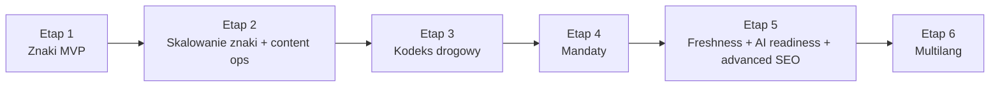

# SEO Content Roadmap

## 1. Cel dokumentu

Ten dokument opisuje dalsza droge rozwoju publicznego pionu contentowego po domknieciu:

- [ZNAKI-DROGOWE-SEO-ETAP-1-PLAN.md](C:/Users/xxx/Desktop/serwistestyprawojazdy/docs/ZNAKI-DROGOWE-SEO-ETAP-1-PLAN.md)

To nie jest dokument do biezacego taskowania pojedynczych plikow. Jego rola jest inna:

- pokazac kolejne etapy po `Etapie 1`,
- ustawic zaleznosci miedzy watkami pobocznymi,
- zdefiniowac bramki wejscia i wyjscia,
- pomoc przechodzic plynnie z jednego etapu do nastepnego bez scope creep.

## 2. Zasady prowadzenia roadmapy

Ta roadmapa opiera sie na kilku zasadach:

1. Najpierw domykamy `Etap 1`, potem skalujemy.
2. Nie laczymy jednoczesnie nowych klastrow contentowych z duza przebudowa architektury.
3. Kazdy nowy etap musi miec warunek wejscia.
4. Kazdy nowy etap musi miec minimalny, zamkniety rezultat.
5. Watki boczne planujemy wczesnie, ale wdrazamy dopiero wtedy, gdy glowny tor jest gotowy.

## 3. Aktualny stan wyjsciowy

Na dzien `2026-04-29`:

- `Etap 1` jest technicznie dowieziony lokalnie i czeka juz tylko na finalny pass na stabilnym publicznym adresie,
- z powodu braku stagingu finalne walidacje Google zostaly odlozone,
- wdrozono fundament `Etapu 2A`, czyli workflow redakcyjny, checklisty publikacyjne i panel do seryjnej pracy nad klastrem znakow.
- wdrozono pierwsza warstwe `Etapu 2B`: strony zaufania `kontakt / metodologia`, standard assetow `alt + wymiary + OG metadata` oraz rozszerzony batch QA do `5` znakow.
- wdrozono operacyjna mape zapytan i watchliste w panelu `Filament`, wraz z pierwszym batch planem `rollout-01` ponad obecny sample QA.
- przez realny panel admina dodano, zedytowano i opublikowano pierwsze `2` znaki z `rollout-01` (`B-35` i `B-36`), co podnioslo publiczny corpus do `7` stron znakow.
- domknieto tez pierwszy material wspierajacy `A-7 vs B-20`, wiec `rollout-01` jest juz zamkniety jako mini-klaster `2 signs + 1 supporting page`.
- dodano kanoniczny inwentarz wszystkich polskich znakow zakazu `B-1` do `B-44` oraz seeder backlogu `rollout-02-prohibitions`, zeby dalsza rozbudowa kategorii `Znaki zakazu` byla kompletna i oparta o oficjalny wykaz.
- backlog `rollout-02-prohibitions` nie jest juz pustym spisem: wszystkie brakujace znaki zakazu maja w systemie bazowe szkice tresci, FAQ, meta i placeholder assety, gotowe do passu redakcyjnego przed publikacja.
- domknieto tez pierwszy duzy publiczny batch `rollout-02`: opublikowano `12` kolejnych znakow zakazu (`B-21`, `B-22`, `B-23`, `B-24`, `B-25`, `B-27`, `B-33`, `B-34`, `B-37`, `B-38`, `B-43`, `B-44`) oraz `3` nowe materialy wspierajace.
- rollout-03 domknal kolejny klaster zakazow wjazdu dla grup pojazdow i ladunkow: opublikowano `16` kolejnych znakow (`B-3`, `B-3a`, `B-4`, `B-5`, `B-6`, `B-7`, `B-8`, `B-9`, `B-10`, `B-11`, `B-12`, `B-13`, `B-13a`, `B-14`, `B-41`, `B-42`) oraz `3` nowe materialy wspierajace.
- rollout-04 domknal cala kategorie `Znaki zakazu`: opublikowano pozostale `13` znakow (`B-15`, `B-16`, `B-17`, `B-18`, `B-19`, `B-26`, `B-28`, `B-29`, `B-30`, `B-31`, `B-32`, `B-39`, `B-40`) oraz `4` nowe materialy wspierajace.
- publiczny corpus modulu ma teraz `48` stron znakow, z czego `46` nalezy do kategorii `Znaki zakazu`; backlog tej kategorii zostal wyzerowany i nie ma juz brakujacych znakow zakazu w statusie `in_review`.
- domknieto tez quality pass dla klastra `Znaki zakazu`: related signs dostaly bardziej semantyczny ranking, a automatyczny test klastra sprawdza caly publiczny corpus tej kategorii pod kluczowe sekcje i linkowanie wspierajace.
- przygotowano kanoniczny start kolejnej kategorii `Znaki ostrzegawcze`: oficjalny katalog `42` znakow, seeder backlogu i szkice tresci dla `40` nieopublikowanych jeszcze stron, ponad juz istniejace `A-7` i `A-17`.
- rollout-05 otworzyl publicznie kolejna kategorie: opublikowano `7` nowych znakow ostrzegawczych (`A-5`, `A-6a`, `A-6b`, `A-6c`, `A-8`, `A-16`, `A-24`) oraz `2` materialy wspierajace.
- rollout-06 rozszerzyl warning cluster o kolejne `11` znakow (`A-1`, `A-2`, `A-3`, `A-4`, `A-9`, `A-10`, `A-11`, `A-11a`, `A-12a`, `A-12b`, `A-12c`) oraz `3` nowe materialy wspierajace.
- rollout-07 domknal kolejny duzy batch warning signs: opublikowano `9` kolejnych znakow (`A-6d`, `A-6e`, `A-14`, `A-15`, `A-18a`, `A-18b`, `A-20`, `A-29`, `A-30`) oraz `4` nowe materialy wspierajace.
- rollout-08 domknal cala kategorie `Znaki ostrzegawcze`: opublikowano ostatnie `13` znakow (`A-13`, `A-19`, `A-21`, `A-22`, `A-23`, `A-25`, `A-26`, `A-27`, `A-28`, `A-31`, `A-32`, `A-33`, `A-34`) oraz `4` nowe materialy wspierajace.
- po seedzie lokalnym modul ma `88` rekordow znakow w bazie i `88` publicznych stron znakow; warning inventory zostal wyzerowany, a publiczny warning corpus ma teraz `42` stron znakow.
- domknieto tez quality pass dla klastra `Znaki ostrzegawcze`: warning signs dostaly osobne assety `main + OG` per znak, a strony kategorii zyskaly dodatkowa sekcje `Powiazane porownania`, wzmacniajaca linkowanie do supporting pages.
- rollout-09 domknal cala kategorie `Znaki nakazu`: `23/23` publiczne znaki `C` oraz `6` supporting pages.
- rollout-10 domknal pelny publiczny batch `Znaki informacyjne`: `72/72` publiczne znaki `D` oraz `4` supporting pages.
- glowny `TrafficSignSeoSeeder` seeduje juz tez rollouty `11-16` dla `E`, `F`, `T`, `G`, `P` i `S`, wiec lokalny corpus publiczny wyszedl poza pierwotny kwartet `A/B/C/D`.
- lokalny seed modulu obejmuje obecnie `217` publicznych stron znakow w `10` aktywnie obslugiwanych kategoriach: `A(42)`, `B(51)`, `C(23)`, `D(72)`, `E(7)`, `F(4)`, `T(4)`, `G(5)`, `P(6)`, `S(3)`.
- dokumentacja wykonawcza i inwentarzowa jest juz domknieta dla `A`, `B`, `C` i `D`; dla rolloutow `11-16` kod i query map sa aktywne, ale nadal brakuje osobnych inventory docs i runbookow QA.

Status roadmapy:

- `Etap 1`: `ready for staging validation`
- `Etap 2`: `in progress`
- `Etap 3`: `planned`
- `Etap 4`: `planned`
- `Etap 5`: `planned`
- `Etap 6`: `planned`

## 4. Widok calosci

Watki poboczne nie sa osobnymi odklejonymi projektami. One sa przypisane do etapow:

- standard tresci i unikalnosci: glownie `Etap 2`
- workflow prawny i freshness: `Etap 3-5`
- E-E-A-T autorzy / reviewerzy: od `Etapu 2`, mocniej `Etap 3-5`
- analityka SEO i GSC: od `Etapu 2`, stale dalej
- asset pipeline i OG: od `Etapu 2`
- trust pages i entity layer: od `Etapu 2`
- AI readiness: glownie `Etap 5`
- multilang i `hreflang`: `Etap 6`

## 5. Etap 1: Znaki MVP

Ten etap jest opisany osobno w:

- [ZNAKI-DROGOWE-SEO-ETAP-1-PLAN.md](C:/Users/xxx/Desktop/serwistestyprawojazdy/docs/ZNAKI-DROGOWE-SEO-ETAP-1-PLAN.md)

Cel:

- dowiezc pierwszy dzialajacy modul `znaki drogowe` na `Blade` z backoffice, routingiem i fundamentem technicznego SEO.

Warunek wyjscia do `Etapu 2`:

- istnieje produkcyjny model danych,
- istnieje panel admina,
- istnieja publiczne strony `hub -> category -> sign -> author`,
- istnieje podstawowe SEO i sitemap,
- istnieje maly batch tresci gotowy do QA.

## 6. Etap 2: Skalowanie znaki + content ops

### Cel

Przejsc z pojedynczego MVP do powtarzalnego systemu publikacji i utrzymania klastra `znaki drogowe`.

### Wchodzi w scope

- rozszerzenie liczby publikowanych znakow,
- standard tresci dla kart znakow,
- workflow publikacji, aktualizacji i QA,
- rozsadne rozwinięcie powiazanych znakow,
- lepszy pipeline obrazow i `OG`,
- polityka paginacji, `noindex` i ochrony przed technicznym duplicate content przy rosnacym corpusie,
- pierwsza warstwa operacyjnej analityki SEO.

### Warunek wejscia

- `Etap 1` jest domkniety technicznie,
- zespół umie dodac i opublikowac znak bez dotykania kodu,
- macie przynajmniej kilka recznie sprawdzonych kart znakow.

### Deliverables

- redakcyjna checklista dla strony znaku,
- workflow `draft -> review -> published -> needs_review`,
- polityka slugow, redirectow i statusow `404/410`,
- polityka redakcyjna `human in the loop`,
- minimalny standard assetow:
  - obraz glowny znaku
  - `OG image`
  - alt
  - jawne wymiary
- query map i pierwsza macierz tematow / znakow / intencji,
- watchlista konkurencji i wzorcow referencyjnych w niszy,
- operacyjny panel do planowania query, batchy i rollout statusow,
- podpiecie `Search Console` i podstawowego monitoringu indeksacji,
- weryfikacja domeny CDN dla obrazow, jesli obrazy beda szly z osobnego hosta,
- pierwsza warstwa stron zaufania:
  - organizacja / about
  - kontakt
  - metodologia / jak powstaja tresci
- pierwsza warstwa standardu zrodel:
  - jak oznaczamy podstawy prawne
  - jak oznaczamy statystyki i dane zewnetrzne
- backlog okazji `first-mover`:
  - nowe znaki
  - zmiany w oznakowaniu
  - nowe interpretacje i nowelizacje
- pierwsza partia realnie opublikowanych znakow,
- podstawowe monitorowanie:
  - indeksacja
  - status sitemap
  - podstawowe CTR / impressions w `GSC`

### Watki poboczne przypiete do Etapu 2

- standard unikalnosci tresci,
- E-E-A-T autorow na poziomie podstawowym,
- pipeline asset naming,
- audyt title / description / canonical,
- crawlable internal linking i anchor text hygiene,
- entity layer `Organization + author pages + trust pages`,
- accessibility baseline dla modulu contentowego,
- minimum `information gain` dla kart znakow,
- baseline keyword research i monitoring konkurencji,
- ochrona crawl budget przez zasady `index / noindex / canonical`.

### Exit criteria

- publikacja nowych znakow jest powtarzalna,
- content nie jest cienki ani przypadkowy,
- kazda karta znaku ma realny element wyrozniajacy ponad sucha definicje,
- istnieje operacyjna lista tematow i znakow o najwyzszym potencjale,
- macie pierwszy sensowny klaster, a nie tylko sample.

### Nie robic jeszcze

- osobnego klastra `kodeks`,
- osobnego klastra `mandaty`,
- multilang,
- duzej automatyzacji AI do masowej produkcji tresci.

## 7. Etap 3: Kodeks drogowy

### Cel

Zbudowac klaster autorytetowy, ktory wspiera strony znakow i porzadkuje tresci prawne.

### Wchodzi w scope

- `/kodeks-drogowy`
- strony artykulow / zagadnien kodeksowych,
- linkowanie `znak -> przepis -> znak`,
- linkowanie `pytanie -> podstawa prawna -> przepis -> pytanie`,
- podstawowy model stron prawnych,
- osobna warstwa danych dla podstaw prawnych przy pytaniach,
- author / reviewer metadata,
- kontrolowany workflow aktualizacji,
- wlasciwe miejsce na pelniejsza warstwe `Legislation`.

Plan wykonawczy tego etapu jest opisany w:

- [LEGAL-TRUST-LAYER-PLAN.md](C:/Users/xxx/Desktop/serwistestyprawojazdy/docs/LEGAL-TRUST-LAYER-PLAN.md)

### Warunek wejscia

- klaster `znaki` jest juz dzialajacy i opublikowany,
- macie sprawdzony workflow tresciowy,
- zespół umie utrzymac jakość i publikacje contentu seryjnie.

### Deliverables

- model danych dla stron kodeksowych,
- osobny routing i layout dla `kodeksu`,
- powiazania miedzy znakami a artykulami kodeksowymi,
- powiazania miedzy pytaniami a zweryfikowanymi podstawami prawnymi,
- publiczny blok `Uzasadnienie prawne` na wybranych stronach pytan,
- widoczne daty publikacji i aktualizacji,
- mocniejsza warstwa author / reviewer,
- polityka zrodel, cytowan i widocznej metodologii dla tresci prawnych,
- decyzja, gdzie i w jakim zakresie wdrazamy `Legislation schema`.

### Watki poboczne przypiete do Etapu 3

- workflow aktualizacji prawnej,
- policy dla zrodel i cytowan,
- wstep do `Legislation schema`, ale tylko tam, gdzie macie realne strony prawne.
- jawne rozroznienie `autor / reviewer / stan prawny`.
- zasada: konkurencja, np. strony pokazujace podstawy prawne przy pytaniach, moze byc tylko benchmarkiem lub tropem do audytu; finalnym zrodlem sa oficjalne akty prawne.

### Co prawnego robimy juz w Etapie 1, a co dopiero tutaj

`Etap 1`:

- sekcja `podstawa prawna` na stronie znaku,
- ostrozny opis kontekstu prawnego,
- przygotowanie pol danych pod przyszle powiazania.

`Etap 3`:

- strony `kodeksowe` jako samodzielne byty contentowe,
- relacje miedzy znakami i przepisami,
- relacje miedzy pytaniami i przepisami,
- osobna publiczna sekcja `Uzasadnienie prawne` przy pytaniach, bez modyfikowania `questions.explanation` i bez wplywu na `/nauka`,
- pelniejszy model nowelizacji, zmian i interpretacji,
- sensowne wdrozenie `Legislation schema`, jesli dane i widocznosc frontowa sa na to gotowe.

### Exit criteria

- strony znakow maja dokad linkowac w warstwie prawnej,
- publiczne strony pytan maja dokad linkowac w warstwie prawnej,
- klaster prawny istnieje jako osobny, sensowny pion tresci,
- tresci prawne sa gotowe do dalszej rozbudowy bez chaosu.

### Nie robic jeszcze

- rozsadzania zakresu na wszystkie mozliwe akty prawne,
- masowego legal graph na zapas,
- agresywnego mnozenia podobnych podstron bez unikalnej wartosci.

## 8. Etap 4: Mandaty

### Cel

Zbudowac klaster transakcyjno-informacyjny wokol mandatow i punktow karnych.

### Wchodzi w scope

- `/mandaty`
- strony typow wykroczen i kar,
- deeplinki z kart znakow i z `kodeksu`,
- tabelaryczne dane czytelne dla usera i crawlera,
- proces utrzymania aktualnosci danych.

### Warunek wejscia

- znaki i kodeks juz istnieja i linkuja do siebie,
- macie realny proces review tresci prawnych,
- wiecie, kto odpowiada za aktualizacje stawek i zmian przepisow.

### Deliverables

- routing i layout dla `mandatow`,
- model danych dla stron mandatowych,
- sekcje tabelaryczne i FAQ,
- podpiecie deeplinkow z kart znakow,
- prosty system flagowania tresci do aktualizacji.

### Watki poboczne przypiete do Etapu 4

- freshness operacyjny,
- notatki o stanie prawnym,
- ostrozna polityka danych liczbowych i ich zrodel.

### Exit criteria

- klaster mandatow daje wartosc i ruch intencyjny,
- dane sa aktualizowalne bez paniki,
- linkowanie wewnetrzne miedzy `znaki / kodeks / mandaty` dziala jako calosc.

### Nie robic jeszcze

- zaawansowanego content automation bez kontroli,
- tabel jako obrazki,
- publikacji niezweryfikowanych zmian prawnych.

## 9. Etap 5: Freshness + AI readiness + advanced SEO

### Cel

Podniesc jakosc, widocznosc i utrzymywalnosc juz istniejacego corpusu.

### Wchodzi w scope

- workflow `needs_review`,
- harmonogram rewizji,
- rozbudowane definicje i leady pod direct answers,
- tabele, bloki faktow i mocniejsze strukturzenie tresci,
- dalsza optymalizacja schema,
- monitoring zachowania klastra w wyszukiwarce i narzedziach AI.

### Warunek wejscia

- istnieje juz realny corpus opublikowanych stron,
- macie co aktualizowac i co mierzyc,
- `znaki + kodeks + mandaty` juz funkcjonuja jako system.

### Deliverables

- plan odswiezania tresci,
- flagowanie starych stron,
- standard definicji otwierajacej,
- standard sekcji faktograficznych,
- rozszerzona mapa linkowania wewnetrznego,
- stale walidacje `Rich Results Test / URL Inspection / sitemap health`,
- warstwa obserwacji:
  - GSC
  - indeksacja
  - CTR
  - page-level performance

### Watki poboczne przypiete do Etapu 5

- AI readiness,
- lepsze featured-snippet formatting,
- mocniejsze powiazanie author / reviewer / organization.

### Exit criteria

- corpus nie starzeje sie bez kontroli,
- macie system rewizji i poprawiania tresci,
- content jest lepiej przygotowany na wyszukiwarke i odpowiedzi syntetyczne.

### Nie robic jeszcze

- masowej produkcji tresci bez review,
- pogoni za schema dla samej schema,
- sztucznego nadmuchania contentu bez dodatkowej wartosci.

## 10. Etap 6: Multilang

### Cel

Wejsc w druga warstwe jezykowa dopiero wtedy, gdy polski core jest stabilny procesowo.

### Wchodzi w scope

- osobne wersje URL,
- realne tłumaczenia, nie szablonowe duplikaty,
- `hreflang`,
- proces redakcyjny i QA dla kolejnego jezyka,
- kontrola canonicali i powiazan miedzy wersjami.

### Warunek wejscia

- polski corpus jest stabilny,
- istnieje proces publikacji i aktualizacji,
- macie zasoby do utrzymania drugiej wersji jezykowej.

### Deliverables

- decyzja o pierwszym dodatkowym jezyku,
- architektura URL,
- model danych / translacji,
- `hreflang`,
- reguly publikacji i aktualizacji wielojezycznej.

### Watki poboczne przypiete do Etapu 6

- governance tresci miedzy wersjami,
- lokalizacja, nie tylko tlumaczenie,
- monitoring duplicate / canonical / alternates.

### Exit criteria

- druga wersja jezykowa nie rozwala procesow,
- alternatywne wersje sa poprawnie mapowane,
- macie realna zdolnosc utrzymania tych stron.

### Nie robic wczesniej

- sztucznego `hreflang` bez realnych wersji jezykowych,
- parametrow `?lang=`,
- automatycznego rolloutowania setek przetlumaczonych stron bez QA.

## 11. Watki boczne rozpisane horyzontalnie

To sa watki, ktore warto miec zaplanowane od razu, ale nie kazdy z nich jest do implementacji juz teraz.

### A. Content quality system

Zaczynamy planowac: `Etap 1`

Wdrażamy realnie: `Etap 2`

Zakres:

- checklisty redakcyjne,
- unikalnosc sekcji,
- standardy FAQ,
- standard otwierajacej definicji,
- minimum `information gain` na strone,
- checklisty zrodel i dowodow dla twierdzen prawnych.

### B. Legal update workflow

Zaczynamy planowac: `Etap 2`

Wdrażamy realnie: `Etap 3-5`

Zakres:

- zrodla prawne,
- odpowiedzialnosc za review,
- flagowanie tresci do aktualizacji,
- daty aktualizacji.

### C. Author / reviewer / E-E-A-T

Zaczynamy planowac: `Etap 1`

Wdrażamy realnie: `Etap 2-5`

Zakres:

- profile autorow,
- profile reviewerow,
- metadata na stronach,
- organizacyjna warstwa zaufania.
- rozroznienie roli:
  - autor tresci
  - reviewer prawny
  - aktualizacja redakcyjna

### D. SEO analytics and monitoring

Zaczynamy planowac: `Etap 1`

Wdrażamy realnie: `Etap 2+`

Zakres:

- GSC,
- sitemap health,
- page coverage,
- CTR / impressions,
- monitoring indeksacji,
- URL Inspection dla kluczowych typow stron.

### E. Research and market intelligence

Zaczynamy planowac: `Etap 1`

Wdrażamy realnie: `Etap 2+`

Zakres:

- keyword research pod znaki, kategorie, przepisy i mandaty,
- monitoring konkurencji w niszy,
- watchlista nowych znakow i zmian przepisow,
- regularny review okazji `first-mover`.

### F. Asset and image pipeline

Zaczynamy planowac: `Etap 1`

Wdrażamy realnie: `Etap 2`

Zakres:

- naming,
- `OG`,
- wymiary,
- LCP image discipline,
- image sitemap,
- CDN verification w Search Console, jesli obrazy sa na osobnym hostcie,
- ewentualna automatyzacja generacji assetow.

### G. Accessibility and semantic HTML

Zaczynamy planowac: `Etap 1`

Wdrażamy realnie: `Etap 2+`

Zakres:

- poprawna hierarchia naglowkow,
- tabele czytelne dla ludzi i botow,
- sensowne `alt`,
- semantyczny layout,
- brak ukrywania istotnej tresci tylko dla maszyn.

### H. Canonical / redirect governance

Zaczynamy planowac: `Etap 1`

Wdrażamy realnie: `Etap 2+`

Zakres:

- self-canonical na stronach indeksowalnych,
- polityka zmiany slugow,
- `301/308` dla zmian URL,
- `404/410` dla usunietych tresci,
- linkowanie zawsze do URL kanonicznych,
- zasady `noindex` dla stron bez wartosci SEO,
- zasady paginacji i ochrony crawl budget przy wzroscie liczby URL.

### I. Off-page authority and partnerships

Zaczynamy planowac: `Etap 2`

Wdrażamy realnie: `Etap 3+`

Zakres:

- digital PR oparty o dane,
- partnerstwa z `OSK`,
- partnerstwa z podmiotami BRD i edukacyjnymi,
- broken link building i outreach zrodlowy.

### J. AI readiness

Zaczynamy planowac: `Etap 3`

Wdrażamy realnie: `Etap 5`

Zakres:

- direct answers,
- definicje,
- structured fact blocks,
- dalsze dopracowanie tresci do odpowiedzi syntetycznych.

## 12. Bramki decyzyjne

Nie przechodzimy plynnie dalej tylko dlatego, ze "kolejny etap brzmi sensownie".

Kazda zmiana etapu powinna miec jawna decyzje:

### Bramka A: z Etapu 1 do Etapu 2

- czy modul dziala technicznie,
- czy admin jest uzywalny,
- czy sample content jest sensowny,
- czy layout i routing nie wymagaja cofki.

### Bramka B: z Etapu 2 do Etapu 3

- czy umiecie publikowac seryjnie,
- czy jakosc jest stabilna,
- czy znaki zasluguja juz na warstwe prawna.

### Bramka C: z Etapu 3 do Etapu 4

- czy proces prawny jest pod kontrola,
- czy klaster znakow ma juz sensowne linkowanie do przepisow,
- czy jest gotowosc operacyjna do utrzymywania danych o karach.

### Bramka D: z Etapu 4 do Etapu 5

- czy istnieje juz dostatecznie duzy corpus,
- czy macie realne dane z GSC / indeksacji / ruchu,
- czy freshness jest faktycznym problemem, a nie teoria.

### Bramka E: z Etapu 5 do Etapu 6

- czy polski core jest stabilny,
- czy proces publikacji jest przewidywalny,
- czy macie zasoby do utrzymania drugiego jezyka.

## 13. Rekomendowana kolejnosc dokumentacji

Dokumenty do utrzymania przy tym torze powinny wygladac tak:

1. plan wykonawczy `Etapu 1`
2. roadmapa dalszych etapow
3. osobny dokument wykonawczy dla `Etapu 3` przed startem `kodeksu`
4. osobny dokument wykonawczy dla `Etapu 4` przed startem `mandatow`
5. dopiero potem osobne runbooki dla freshness, multilang lub AI readiness

Czyli:

- roadmapa jest stabilna i dosc ogolna,
- wykonawcze checklisty sa osobne dla konkretnych etapow.

## 14. Aktualny nastepny ruch

Przy obecnym stanie infrastruktury najblizszy realny ruch to dalszy ciag `Etapu 2B`:

- `Etap 1` od strony infrastrukturalnej nadal czeka juz glownie na stabilny publiczny URL do finalnych walidacji Google,
- po domknieciu `A/B/C/D` najblizszy ruch dokumentacyjny to nadrobienie inventory docs i runbookow QA dla rolloutow `11-16`, bo te grupy sa juz aktywne w glownym seederze,
- operacyjnie kolejny quality pass powinien objac publiczne batch'e `E/F/T/G/P/S`, zanim uruchomimy nastepna fale `17+`,
- dopiecie standardu zrodel i korekt w codziennym workflow redakcyjnym,
- rozszerzenie batcha operacyjnego o kolejne materialy wspierajace oraz decyzje, ktora z juz przygotowanych, ale jeszcze niewlaczonych rodzin (`kontrolki`, `osoba kierujaca ruchem`, `znaki wojskowe`, `sygnaly/znaki tramwajowe`, `urzadzenia BRD`) otwiera `rollout-17+`.

Do finalnych walidacji `Rich Results Test / URL Inspection` wracamy przy pierwszym stabilnym stagingu albo domenie docelowej.

## 15. Dokumenty powiazane

- [ZNAKI-DROGOWE-SEO-ETAP-1-PLAN.md](C:/Users/xxx/Desktop/serwistestyprawojazdy/docs/ZNAKI-DROGOWE-SEO-ETAP-1-PLAN.md)
- [ZNAKI-OSTRZEGAWCZE-INWENTARZ.md](C:/Users/xxx/Desktop/serwistestyprawojazdy/docs/ZNAKI-OSTRZEGAWCZE-INWENTARZ.md)
- [ZNAKI-ZAKAZU-INWENTARZ.md](C:/Users/xxx/Desktop/serwistestyprawojazdy/docs/ZNAKI-ZAKAZU-INWENTARZ.md)
- [ZNAKI-NAKAZU-INWENTARZ.md](C:/Users/xxx/Desktop/serwistestyprawojazdy/docs/ZNAKI-NAKAZU-INWENTARZ.md)
- [ZNAKI-INFORMACYJNE-INWENTARZ.md](C:/Users/xxx/Desktop/serwistestyprawojazdy/docs/ZNAKI-INFORMACYJNE-INWENTARZ.md)
- [strategia-seo-znaki-drogowe.md](C:/Users/xxx/Desktop/strategia-seo-znaki-drogowe.md)
- [docs/ROADMAP-TECH.md](C:/Users/xxx/Desktop/serwistestyprawojazdy/docs/ROADMAP-TECH.md)
- [docs/STATUS-MVP.md](C:/Users/xxx/Desktop/serwistestyprawojazdy/docs/STATUS-MVP.md)
