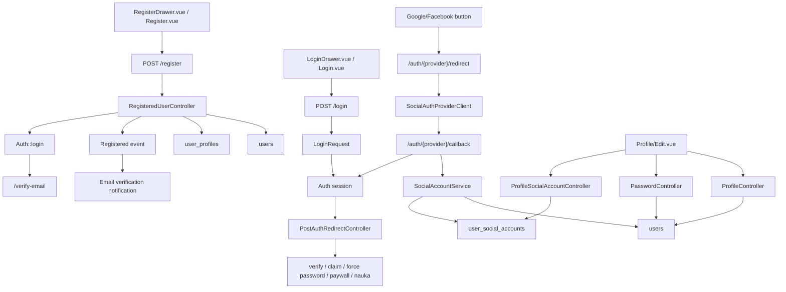

# Auth, SMTP i plan naprawy wdrozenia

Ostatnia aktualizacja: `2026-05-26`
Status dokumentu: `kanoniczny plan operacyjny i rejestr postepu`

Ten dokument porzadkuje aktualny stan systemu rejestracji, logowania,
zarzadzania kontem i maili systemowych. Ma byc punktem odniesienia przed
kolejnymi zmianami w kodzie i konfiguracji produkcyjnej.

Nie przechowujemy tutaj sekretow, hasel, tokenow OAuth ani hasel SMTP.

## 1. Zakres

W zakresie sa:

- rejestracja formularzem,
- rejestracja przez Google i Facebook,
- weryfikacja adresu email,
- logowanie i wylogowanie,
- reset hasla,
- zmiana hasla przez zalogowanego uzytkownika,
- zmiana adresu email,
- laczenie i odlaczanie kont Google/Facebook,
- maile systemowe,
- konfiguracja SMTP na produkcji,
- plan wdrozenia napraw na docelowej domenie `prawkonaraz.pl`.

Poza zakresem sa:

- kwestie prawne oficjalnej bazy pytan,
- migracja mediow i backupow do R2, poza zaleznosciami od maili,
- platnosci i checkout,
- przebudowa calej architektury kont.

## 2. Aktualny stan potwierdzony

### 2.1 Produkcja

Stan potwierdzony 2026-05-25:

- domena kanoniczna po decyzji klienta: `https://prawkonaraz.pl`,
- `www.prawkonaraz.pl` przekierowuje do `https://prawkonaraz.pl`,
- Cloudflare obsluguje DNS, proxy i wymuszenie HTTPS,
- aplikacja dziala na VPS Mikrus 4.1 PRO,
- produkcyjny `APP_URL` jest ustawiony na `https://prawkonaraz.pl`,
- produkcyjny `APP_LOCALE` jest ustawiony na `pl`,
- produkcyjny `SESSION_DOMAIN` jest ustawiony na `.prawkonaraz.pl`,
- produkcyjny `MAIL_FROM_ADDRESS` jest ustawiony na `kontakt@prawkonaraz.pl`,
- produkcyjny `MAIL_FROM_NAME` jest ustawiony na `prawkonaraz.pl`,
- produkcyjny `CONTENT_CONTACT_EMAIL` jest ustawiony na
  `kontakt@prawkonaraz.pl`,
- produkcyjny `MAIL_MAILER` jest ustawiony na `smtp`,
- produkcyjny SMTP uzywa Brevo (`smtp-relay.brevo.com:587`),
- produkcyjne sekrety SMTP sa ustawione na VPS i nie sa przechowywane w repo,
- produkcyjne klucze Google OAuth sa ustawione na VPS i nie sa przechowywane w
  repo,
- produkcyjne klucze Facebook OAuth sa puste.

Wniosek: produkcja dziala jako aplikacja webowa i wysyla maile przez Brevo.
Google OAuth jest gotowy po realnym tescie produkcyjnym. Facebook OAuth jest
odlozony, bo Meta blokuje utworzenie konta developerskiego na obecnym
urzadzeniu jako zbyt nowym.

Uwaga po zmianie domeny:

- `prawkonaraz.pl` jest przepieta na Cloudflare/VPS,
- publiczny test `https://prawkonaraz.pl` zwraca `200 OK`,
- publiczny health endpoint zwraca `status: ok`,
- nowa domena zostala uwierzytelniona w Brevo i DNS publicznie pokazuje Brevo
  code, DKIM 1, DKIM 2 oraz DMARC,
- produkcyjny test SMTP z `kontakt@prawkonaraz.pl` zostal wyslany na
  `tomaszkulewicz@gmail.com`,
- Facebook OAuth wymaga odblokowania dostepu do Meta Developers i utworzenia
  aplikacji z redirectem dla `prawkonaraz.pl`.

Aktualizacja Fazy 1:

- wykonano backup produkcyjnego `.env` przed proba SMTP,
- VPS ma poprawna lacznosc do `ssl0.ovh.net:465` i `smtp.mail.ovh.net:465`,
- porzucono OVH SMTP, bo nie bylo aktywnej skrzynki email do utworzenia hasla,
- dodano rekordy Brevo DNS w Cloudflare: Brevo code, SPF, DKIM 1, DKIM 2 i
  DMARC,
- publiczny DNS zwraca poprawne rekordy Brevo dla `prawkoapp.pl`,
- produkcyjny `.env` zostal przelaczony na Brevo SMTP,
- Laravel na produkcji wyslal testowy mail przez Brevo i zwrocil `sent`.
- testowy mail wyslany przez produkcyjny Laravel/Brevo dotarl na Gmail
  (`tomaszkulewicz@gmail.com`) z tematem `Test SMTP prawkoapp.pl -> Gmail`,
- produkcyjny Laravel wyslal prawdziwy mail weryfikacyjny na Gmail przez metode
  `sendEmailVerificationNotification`; mail dotarl, zawieral domyslny angielski
  szablon Laravel i link do `https://prawkoapp.pl/verify-email/...`,
- produkcyjny Laravel wyslal mail resetu hasla na Gmail; mail dotarl i link
  prowadzil do `https://prawkoapp.pl/reset-password/...`,
- po przelaczeniu SMTP `ops:health-report` i `ops:smoke-test` na produkcji
  przeszly poprawnie.

### 2.2 Lokalny Docker

Stan potwierdzony 2026-05-25:

- `docker compose ps` pokazuje zdrowy kontener `app`,
- dzialaja kontenery `web`, `postgres`, `redis`, `scheduler`, `ranked-websocket` i `media`,
- lokalna aplikacja jest wystawiona na `http://localhost:8000`.

Ostatnie uruchomione testy:

```bash
docker compose exec -T app php artisan test tests/Feature/Auth --stop-on-failure
docker compose exec -T app php artisan test tests/Feature/ProfileTest.php --stop-on-failure
docker compose exec -T app php artisan test tests/Feature/ProductAccessResolverTest.php --stop-on-failure
docker compose exec -T app php artisan test tests/Feature/Moderator --stop-on-failure
docker compose exec -T app php artisan test tests/Feature/Console/MailTestCommandTest.php --stop-on-failure
docker compose exec -T app php artisan test tests/Feature/Auth/AuthLocalizationTest.php tests/Feature/Auth/PasswordResetTest.php tests/Feature/Auth/EmailVerificationTest.php --stop-on-failure
docker compose exec -T app php artisan test tests/Feature/Auth tests/Feature/ProfileTest.php --stop-on-failure
docker compose exec -T app php artisan test tests/Feature/ProfileTest.php tests/Feature/Auth/PasswordUpdateTest.php tests/Feature/Auth/SocialLoginTest.php --stop-on-failure
npm run build
```

Wynik:

- `tests/Feature/Auth`: `30 passed`, `114 assertions`,
- `tests/Feature/ProfileTest.php`: `8 passed`, `41 assertions`.
- `tests/Feature/ProductAccessResolverTest.php`: `9 passed`, `34 assertions`.
- `tests/Feature/Moderator`: `15 passed`, `174 assertions`.
- `tests/Feature/Console/MailTestCommandTest.php`: `2 passed`, `5 assertions`.
- `AuthLocalizationTest + PasswordResetTest + EmailVerificationTest`:
  `9 passed`, `24 assertions`.
- `tests/Feature/Auth + ProfileTest.php`: `45 passed`, `187 assertions`.
- `ProfileTest + PasswordUpdateTest + SocialLoginTest`: `42 passed`,
  `226 assertions`.
- `npm run build`: `passed`.

Wniosek: obecne testy potwierdzaja aktualne zachowanie systemu, ale nie
pokrywaja jeszcze wszystkich scenariuszy wymaganych przed publicznym launchem.

### 2.3 Trasy i punkty wejscia

Glowne trasy formularzowe sa w `routes/auth.php`:

- `GET /register`,
- `POST /register`,
- `GET /login`,
- `POST /login`,
- `GET /forgot-password`,
- `POST /forgot-password`,
- `GET /reset-password/{token}`,
- `POST /reset-password`,
- `GET /verify-email`,
- `GET /verify-email/{id}/{hash}`,
- `POST /email/verification-notification`,
- `GET /confirm-password`,
- `POST /confirm-password`,
- `PUT /password`,
- `POST /logout`.

Trasy OAuth sa w `routes/web.php`:

- `GET /auth/{provider}/redirect`,
- `GET /auth/{provider}/callback`.

Trasy profilu sa w `routes/web.php` za middleware `auth` i `verified`:

- `GET /profile`,
- `PATCH /profile`,
- `PATCH /profile/product`,
- `DELETE /profile/social/{provider}`,
- `DELETE /profile`.

Uwaga: `POST /register` nie ma osobnej nazwy route, dlatego `route:list
--name=register` pokazuje tylko `GET /register`. Sama trasa POST istnieje w
pliku routingu.

### 2.4 Mapa plikow

Backend:

- `routes/auth.php` - formularzowa rejestracja, logowanie, reset hasla,
  weryfikacja email, zmiana hasla, logout.
- `routes/web.php` - OAuth, dashboard po logowaniu, profil i trasy za
  `auth + verified`.
- `app/Http/Controllers/Auth/RegisteredUserController.php` - rejestracja
  formularzem.
- `app/Http/Controllers/Auth/AuthenticatedSessionController.php` - login i
  logout formularzem.
- `app/Http/Requests/Auth/LoginRequest.php` - walidacja loginu, rate limiting,
  blokada banow i wygaslych kont tymczasowych.
- `app/Http/Controllers/Auth/EmailVerificationNotificationController.php` -
  resend linku weryfikacyjnego.
- `app/Http/Controllers/Auth/VerifyEmailController.php` - potwierdzenie email.
- `app/Http/Controllers/Auth/PasswordResetLinkController.php` - request resetu
  hasla.
- `app/Http/Controllers/Auth/NewPasswordController.php` - ustawienie nowego
  hasla z tokenu resetu.
- `app/Http/Controllers/Auth/PasswordController.php` - zmiana hasla przez
  zalogowanego uzytkownika.
- `app/Http/Controllers/ProfileController.php` - zmiana danych profilu, emaila
  i usuniecie konta.
- `app/Http/Controllers/Auth/SocialAuthController.php` - redirect i callback
  OAuth.
- `app/Support/SocialAuthProviderClient.php` - komunikacja z Google/Facebook.
- `app/Support/SocialAccountService.php` - tworzenie, laczenie i odlaczanie
  kont social.
- `app/Models/User.php` - glowny model uzytkownika, `MustVerifyEmail`.
- `app/Models/UserSocialAccount.php` - powiazania Google/Facebook.
- `database/migrations/2026_05_01_092000_add_social_login_foundation.php` -
  `password_login_enabled` i tabela `user_social_accounts`.

Frontend:

- `resources/js/Pages/Auth/Register.vue` - ekran rejestracji z drawerem.
- `resources/js/Pages/Auth/Login.vue` - ekran logowania z drawerem.
- `resources/js/Components/Auth/RegisterDrawer.vue` - formularz rejestracji i
  start OAuth z kategoria.
- `resources/js/Components/Auth/LoginDrawer.vue` - formularz logowania i start
  OAuth bez kategorii.
- `resources/js/Pages/Auth/VerifyEmail.vue` - ekran weryfikacji email.
- `resources/js/Pages/Auth/ForgotPassword.vue` - request resetu hasla.
- `resources/js/Pages/Auth/ResetPassword.vue` - formularz nowego hasla.
- `resources/js/Pages/Profile/Edit.vue` - ekran profilu.
- `resources/js/Pages/Profile/Partials/UpdateProfileInformationForm.vue` -
  zmiana nazwy i emaila.
- `resources/js/Pages/Profile/Partials/UpdatePasswordForm.vue` - zmiana hasla.
- `resources/js/Pages/Profile/Partials/SocialConnectionsForm.vue` - laczenie i
  odlaczanie Google/Facebook.
- `resources/js/Pages/Profile/Partials/DeleteUserForm.vue` - usuniecie konta.

Testy:

- `tests/Feature/Auth/*` - podstawowe testy auth, weryfikacji, resetu hasla,
  social login i password update.
- `tests/Feature/ProfileTest.php` - profil, zmiana emaila, usuniecie konta.
- `tests/Feature/ProductAccessResolverTest.php` - zaleznosc auth od roli,
  blokady, kont tymczasowych, wymuszonej zmiany hasla i grantow dostepu.
- `tests/Feature/Moderator/*` - konta tworzone przez moderatora, startowe
  hasla, konta tymczasowe, claim flow i kwoty moderatora.
- `tests/Feature/Console/MailTestCommandTest.php` - operatorska komenda
  `ops:test-mail`, ktora odmawia pracy na `log/array` i wysyla mail testowy
  przez skonfigurowany mailer.

### 2.5 Drugi przebieg zaleznosci bocznych

Drugi przebieg 2026-05-25 objal funkcjonalnosci, ktore nie sa stricte auth,
ale moga zmienic zachowanie rejestracji, loginu i konta:

- `HandleInertiaRequests` - shared props `auth`, `authDrawers`,
  `navigation`, `studyContext`.
- `PublicNavigation` - linki login/register/profile/logout/nauka w menu i
  footerze.
- `PostAuthRedirectController` - centralny redirect po logowaniu.
- `ProductAccessResolver` - dostep do produktu po zakupie, roli systemowej albo
  grancie moderatora.
- `PjmFreeAccessResolver` - bezplatny dostep PJM zalezy od verified email,
  profilu i kategorii.
- `EnsureProductAccess`, `EnsurePjmModuleAccess`, `EnsureStudySessionAccess` -
  przekierowania po utracie dostepu, braku weryfikacji, koncie tymczasowym albo
  wymuszonej zmianie hasla.
- `ModeratorAccountProvisioningService` - konta pelne i tymczasowe tworzone
  przez moderatorow.
- `TemporaryAccountClaimController` - przejecie konta tymczasowego i wysylka
  linku weryfikacyjnego.
- `MeProfileController` - API profilu pod `/api/v1/me/profile`.
- `config/session.php` - domena, secure cookie, SameSite i wspoldzielenie sesji
  pomiedzy apex/www.

Najwazniejsze wnioski:

- naprawy auth musza testowac nie tylko `/login` i `/register`, ale rowniez
  `/dashboard`, `/profile`, `/api/v1/me/profile`, `/aktywuj-dostep` i `/nauka`;
- po zmianie emaila utrata `verified` dotyka tez API profilu, bo grupa
  `/api/v1` jest za `auth + verified`;
- konta moderatora i tymczasowe maja osobne stany: `requires_password_change`,
  `is_temporary_account`, `claimed_at`, `temporary_account_expires_at`;
- pelna naprawa SMTP dotyka rowniez `TemporaryAccountClaimController`, bo claim
  konta tymczasowego wysyla link weryfikacyjny;
- social login nie moze omijac `PostAuthRedirectController`, bo ten kontroler
  pilnuje kont tymczasowych, wymuszonej zmiany hasla, email verification,
  moderatorow, paywalla i PJM.

## 3. Co jest juz zrobione

### 3.1 Rejestracja formularzem

Zrobione:

- formularz rejestracji istnieje,
- wymagane sa `name`, `email`, `password`, `password_confirmation`,
  `target_category_id`,
- email jest unikalny w tabeli `users`,
- haslo jest hashowane,
- tworzony jest profil uzytkownika,
- po rejestracji wywolywany jest event `Registered`,
- uzytkownik jest logowany i kierowany na ekran weryfikacji email.

Ograniczenia:

- jesli SMTP nie dziala, mail weryfikacyjny nie dociera,
- brak lepszego UX dla ponownej rejestracji tym samym emailem przed
  potwierdzeniem pierwszego konta,
- aktualne testy nie sprawdzaja awarii SMTP w momencie rejestracji.

### 3.2 Weryfikacja email

Zrobione:

- model `User` implementuje `MustVerifyEmail`,
- istnieje ekran `/verify-email`,
- istnieje resend linku weryfikacyjnego,
- link weryfikacyjny jest podpisany i ograniczony middleware `signed`,
- resend ma throttle `6,1`.

Ograniczenia:

- link nie jest jednorazowy w sensie biznesowym; ponowne klikniecie po
  weryfikacji jest idempotentne,
- resend nie uniewaznia starszych linkow,
- brak osobnego audytu wygaslych linkow,
- brak testu zachowania po kliknieciu starego linku po resend.

### 3.3 Logowanie i wylogowanie formularzem

Zrobione:

- logowanie formularzem dziala,
- jest rate limiting po `email + ip`,
- konta zbanowane sa blokowane,
- konta tymczasowe po wygasnieciu sa blokowane,
- po logowaniu dziala centralny redirect przez `PostAuthRedirectController`,
- logout przez POST dziala i czyści sesje,
- `GET /logout` pokazuje bezpieczny ekran potwierdzenia i sam nie wylogowuje
  uzytkownika.

Ograniczenia:

- login nie blokuje samego uwierzytelnienia uzytkownika bez potwierdzonego
  emaila, tylko kieruje go dalej do ekranu weryfikacji przez redirect logic.

### 3.4 Reset hasla

Zrobione:

- istnieje request resetu hasla,
- istnieje formularz ustawienia nowego hasla,
- po resecie `password_login_enabled` jest ustawiane na `true`,
- OAuth-only user moze technicznie ustawic haslo przez reset hasla.

Ograniczenia:

- ekran resetu hasla jest czesciowo po angielsku,
- maile resetu sa domyslne Laravelowe,
- brak testow awarii SMTP,
- brak jasnego UX dla OAuth-only usera: "ustaw haslo" powinno byc osobnym
  flow w profilu, a nie ukrytym obejściem przez reset hasla.

### 3.5 Zmiana hasla

Zrobione:

- zalogowany uzytkownik moze zmienic haslo,
- wymagane jest `current_password`,
- po zmianie `password_login_enabled` jest ustawiane na `true`.

Ograniczenia:

- OAuth-only user bez hasla nie moze uzyc tego formularza, bo nie zna
  `current_password`,
- brakuje osobnego trybu `ustaw pierwsze haslo`.

### 3.6 Zmiana email

Zrobione:

- zalogowany, zweryfikowany uzytkownik moze zmienic email w profilu,
- email jest walidowany i musi byc unikalny,
- po zmianie emaila `email_verified_at` jest zerowane.

Ograniczenia:

- system nie wysyla automatycznie nowego linku weryfikacyjnego po zmianie
  emaila,
- po zmianie emaila uzytkownik traci status `verified` i przy kolejnych
  trasach moze zostac przeniesiony na ekran weryfikacji,
- profil jest za middleware `verified`, wiec flow po zmianie emaila wymaga
  bardzo ostroznego UX i testow.

### 3.7 Google i Facebook

Zrobione:

- istnieje wlasny cienki klient OAuth,
- istnieja trasy redirect/callback,
- istnieje tabela `user_social_accounts`,
- provider i provider_user_id sa unikalne,
- system potrafi:
  - utworzyc nowe konto po OAuth,
  - rozpoznac istniejace konto po provider_user_id,
  - podpiac zaufanego providera do istniejacego konta po takim samym emailu,
  - pozwolic zalogowanemu uzytkownikowi podpiac Facebook/Google z takim samym
    emailem w profilu,
  - zablokowac odlaczenie ostatniej metody logowania dla OAuth-only usera.
- polityka zaufania emaila jest zaimplementowana w kodzie:
  - Google z `email_verified=true` jest traktowany jako zaufany,
  - Google z `email_verified=false` jest odrzucany,
  - Google bez sygnalu `email_verified` tworzy konto niezweryfikowane i wysyla
    nasz link weryfikacyjny,
  - Facebook przy obecnej implementacji tworzy konto niezweryfikowane i wysyla
    nasz link weryfikacyjny,
  - Facebook/Google bez pewnego potwierdzenia emaila nie moze automatycznie
    podpiac sie do istniejacego konta po samym adresie email,
  - istniejace, juz podpiete konto social moze logowac sie po
    `provider_user_id`, nawet jesli provider nie zwroci sygnalu weryfikacji,
  - callback social login kieruje na centralne `/dashboard`, zeby nie omijac
    logiki `PostAuthRedirectController`.

Ograniczenia:

- produkcja nie ma ustawionych kluczy OAuth,
- Facebook zwraca u nas `emailVerified = null`,
- automatyczne laczenie po samym emailu jest obecnie dozwolone tylko dla
  zaufanego Google z `email_verified=true`,
- brak maila powitalnego po OAuth,
- brak osobnego flow "ustaw haslo" po OAuth,
- brak testow cofniecia zgody w Google/Facebook,
- logout z aplikacji nie wylogowuje z Google/Facebook i nie powinien tego robic
  bez osobnej decyzji produktowej.

## 4. Najwazniejsze ryzyka

| Priorytet | Obszar | Stan | Ryzyko | Decyzja / naprawa |
| --- | --- | --- | --- | --- |
| P0 | SMTP | Zamkniete | Uzytkownicy nie dostaja maili weryfikacji i resetu hasla | Brevo SMTP dziala na produkcji, testowy mail, weryfikacja i reset hasla dotarly na Gmail |
| P0 | OAuth z Facebookiem | Zamkniete w kodzie, do konfiguracji providerow | Mozliwe nadmierne zaufanie do emaila z providera | Facebook bez pewnej weryfikacji tworzy konto niezweryfikowane i nie moze automatycznie podpiac istniejacego konta po samym emailu |
| P1 | Zmiana emaila | Zamkniete dla MVP | User moze utknac w niejasnym stanie po zmianie emaila | Po zmianie emaila zerujemy `email_verified_at`, wysylamy nowy link i kierujemy do weryfikacji |
| P1 | Linki weryfikacyjne | Zamkniete dla MVP | Standard Laravel nie daje jednorazowosci i invalidacji starych linkow po resend | Akceptujemy standard Laravel: podpisany link czasowy, idempotentne klikniecie i brak invalidacji starszych linkow po resend |
| P1 | OAuth-only haslo | Otwarte | User OAuth-only nie ma prostego sposobu ustawienia hasla w profilu | Dodac flow `ustaw haslo` bez `current_password`, zabezpieczone sesja/OAuth/email |
| P1 | Usuniecie konta OAuth-only | Otwarte | Formularz usuniecia wymaga hasla, ktorego user moze nie miec | Dodac alternatywne potwierdzenie dla kont bez hasla |
| P2 | Logout | Zamkniete | Mozliwe logout CSRF / przypadkowe wylogowanie | `GET /logout` tylko pokazuje potwierdzenie; faktyczna zmiana stanu zostaje pod `POST /logout` z CSRF |
| P2 | Komunikaty i ekrany | Czesciowo zamkniete | Czesc resetu hasla i bledow jest po angielsku / domyslna | Krytyczne maile i ekrany resetu sa po polsku; zostaje dalsze porzadkowanie auth UX |
| P2 | Test coverage | Otwarte | Zielone testy nie pokrywaja wymaganej matrycy edge-case | Dodac testy akceptacyjne z sekcji 10 |

## 5. Mapa powiazan



## 6. Plan naprawy

### Faza 0: Bezpieczny start

Status: `done jako procedura robocza; kontynuowac przed kazdym deployem`

Kroki:

1. Upewnic sie, ze mamy backup produkcyjnej bazy przed zmianami auth.
2. Nie mieszac napraw auth z niezaleznymi zmianami UI i deploymentu.
3. Pracowac na osobnym branchu.
4. Przed kazdym deployem uruchamiac minimum:
   - `docker compose exec -T app php artisan test tests/Feature/Auth`,
   - `docker compose exec -T app php artisan test tests/Feature/ProfileTest.php`.
5. Nie wpisywac sekretow do repo ani dokumentacji.

Warunek zakonczenia:

- jest branch roboczy,
- jest backup,
- baseline testow jest zapisany.

### Faza 1: SMTP i realne maile

Status: `done przez Brevo`

Kroki:

1. OVH SMTP porzucone, bo nie bylo aktywnej skrzynki email do utworzenia hasla.
2. Uzyto Brevo SMTP i potwierdzono rekordy DNS w Cloudflare:
   - Brevo code,
   - SPF,
   - DKIM,
   - DMARC.
3. Sprawdzono z VPS wysylke przez Brevo SMTP.
4. Przelaczyc produkcyjne env:
   - `MAIL_MAILER=smtp`,
   - `MAIL_HOST=smtp-relay.brevo.com`,
   - `MAIL_PORT=587`,
   - `MAIL_SCHEME=null`,
   - `MAIL_USERNAME` jako login SMTP z Brevo,
   - `MAIL_PASSWORD` jako SMTP key z Brevo,
   - docelowo `MAIL_FROM_ADDRESS=kontakt@prawkonaraz.pl`, po autoryzacji
     domeny w Brevo.
5. Wyczyscic cache konfiguracji:
   - `php artisan config:clear`,
   - `php artisan config:cache`.
6. Wyslac testowy mail z produkcji.
7. Przetestowac realnie:
   - rejestracje,
   - resend verification,
   - reset hasla.

Zrodlo konfiguracji Brevo:

- oficjalna dokumentacja Brevo wskazuje `smtp-relay.brevo.com` jako relay SMTP
  i rekomenduje port `587` jako domyslny port SMTP submission.
- URL dokumentacji: `https://help.brevo.com/hc/en-us/articles/7924908994450-Send-transactional-emails-using-Brevo-SMTP`.
- URL dokumentacji portow: `https://help.brevo.com/hc/en-us/articles/10905415650322-Which-SMTP-port-should-I-use-Port-587-465-or-2525`.

Uwaga dla tego repo:

- aktualny `config/mail.php` czyta `MAIL_SCHEME`, a nie klasyczne
  `MAIL_ENCRYPTION`; wartosc szyfrowania trzeba dobrac i przetestowac na
  podstawie faktycznego transportu Symfony Mailer w tej wersji Laravel.

Komenda operatorska po wpisaniu sekretow:

```bash
php artisan ops:test-mail kontakt@prawkonaraz.pl --subject="Test SMTP prawkonaraz.pl"
```

Komenda celowo konczy sie bledem, jesli `MAIL_MAILER` jest ustawiony na `log`
albo `array`, zeby nie dac falszywego poczucia, ze mail zostal wyslany.

Bezpieczne ustawienie Brevo na VPS z Windowsa:

```powershell
powershell -ExecutionPolicy Bypass -File .\output\configure-brevo-smtp-secure.ps1
```

Skrypt pyta lokalnie o `Brevo SMTP login` i `Brevo SMTP key`, robi backup `.env`
na VPS, ustawia `MAIL_*`, czysci cache konfiguracji i wysyla testowy mail przez
istniejacego `php artisan tinker --execute`. Sekretow nie wpisujemy do
dokumentacji ani do rozmowy.

Warunek zakonczenia:

- mail weryfikacyjny dochodzi do realnej skrzynki,
- mail resetu hasla dochodzi do realnej skrzynki,
- linki w mailach prowadza do docelowej domeny `https://prawkonaraz.pl`,
- brak sekretow w repo.

Status 2026-05-25:

- mail testowy SMTP: `done`,
- mail weryfikacyjny Laravel: `done`,
- mail resetu hasla: `done`,
- produkcyjne konto testowe `tomaszkulewicz@gmail.com` utworzone do testu SMTP
  zostalo usuniete po potwierdzeniu odbioru maili,
- spolszczenie maili: `done` po stronie serwera; pliki `lang/pl*` wdrozone na
  produkcje, a Laravel generuje polskie tematy i przyciski notyfikacji.

### Faza 2: Spolszczenie i stabilizacja maili

Status: `czesciowo wdrozone`

Zrobione lokalnie:

- dodano `lang/pl.json` dla domyslnych maili Laravel i tekstow szablonu maila,
- dodano `lang/pl/auth.php`, `lang/pl/passwords.php` i `lang/pl/validation.php`,
- spolszczono `ForgotPassword.vue`,
- spolszczono `ResetPassword.vue`,
- dodano `tests/Feature/Auth/AuthLocalizationTest.php`,
- potwierdzono lokalnie, ze `APP_LOCALE=pl`,
- potwierdzono lokalnie w przegladarce, ze `/forgot-password` i formularz
  `/reset-password/{token}` pokazuja polskie teksty,
- potwierdzono na produkcji przez `php artisan about`, ze locale aplikacji to
  `pl`.
- wdrozono na produkcje pliki `lang/pl*`,
- potwierdzono na produkcji, bez wysylania kolejnych maili, ze Laravel generuje
  polski temat i przycisk dla `VerifyEmail` oraz `ResetPassword`.
- wyslano produkcyjny mail weryfikacyjny i resetu hasla na
  `tomaszkulewicz+phase2-prawkoapp@gmail.com`; status wysylki `sent`,
  odbior obu maili zostal potwierdzony przez wlasciciela skrzynki,
- produkcyjne konto testowe `tomaszkulewicz+phase2-prawkoapp@gmail.com` oraz
  token resetu hasla zostaly usuniete po tescie.
- wdrozono na produkcje polskie ekrany `ForgotPassword.vue` i
  `ResetPassword.vue` razem z czystym `public/build` zbudowanym z aktualnego
  release'u produkcyjnego oraz tylko tymi dwiema zmianami,
- potwierdzono w przegladarce produkcyjnej, ze `/forgot-password` i
  `/reset-password/{token}` renderuja polskie teksty po JS,
- backup poprzedniego builda produkcyjnego zostawiono na VPS w
  `public/build.before-phase2-auth-frontend-20260525` oraz
  `/tmp/public-build-before-phase2-auth-frontend-20260525.tar.gz`.

Zostaje w tej fazie:

1. Rozwazyc wlasne notyfikacje w kolejnej iteracji:
   - verify email,
   - reset password,
   - welcome email po OAuth,
   - email changed.
2. Dodac obsluge czytelnego bledu, jesli SMTP jest chwilowo niedostepny.

Uwaga wdrozeniowa:

- na VPS Mikrus nie ma obecnie Node ani `node_modules`,
- ekranow Vue nie nalezy deployowac przez przypadkowy lokalny `public/build`,
  jesli lokalny worktree zawiera wiele innych zmian,
- bezpieczny deploy frontu Fazy 2 wymaga czystego release builda z dokladnie
  wybranymi zmianami albo osobnej decyzji o instalacji Node/build stepie.

Warunek zakonczenia:

- wszystkie maile i ekrany krytyczne sa po polsku,
- uzytkownik nie widzi surowych komunikatow Laravel/Symfony,
- awaria SMTP nie tworzy cichego, niezrozumialego stanu.

### Faza 3: Weryfikacja email i zmiana emaila

Status: `done dla MVP`

Decyzja MVP:

- akceptujemy standard Laravel, gdzie link weryfikacyjny jest czasowy i
  podpisany, ale nie jest jednorazowy,
- po resend starszy link pozostaje wazny do czasu wygasniecia, o ile dotyczy
  tego samego uzytkownika i tego samego adresu email,
- ponowne klikniecie juz uzytego linku jest nieszkodliwe: nie wysyla drugiego
  eventu `Verified` i przekierowuje uzytkownika dalej,
- link z wygaslym podpisem nie weryfikuje konta,
- jednorazowe tokeny wprowadzimy tylko, jesli pojawi sie twarde wymaganie
  biznesowe, compliance albo wyzszy poziom ryzyka.

Zrobione lokalnie:

- po zmianie emaila w profilu aplikacja zeruje `email_verified_at`,
- po zmianie emaila aplikacja automatycznie wysyla nowy link weryfikacyjny,
- po zmianie emaila profil wraca ze statusem `verification-link-sent`, czyli UI
  pokazuje ten sam komunikat co po recznym resend,
- dodano test resend dla niezweryfikowanego uzytkownika,
- dodano test, ze zweryfikowany uzytkownik nie dostaje kolejnego linku,
- dodano test wygaslego linku,
- dodano test ponownego klikniecia tego samego linku,
- dodano test dokumentujacy, ze starszy link po resend nadal dziala w standardzie
  Laravel,
- dodano test, ze zmiana emaila wysyla `VerifyEmail`,
- dodano test, ze brak zmiany emaila nie wysyla zadnego maila.

Wynik testow lokalnych:

- `tests/Feature/Auth/EmailVerificationTest.php + tests/Feature/ProfileTest.php`:
  `16 passed`, `69 assertions`,
- `tests/Feature/Auth + tests/Feature/ProfileTest.php`: `45 passed`,
  `187 assertions`.

Wdrozenie produkcyjne:

- wdrozono `app/Http/Controllers/ProfileController.php`,
- backup poprzedniego kontrolera jest na VPS:
  `app/Http/Controllers/ProfileController.php.before-phase3-20260525`,
- `ops:health-report`: `OK`,
- `ops:smoke-test`: `OK`,
- realny test HTTP zmiany emaila przeszedl:
  `tomaszkulewicz+phase3-old-prawkoapp@gmail.com` ->
  `tomaszkulewicz+phase3-new-prawkoapp@gmail.com`,
- po zmianie konto testowe ma `email_verified_at = null` i trafia na
  `/verify-email`,
- odbior maila weryfikacyjnego po zmianie emaila zostal potwierdzony przez
  wlasciciela skrzynki,
- konto testowe Fazy 3 zostalo usuniete z produkcji po potwierdzeniu odbioru.

Zostaje:

1. Wrocic do decyzji o jednorazowych tokenach dopiero, jesli standard Laravel
   okaze sie niewystarczajacy.

Warunek zakonczenia:

- zmiana emaila zawsze konczy sie jasnym flow weryfikacji,
- user wie, co ma zrobic,
- testy pokrywaja resend, stary link, wygasly link i drugi klik.

### Faza 4: OAuth Google/Facebook

Status: `Google skonfigurowany i przetestowany; Facebook zablokowany operacyjnie po stronie Meta`

Decyzja:

- tylko Google z `email_verified=true` traktujemy jako pewnie zweryfikowany
  email,
- `email_verified=false` odrzucamy,
- brak sygnalu weryfikacji (`null`) nie blokuje zalozenia nowego konta, ale
  konto musi potwierdzic email naszym linkiem,
- provider bez pewnego potwierdzenia emaila nie moze automatycznie przejac ani
  podpiac istniejacego konta po samym adresie email,
- zalogowany uzytkownik moze podpiac provider z takim samym emailem w profilu,
  bo najpierw udowodnil dostep do lokalnego konta,
- logout z aplikacji nie wylogowuje z Google/Facebook.

Zrobione w kodzie:

- dodano rozroznienie zaufanego i niezaufanego emaila OAuth,
- nowe konta z niezaufanego providera sa tworzone jako niezweryfikowane,
- po utworzeniu niezaufanego konta OAuth wysylany jest nasz mail weryfikacyjny,
- automatyczne linkowanie istniejacego konta po emailu dziala tylko dla
  zaufanego Google `email_verified=true`,
- istniejace powiazanie `provider_user_id` nadal pozwala logowac sie bez
  ponownego sygnalu weryfikacji emaila,
- social login wraca na `/dashboard`, czyli przez centralna logike po logowaniu,
- dodano testy dla Google/Facebook z `emailVerified=true`, `false` i `null`,
  automatycznego linkowania, juz podpietego konta i linkowania z profilu.
- dodano ukrywanie providerow social login, ktore nie maja ustawionych
  `CLIENT_ID` i `CLIENT_SECRET`.

Wynik testow lokalnych:

- `tests/Feature/Auth/SocialLoginTest.php`: `12 passed`, `73 assertions`,
- `tests/Feature/Auth + tests/Feature/ProfileTest.php`: `51 passed`,
  `225 assertions`.

Wdrozenie produkcyjne:

- wdrozono `app/Support/SocialAccountService.php`,
- wdrozono `app/Http/Controllers/Auth/SocialAuthController.php`,
- dopisano brakujace pola OAuth do `.env.mikrus.example`,
- backup poprzednich plikow jest na VPS:
  `app/Support/SocialAccountService.php.before-phase4-20260525`,
  `app/Http/Controllers/Auth/SocialAuthController.php.before-phase4-20260525`,
- wyczyszczono i odbudowano cache konfiguracji Laravel,
- `ops:health-report`: `OK`,
- `ops:smoke-test`: `OK`.
- po zablokowaniu Meta wdrozono poprawke UI, ktora ukrywa Facebook, gdy nie ma
  produkcyjnych sekretow; produkcja zwraca `enabledSocialProviders=["google"]`.
- backup plikow sprzed tej poprawki na VPS:
  `/tmp/prawkonaraz-social-provider-backup-20260525211920`.

Konfiguracja Google OAuth:

- utworzono Google OAuth Client typu `Web application`,
- `Authorized JavaScript origin`: `https://prawkonaraz.pl`,
- `Authorized redirect URI`: `https://prawkonaraz.pl/auth/google/callback`,
- produkcyjny `.env` ma ustawione `GOOGLE_CLIENT_ID`,
  `GOOGLE_CLIENT_SECRET` i `GOOGLE_REDIRECT_URI`,
- publiczny redirect `/auth/google/redirect` zwraca `302` do Google z poprawnym
  `redirect_uri=https://prawkonaraz.pl/auth/google/callback`,
- realny test flow przeszedl:
  - wybor kategorii,
  - klik Google,
  - zgoda Google,
  - powrot do aplikacji,
  - przekierowanie na `/aktywuj-dostep`,
- w bazie konto testowe `tomaszkulewicz@gmail.com` ma `verified=yes`,
  `password_login_enabled=no`, podpiete `google` i wybrana kategorie.

Bloker Facebook/Meta:

- proba przejscia do konfiguracji Facebook OAuth zostala zatrzymana przez Meta,
  bo konto developerskie nie moze zostac utworzone z obecnego urzadzenia,
- to nie jest blad aplikacji ani VPS,
- do czasu odblokowania Meta traktujemy Facebook jako provider odlozony poza
  MVP,
- dla publicznego MVP akceptujemy logowanie formularzem i Google,
- przycisk Facebook jest ukrywany, jesli nie ma produkcyjnych sekretow Facebook.

Zmienne produkcyjne Facebook do ustawienia po odblokowaniu Meta Developers:

```dotenv
FACEBOOK_CLIENT_ID=
FACEBOOK_CLIENT_SECRET=
FACEBOOK_REDIRECT_URI=https://prawkonaraz.pl/auth/facebook/callback
```

Po wpisaniu sekretow na VPS:

```bash
php artisan config:clear
php artisan config:cache
```

Zrodla konfiguracji OAuth:

- Google OAuth dla aplikacji webowych wymaga klienta typu `Web application` i
  redirect URI zgodnego znak w znak z wartoscia wysylana przez aplikacje:
  `https://developers.google.com/identity/protocols/oauth2/web-server`.
- Google OpenID Connect przy scope `openid profile email` zwraca `email` i
  `email_verified`, dlatego tylko ten sygnal traktujemy jako zaufany:
  `https://developers.google.com/identity/openid-connect/openid-connect`.
- Meta/Facebook wymaga ustawienia `Valid OAuth Redirect URIs` w `Client OAuth
  Settings`; dla naszego flow jest to
  `https://prawkonaraz.pl/auth/facebook/callback`:
  `https://developers.facebook.com/docs/facebook-login/web`.
- Meta/Facebook pozwala prosic o `public_profile` i `email`, ale nie daje nam w
  tym flow pewnego pola `email_verified`, dlatego w aplikacji wymagamy naszej
  weryfikacji email:
  `https://developers.facebook.com/docs/facebook-login/overview`.

Kroki pozostale:

1. Odblokowac mozliwosc utworzenia konta/aplikacji w Meta Developers albo
   wykonac konfiguracje z innego dojrzalego konta/urzadzenia klienta.
2. Utworzyc aplikacje OAuth w Facebook/Meta.
3. Ustawic redirect produkcyjny:
   - `https://prawkonaraz.pl/auth/facebook/callback`.
4. Wpisac sekrety Facebook tylko na serwerze.
5. Dodac obsluge cancel/error OAuth z czytelnym powrotem do login/register.
6. Dodac welcome email po pierwszej rejestracji OAuth.
7. Przetestowac realny flow Facebook na produkcji.

Warunek zakonczenia Fazy 4 dla MVP:

- Google jest skonfigurowany produkcyjnie i przeszedl realny test,
- Facebook ma jawny status `odlozony/bloker zewnetrzny Meta`,
- UI nie prowadzi uzytkownika w niedzialajacy flow Facebook bez produkcyjnych
  sekretow,
- provider bez pewnie zweryfikowanego emaila nie moze przejac istniejacego konta
  po samym emailu,
- OAuth nie tworzy duplikatow,
- OAuth nie omija paywalla ani weryfikacji statusu konta.

### Faza 5: Zarzadzanie kontem

Status: `w toku; glowne UX dla OAuth-only wdrozone, zmiana emaila zabezpieczona`

Zrobione:

- formularz profilu rozpoznaje, czy konto ma wlaczone logowanie haslem,
- konto Google/OAuth-only widzi tryb `Ustaw haslo` bez pola `Obecne haslo`,
- konto z wlaczonym logowaniem haslem nadal musi podac obecne haslo,
- po ustawieniu pierwszego hasla `password_login_enabled` przechodzi na `true`,
- dodano testy dla ustawienia pierwszego hasla bez `current_password` i dla
  blokady zmiany hasla bez obecnego hasla na zwyklym koncie,
- wdrozono na produkcje 2026-05-25,
- `ops:health-report`: `OK`,
- `ops:smoke-test`: `OK`,
- backup plikow sprzed wdrozenia na VPS:
  `/tmp/prawkonaraz-oauth-first-password-backup-20260525220634`,
- konta OAuth-only bez hasla nie usuwaja konta jednym kliknieciem z aktywnej
  sesji,
- dla OAuth-only dodano prosbe o link usuniecia konta wysylany na email konta,
- link usuniecia konta jest podpisany i wygasa po 30 minutach,
- klikniecie linku otwiera osobna strone ostatecznego potwierdzenia,
- dopiero formularz z tej strony usuwa konto i usuwa sesje uzytkownika,
- konto z wlaczonym logowaniem haslem nadal usuwa konto przez `current_password`,
- dodano testy wysylki linku, wymogu zgodnego emaila, blokady linku dla kont z
  haslem, strony potwierdzenia, usuniecia po podpisanym linku i odrzucenia
  blednego hasha,
- wdrozono na produkcje 2026-05-26,
- `ops:health-report`: `OK`,
- `ops:smoke-test`: `OK`,
- backup plikow sprzed wdrozenia usuniecia konta OAuth-only na VPS:
  `/tmp/prawkonaraz-oauth-delete-confirmation-backup-20260525224112`,
- backup drobnej poprawki widoku potwierdzenia:
  `/tmp/prawkonaraz-oauth-delete-confirmation-view-fix-20260525224237`,
- profil pokazuje bledy OAuth/social login bezposrednio w sekcji `Logowanie`,
- UI odpinania Google/Facebook pokazuje, czy metoda jest ostatnia, i tlumaczy,
  dlaczego nie mozna jej odpiac bez ustawionego hasla,
- konto z ustawionym haslem moze odpiac Google/Facebook,
- anulowany OAuth wraca do poprawnego miejsca: login, rejestracja albo profil,
- wygasla sesja OAuth wraca na login z czytelnym komunikatem,
- komunikaty providera sa po polsku i uzywaja nazw `Google`/`Facebook`,
- dodano testy anulowanego OAuth dla loginu, rejestracji i linkowania profilu,
  wygaslej sesji OAuth oraz odpiecia social login po ustawieniu hasla,
- wdrozono na produkcje 2026-05-26,
- `ops:health-report`: `OK`,
- `ops:smoke-test`: `OK`,
- backup plikow sprzed wdrozenia UI odpinania i bledow OAuth na VPS:
  `/tmp/prawkonaraz-oauth-error-social-ui-backup-20260525224859`,
- zmiana adresu e-mail na koncie z wlaczonym logowaniem haslem wymaga teraz
  pola `current_password`,
- zmiana adresu e-mail na koncie OAuth-only nie zmienia loginu od razu:
  aplikacja wysyla link potwierdzajacy na dotychczasowy adres,
- link potwierdzenia zmiany e-maila jest podpisany, wygasa po 30 minutach i
  zawiera hash aktualnego adresu, wiec staje sie niewazny po zmianie obecnego
  e-maila,
- po potwierdzeniu linku aplikacja ustawia nowy e-mail, zeruje
  `email_verified_at` i wysyla standardowy link weryfikacyjny na nowy adres,
- po finalnej zmianie e-maila zalogowany uzytkownik trafia bezposrednio na
  ekran `/verify-email` z komunikatem o zmianie adresu i nowym linku
  weryfikacyjnym,
- dodano widok `profile.confirm-email-change` i mail
  `ConfirmEmailChange`,
- dodano testy wymogu hasla, blednego hasla, wysylki potwierdzenia na obecny
  adres OAuth-only, strony potwierdzenia, finalnej zmiany e-maila, odrzucenia
  blednego hasha i sytuacji, gdy nowy adres zostanie zajety przed kliknieciem
  linku,
- wdrozono na produkcje 2026-05-26,
- `ops:health-report`: `OK`,
- `ops:smoke-test`: `OK`,
- publiczny `GET https://prawkonaraz.pl/profile` zwraca `302` do
  `https://prawkonaraz.pl/login`,
- publiczny `GET https://prawkonaraz.pl/api/v1/health` zwraca `status: ok`,
- backup plikow sprzed wdrozenia zabezpieczenia zmiany e-maila na VPS:
  `/tmp/prawkonaraz-email-change-security-backup-20260525231714`,
- backup drobnej poprawki przekierowania na ekran weryfikacji:
  `/tmp/prawkonaraz-email-change-security-backup-20260525232136-verify-redirect`,
- realny test produkcyjny zmiany e-maila wykonany 2026-05-26 na kontach
  testowych z aliasami Gmail:
  - konto z haslem: proba bez `current_password` zostala odrzucona i e-mail
    pozostal stary,
  - konto z haslem: proba z poprawnym `current_password` zmienila e-mail,
    ustawila `email_verified_at = null` i przekierowala na `/verify-email`,
  - konto OAuth-only: zadanie zmiany e-maila nie zmienilo loginu od razu i
    zostawilo stary e-mail jako zweryfikowany do czasu klikniecia linku,
  - link potwierdzajacy OAuth-only po poprawce widoku zwrocil `200`, pokazal
    formularz i po POST zmienil e-mail oraz ustawil `email_verified_at = null`,
  - wykryto i naprawiono produkcyjny blad widoku potwierdzenia: widoki
    `profile.confirm-email-change` i `profile.confirm-delete` probowaly ladowac
    `resources/css/app.css`, ktore nie istnieje jako osobny wpis w manifeście
    Vite; teraz uzywaja `resources/js/app.ts`,
  - odbior w Gmailu zostal potwierdzony dla trzech maili: weryfikacji nowego
    e-maila konta z haslem, potwierdzenia zmiany na stary adres OAuth-only oraz
    weryfikacji nowego e-maila OAuth-only,
  - produkcyjny katalog roboczy testu:
    `/tmp/prawkonaraz-email-change-real-test-20260526000233`,
  - testowe konta `id=97` i `id=98` zostaly usuniete z produkcji po
    potwierdzeniu odbioru maili,
- backup plikow sprzed poprawki widokow potwierdzenia:
  `/tmp/prawkonaraz-email-confirmation-view-fix-backup-20260526000557`.

Kroki:

1. Done: dodac tryb `ustaw haslo` dla OAuth-only usera.
2. Done: doprecyzowac UI odlaczania Google/Facebook.
3. Done: dodac alternatywne potwierdzenie usuniecia konta dla OAuth-only usera.
4. Done: zabezpieczyc zmiane emaila haslem albo potwierdzeniem na obecnym
   adresie dla OAuth-only.
5. Done: faktyczne wylogowanie zostaje tylko przez `POST`; `GET /logout`
   pokazuje bezpieczny ekran potwierdzenia i sam nie konczy sesji.

Warunek zakonczenia:

- user zawsze ma minimum jedna aktywna metode logowania,
- OAuth-only user moze ustawic haslo,
- OAuth-only user moze usunac konto po bezpiecznym potwierdzeniu,
- zmiana emaila jest zabezpieczona i zrozumiala.

### Faza 6: Testy akceptacyjne

Status: `do dopisania`

Minimalny zestaw testow przed uznaniem auth za gotowy:

Rejestracja formularzem:

- nowy email tworzy konto i wysyla mail,
- istniejacy email zwraca czytelny blad,
- niepoprawny format emaila zwraca blad,
- brak potwierdzenia emaila blokuje wejscie do tras `verified`,
- ponowna rejestracja tym samym emailem przed potwierdzeniem nie tworzy
  duplikatu.

Weryfikacja email:

- link dziala przed wygasnieciem,
- wygasly link nie weryfikuje konta,
- ponowne klikniecie jest obslugiwane czytelnie,
- resend dziala,
- stary link po resend ma zachowanie zgodne z podjeta decyzja,
- link prowadzi do docelowej domeny `https://prawkonaraz.pl`.

Reset hasla:

- request resetu wysyla mail,
- token dziala przed wygasnieciem,
- wygasly token nie dziala,
- po ustawieniu hasla mozna sie zalogowac,
- OAuth-only user po resecie ma `password_login_enabled=true`.

Zmiana hasla:

- poprawne obecne haslo pozwala zmienic haslo,
- bledne obecne haslo blokuje zmiane,
- OAuth-only user ma osobny flow ustawienia pierwszego hasla.

Zmiana email:

- konto z haslem musi podac poprawne obecne haslo,
- konto OAuth-only musi potwierdzic zmiane linkiem wyslanym na obecny adres,
- przed potwierdzeniem OAuth-only stary email pozostaje aktywnym loginem,
- po potwierdzeniu email zmienia sie na nowy i zeruje weryfikacje,
- po finalnej zmianie emaila wysylany jest nowy link weryfikacyjny,
- nowy email musi zostac potwierdzony.

OAuth:

- pierwsze logowanie Google tworzy konto,
- kolejne logowanie Google rozpoznaje konto,
- pierwsze logowanie Facebook tworzy konto wedlug nowej polityki weryfikacji,
- kolejne logowanie Facebook rozpoznaje konto,
- provider z emailem istniejacego konta nie tworzy duplikatu,
- Google i Facebook na ten sam email lacza sie wedlug ustalonej polityki,
- cancel po stronie providera wraca z czytelnym komunikatem,
- cofniecie zgody u providera nie psuje lokalnego konta,
- logout z aplikacji nie probuje wylogowac z Google/Facebook.

Maile:

- verify email dochodzi,
- reset password dochodzi,
- welcome OAuth dochodzi, jesli zostanie dodany,
- SPF/DKIM/DMARC sa skonfigurowane na tyle, by ograniczyc spam,
- awaria SMTP daje czytelny blad albo kontrolowany fallback.

## 7. Plan wdrozenia napraw na produkcje

Kazda faza napraw powinna isc osobnym deployem, jesli to mozliwe.

### Pre-flight

1. Sprawdzic `git status` i upewnic sie, ze commit zawiera tylko zamierzone
   zmiany.
2. Uruchomic testy lokalnie w Dockerze.
3. Wykonac backup produkcyjnej bazy.
4. Jesli zmiana dotyczy env, zapisac poprzednie wartosci poza repo.
5. Upewnic sie, ze docelowo `APP_URL=https://prawkonaraz.pl`.

### Deploy

1. Wgrac kod.
2. Uruchomic migracje, jesli sa.
3. Uruchomic:
   - `php artisan config:clear`,
   - `php artisan route:clear`,
   - `php artisan view:clear`,
   - `php artisan config:cache`.
4. Uruchomic health check.
5. Uruchomic smoke test.
6. Wykonac reczny test krytycznego flow, ktorego dotyczy zmiana.

### Rollback

Rollback musi byc przygotowany przed deployem.

Minimalny rollback:

- przywrocic poprzedni release,
- przywrocic poprzedni `.env`, jesli zmiana dotyczyla konfiguracji,
- wyczyscic i odbudowac cache konfiguracji,
- jesli migracja nie jest odwracalna bezpiecznie, zatrzymac rollback kodu i
  wykonac reczna decyzje operatorska.

## 8. Kolejnosc rekomendowana

Rekomendowana kolejnosc jest taka:

1. SMTP produkcyjny i realny test maili.
2. Spolszczenie resetu hasla i komunikatow mailowych.
3. Naprawa zmiany emaila.
4. Decyzja o standardzie linkow weryfikacyjnych.
5. OAuth security policy.
6. Produkcyjna konfiguracja Google/Facebook.
7. Flow `ustaw haslo` dla OAuth-only.
8. Testy akceptacyjne pelnej matrycy.
9. Done: bezpieczny flow logout: `GET /logout` pokazuje potwierdzenie, a
   zmiana stanu odbywa sie tylko przez `POST /logout`.

Uzasadnienie:

- bez SMTP nie ma dzialajacej rejestracji produkcyjnej,
- bez polityki OAuth nie nalezy wlaczac social login publicznie,
- bez testow edge-case bedziemy mieli falszywe poczucie bezpieczenstwa, bo
  obecne testy przechodza, ale nie sprawdzaja calej wymaganej matrycy.

Status kolejnosci:

- punkty 1-3 sa wykonane,
- punkt 4 zostal swiadomie rozstrzygniety na standard Laravel dla MVP,
- punkt 5 jest wykonany w kodzie,
- punkt 6 jest wykonany dla Google; Facebook jest swiadomie odlozony,
- punkt 9 jest wykonany: ekran potwierdzenia jest dostepny przez GET, ale
  logout jako operacja zmieniajaca stan pozostaje tylko pod `POST`.

## 8.1 Audyt CSRF 419 z 2026-06-18

Produkcja ma realne przypadki `419 Page Expired` dla logowania, logoutu oraz
operacji modulu nauki. Audyt odrzucil hipoteze wspoldzielonego full-page cache:
HTML jest zwracany jako `no-cache, private`, a Cloudflare raportuje
`cf-cache-status: DYNAMIC`.

Najbardziej prawdopodobna klasa przyczyn to stary token po wygasnieciu,
regeneracji albo utracie sesji Redis, szczegolnie w dlugo otwartej karcie lub
po przywroceniu dokumentu z historii przegladarki.

Kanoniczny plan naprawy, testow i monitoringu:

- `docs/AUTH-CSRF-419-AUDIT-AND-REPAIR-PLAN.md`.

Do czasu realizacji tego planu nie nalezy:

- wylaczac CSRF,
- dodawac login/register/logout do wyjatkow middleware,
- retry'owac automatycznie zapisow odpowiedzi po 419,
- traktowac wydluzenia sesji jako pelnej naprawy.

## 9. Co zostaje jako `done`

Na dzien `2026-05-25` jako wykonane traktujemy:

- pierwsze produkcyjne wdrozenie aplikacji,
- docelowa domena `prawkonaraz.pl` zapisana w dokumentacji i przykladach env,
- Cloudflare DNS/proxy/HTTPS dla poprzedniej domeny produkcyjnej,
- redirect `www -> bez www` dla poprzedniej domeny produkcyjnej,
- podstawowy system auth Laravel,
- formularz rejestracji,
- formularz logowania,
- formularz resetu hasla,
- podstawowa weryfikacja email,
- podstawowy profil uzytkownika,
- struktura tabeli social login,
- podstawowa implementacja Google/Facebook OAuth w kodzie,
- podstawowe testy `Auth` i `ProfileTest`,
- realna wysylka maili produkcyjnych przez Brevo,
- realny test maila weryfikacyjnego i resetu hasla na Gmail,
- lokalne polskie tlumaczenia maili i komunikatow auth/password,
- produkcyjny deploy tlumaczen maili `lang/pl*`,
- produkcyjny deploy polskich ekranow resetu hasla,
- reczny test odbioru polskich maili po Fazie 2 na realnej skrzynce,
- lokalna naprawa zmiany emaila: automatyczna wysylka nowego linku
  weryfikacyjnego,
- produkcyjny deploy Fazy 3,
- produkcyjny test zmiany emaila po Fazie 3,
- testy Fazy 3 dla resend, wygaslego linku, drugiego klikniecia i starszego
  linku po resend,
- polityka zaufania OAuth Google/Facebook w kodzie,
- testy Fazy 4 dla zaufanego Google, niezaufanego Google/Facebook,
  automatycznego linkowania i juz podpietych kont social,
- produkcyjny deploy Fazy 4,
- realny produkcyjny test Google OAuth na `https://prawkonaraz.pl`,
- ukrywanie niedostepnego Facebook OAuth w UI na produkcji,
- produkcyjny health check i smoke test po wdrozeniu Fazy 4,
- ustawienie pierwszego hasla dla kont Google/OAuth-only,
- bezpieczne usuniecie konta OAuth-only przez link email,
- czytelna obsluga anulowanego/wygaslego OAuth,
- doprecyzowany UI odpinania Google/Facebook w profilu,
- produkcyjny deploy glownych krokow Fazy 5.

Nie traktujemy jako wykonane:

- gotowego Facebook social login na produkcji,
- jednorazowych linkow weryfikacyjnych,
- pelnej matrycy testow akceptacyjnych.

## 10. No-go przed publicznym launchem

Nie uruchamiac publicznego naboru uzytkownikow, jesli:

- `MAIL_MAILER=log` na produkcji,
- Facebook jest widoczny publicznie jako dzialajacy provider, ale nie ma
  skonfigurowanych kluczy,
- produkcyjna konfiguracja OAuth zostalaby wlaczona poza wdrozona polityka
  zaufania emaila,
- reset hasla nie zostal przetestowany na realnej skrzynce,
- nie mamy backupu przed migracjami auth,
- nie mamy rollbacku dla zmian auth.

## 11. Najblizszy konkretny krok

Najblizszy krok:

1. doprecyzowac UI odlaczania Google/Facebook po dodaniu hasla,
2. dodac bezpieczne usuniecie konta dla OAuth-only bez hasla,
3. dodac czytelna obsluge cancel/error dla OAuth.
