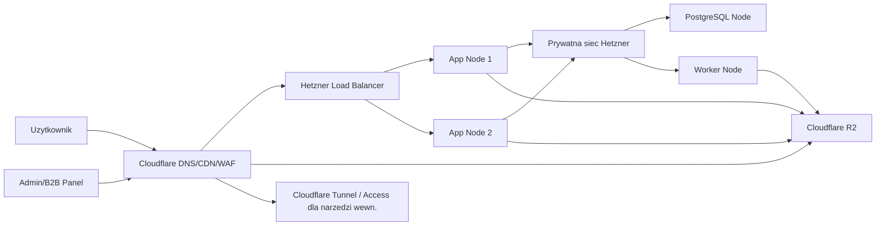

# Infrastruktura V2: od MVP do Enterprise/B2B

## 1. Cel dokumentu

Ten dokument opisuje wersje `v2`, czyli architekture po udanym MVP, gdy produkt:

- ma juz prawdziwy ruch,
- zarabia albo ma jasna trakcje,
- wchodzi w segment B2B,
- obsluguje szkoly jazdy, floty szkoleniowe albo partnerow,
- potrzebuje wiekszej niezawodnosci, kontroli dostepu, audytu i skalowalnosci.

To nie jest "rewolucja po MVP". To ma byc kontrolowana ewolucja:

- bez przepisywania wszystkiego od zera,
- bez przeskakiwania od jednego VPS do przesadnego enterprise theatre,
- bez palenia budzetu zanim wymagania B2B stana sie realne.

## 2. Zasada przewodnia V2

Najwazniejsza zasada:

- nie robimy mikroserwisow tylko dlatego, ze brzmi to enterprise.

Wersja `v2` powinna pozostac:

- modularnym monolitem na warstwie aplikacyjnej,
- z wydzielonym workerem i osobna baza,
- z load balancerem,
- z prywatna siecia,
- z mocniejsza warstwa bezpieczenstwa i audytu.

Czyli:

- prostota MVP zostaje,
- najwieksze ryzyka sa izolowane,
- architektura dojrzewa tam, gdzie to naprawde potrzebne.

## 3. Co zostaje z MVP, a co sie zmienia

## 3.1. Co zostaje

Te elementy sa dobre i nie warto ich ruszac bez potrzeby:

- Cloudflare przed aplikacja,
- R2 jako storage mediow,
- `Laravel + Inertia + Vue` jako glowna warstwa aplikacyjna,
- `Filament` jako baza pod backoffice i operacje administracyjne,
- media poza baza i poza lokalnym dyskiem serwera,
- preprocessing assetow przed uploadem,
- nazwy plikow z hashem,
- dlugi cache dla publicznych assetow,
- PostgreSQL jako glowna baza,
- prosty model aplikacyjny bez rozbijania wszystkiego na osobne uslugi.

## 3.2. Co sie zmienia

W V2 dokladamy:

- wiecej niz jeden serwer aplikacyjny,
- load balancer,
- prywatna siec miedzy komponentami,
- osobny host bazy,
- osobny worker do zadan asynchronicznych,
- lepsze logowanie, monitoring i audit trail,
- model wieloorganizacyjny,
- bardziej formalne role i uprawnienia,
- sciezke pod SSO i white-label.

## 4. Wymagania biznesowe dla V2

V2 musi umiec obsluzyc nie tylko pojedynczego uzytkownika koncowego, ale tez organizacje.

Minimalny zestaw wymagan B2B:

- konto organizacji,
- wielu uzytkownikow w organizacji,
- role i uprawnienia,
- zapraszanie uzytkownikow,
- raporty postepow,
- dashboard dla instruktora/managera,
- eksport danych,
- podstawowy audit log,
- sensowna izolacja danych miedzy organizacjami,
- wyzsza dostepnosc niz w MVP.

Rozszerzony zestaw enterprise:

- SSO,
- SCIM lub podobna automatyzacja provisioningowa,
- white-label,
- wiele lokalizacji / oddzialow,
- polityki retencji danych,
- umowy SLA,
- rozliczalnosc operacji administracyjnych,
- granularne role,
- kontrola domen i branding per tenant.

## 5. Docelowa topologia V2



## 6. Co oznacza V2 w praktyce

Minimalna architektura `v2.0`:

- `2x app node`,
- `1x db node`,
- `1x worker` albo worker wspoldzielony z jednym app node na samym poczatku,
- `1x load balancer`,
- prywatna siec miedzy serwerami,
- media nadal w R2,
- Cloudflare nadal przed wszystkim.

Wersja `v2.1`:

- osobny worker,
- read replica albo reporting replica, jesli raportowanie zaczyna dusic baze glowna,
- prosty job queue layer,
- osobny audit stream.

Wersja `v2.2`:

- pelny podzial ruchu B2C i B2B,
- narzedzia administracyjne za Cloudflare Access/Tunnel,
- per-tenant custom domains i branding,
- SSO dla wybranych klientow,
- segmentacja danych bardziej zaawansowana niz samo `tenant_id`.

## 7. Rekomendowana ewolucja infrastruktury

## 7.1. Etap V2.0

Najpierw skalujemy tylko to, co boli:

- frontend/API z jednego VPS na dwa app nody,
- baze przenosimy na osobny host,
- ruch rozdzielamy przez load balancer,
- wszystko spinamy prywatna siecia.

To rozwiazuje:

- single point of failure na warstwie app,
- konkurencje o RAM i CPU miedzy app i baza,
- trudnosci z rolling deploy,
- slaba dostepnosc przy restartach aplikacji.

## 7.2. Etap V2.1

Jesli rosną zadania asynchroniczne:

- importy,
- masowe maile,
- eksporty raportow,
- agregacje analityczne,
- przeliczenia rankingow i readiness,

to wydzielamy worker.

## 7.3. Etap V2.2

Jesli rosną klienci B2B i wymagania formalne:

- dodajemy audit log per organizacja,
- dodajemy SSO,
- dodajemy mocniejsze role,
- rozdzielamy admin tools od public app,
- przygotowujemy model white-label.

## 8. Load balancer i prywatna siec

Hetzner dokumentuje:

- cloud load balancers,
- prywatne sieci miedzy serwerami,
- mozliwosc polaczenia cloud i dedicated przez `vSwitch`.

To jest bardzo dobra sciezka wzrostu, bo pozwala:

- zostawic app nody w Hetzner Cloud,
- baze postawic docelowo na mocniejszej maszynie,
- odizolowac DB od publicznego Internetu,
- rosnac etapami bez zmiany calego dostawcy.

Zrodla:

- https://docs.hetzner.com/cloud/load-balancers/overview
- https://docs.hetzner.com/cloud/networks/connect-dedi-vswitch/

## 9. Rola Cloudflare w V2

Cloudflare nie znika po MVP. Przeciwnie, staje sie wazniejszy.

W V2 Cloudflare odpowiada za:

- DNS,
- cache dla mediow,
- osloniecie originu,
- podstawowa warstwe security edge,
- ewentualnie Access/Tunnel dla narzedzi wewnetrznych.

Cloudflare Tunnel jest outbound-only i pozwala wystawic wewnetrzne narzedzia bez otwierania wszystkiego publicznie.

Zrodla:

- https://developers.cloudflare.com/tunnel/
- https://developers.cloudflare.com/cloudflare-one/connections/connect-networks/private-net/cloudflared/index

## 10. Multi-tenancy: jak wejsc w B2B bez zabicia systemu

## 10.1. Model startowy dla V2

Najlepszy model na poczatek B2B:

- jedna baza,
- wspolne tabele,
- `tenant_id` / `organization_id` w danych biznesowych,
- bardzo restrykcyjna autoryzacja na poziomie aplikacji i zapytan,
- opcjonalnie dodatkowe polityki row-level.

Ten model daje:

- niski koszt,
- latwiejsze migracje,
- prostszy reporting,
- brak eksplozji liczby baz lub schematow.

## 10.2. Kiedy nie wystarczy samo `tenant_id`

Ten model przestaje wystarczac, gdy:

- duzy klient wymaga izolacji danych mocniejszej niz logiczna,
- potrzebne sa rozne polityki retencji,
- klienci maja bardzo rozne obciazenia,
- reporting jednego klienta szkodzi reszcie,
- pojawia sie wymog dedykowanej bazy albo osobnego regionu.

Wtedy przechodzimy do modelu:

- wspolna aplikacja,
- ale wybrane duze tenanty maja osobne bazy albo osobne schematy.

Nie robimy tego od poczatku bez realnej potrzeby.

## 11. RBAC i model organizacji

> **Uwaga OSK V2.12 (2026-08-24):** ten rozdział opisuje ogólną przyszłą
> architekturę B2B. Dla implementacji modułu OSK obowiązują dokumenty w
> [docs/osk/](./osk/README.md), w tym canonical encja `OrganizationUser` i
> tabela `organization_users`. Poniższe `organization_members` pozostaje
> historycznym przykładem ogólnego B2B i nie jest kontraktem dla OSK.

Minimalne role w V2:

- `platform_admin`
- `organization_owner`
- `organization_admin`
- `instructor`
- `manager/report_viewer`
- `student`

Minimalne obiekty domenowe:

- `organizations`
- `organization_members`
- `organization_invites`
- `organization_settings`
- `organization_brands`
- `audit_logs`

Role musza byc explicite modelowane. Nie wystarczy juz zwykly `user.role`.

## 12. White-label i branding

Nie zaczynamy od pelnego white-label.

Faza 1:

- logo per organizacja,
- kolory per organizacja,
- nazwa organizacji,
- raporty z brandingiem,
- subdomena organizacji.

Faza 2:

- custom domain,
- dedykowany login page,
- per-tenant email branding,
- polityki dostepu per tenant.

Wniosek:

- branding najpierw w danych,
- dopiero pozniej w infrastrukturze domenowej.

## 13. Dane i bazy

## 13.1. Podzial logiczny

W V2 baza powinna rozdzielac przynajmniej:

- dane krytyczne transakcyjnie,
- eventy i logi,
- audit trail,
- agregaty raportowe.

Nie musza to byc od razu cztery rozne bazy. Na poczatek wystarczy:

- jedna baza glowna,
- ale z jasnym podzialem tabel i retencja.

## 13.2. Read-heavy analytics

Jesli dashboardy B2B i raporty zaczna byc ciezkie:

- nie katujemy glownej bazy ciaglymi zapytaniami analitycznymi,
- wprowadzamy materializowane widoki, snapshoty albo replike do odczytu.

Najpierw:

- nightly rollups,
- tabele agregatow,
- precomputed stats.

Pozniej:

- read replica,
- osobny reporting DB.

## 13.3. Queue

Na MVP nie chcielismy osobnego queue systemu.

W V2 nadal nie trzeba od razu stawiac czegos ciezkiego.

Sciezka:

1. `Laravel database queue` i statusy zadan,
2. osobny worker,
3. dopiero pozniej osobny broker/Valkey, jesli concurrency i opoznienia tego wymagaja.

## 14. Media w V2

Najwazniejsza rzecz:

- media nadal zostaja poza aplikacja i poza baza.

To sie nie zmienia.

Zmienia sie tylko to, ze:

- pojawia sie wiecej wariantow assetow,
- pojawiaja sie polityki per tenant,
- pojawiaja sie raporty i eksporty,
- moze pojawic sie potrzeba mocniejszego pipeline'u ingestowego.

## 14.1. Co zostaje bez zmian

- R2 jako object storage,
- hashowane nazwy plikow,
- custom domain dla assetow,
- dlugi cache,
- preprocessing przed uploadem.

## 14.2. Co dochodzi

- osobna sciezka dla assetow organizacyjnych,
- osobna sciezka dla eksportow i raportow,
- polityki retencji dla plikow generowanych tymczasowo,
- mocniejsze ograniczenia typow i rozmiarow plikow uploadowanych przez adminow.

Przykladowy namespace:

```text
media/public/questions/...
media/public/org-branding/{org_id}/...
media/private/exports/{org_id}/...
media/private/imports/{org_id}/...
backups/postgres/...
```

## 15. Bezpieczenstwo V2

W V2 bezpieczenstwo przestaje byc tylko "zeby serwer nie padl".

Dochodzi:

- segmentacja public/private,
- audyt operacji administracyjnych,
- mniejsza ekspozycja narzedzi wewnetrznych,
- zasada least privilege,
- osobne sekrety per srodowisko,
- rotacja kluczy i tokenow,
- mocniejsza kontrola dostepu pracownikow i partnerow.

Minimalna polityka:

- publiczny ruch tylko przez Cloudflare i load balancer,
- DB tylko w prywatnej sieci,
- worker tylko w prywatnej sieci,
- panel administracyjny albo narzedzia operacyjne za Access/Tunnel,
- backupy szyfrowane i testowany restore.

## 16. Audit log

Audit log w V2 jest obowiazkowy dla B2B.

Musimy logowac co najmniej:

- kto zaprosil usera,
- kto zmienil role,
- kto usunal lub ukryl pytanie,
- kto zmienil branding organizacji,
- kto wygenerowal eksport,
- kto wykonal operacje administracyjne na danych.

Audit log powinien byc:

- append-only logicznie,
- filtrowalny po `organization_id`,
- dostepny dla uprawnionych rol,
- z retencja zgodna z polityka firmy.

## 17. SSO i tozsamosc

Nie wdrazamy SSO na sile w dniu 1 po MVP.

Ale architektura musi byc gotowa na:

- organizacje,
- domain ownership,
- federacje tozsamosci,
- mapowanie grup/rol.

W praktyce oznacza to, ze model danych i onboarding organizacji nie moze zakladac, ze kazdy user zawsze loguje sie tylko mailem i haslem.

## 18. White-label i custom domains

Nie robimy od razu pelnego SaaS white-label dla wszystkich.

Najpierw:

- `tenant branding`,
- subdomeny,
- raporty z logo.

Potem:

- custom domains dla wybranych klientow,
- osobne polityki cookies/sesji,
- osobne ustawienia komunikacji i brand assets.

## 19. Operacyjna niezawodnosc

W V2 chcemy osiagnac:

- bezpieczny rolling deploy,
- restart pojedynczego noda bez zrzucania calej aplikacji,
- odtworzenie bazy z backupu w przewidywalnym czasie,
- degradacje kontrolowana, a nie losowa.

To oznacza:

- min. dwa app nody,
- load balancer z health checks,
- backup + restore drill,
- worker restartowalny niezaleznie od appki.

## 20. Volumes i storage blokowy

Hetzner Volumes moga byc uzyte jako rozszerzenie pojemnosci, ale trzeba pamietac:

- to block storage, nie object storage,
- backupy i snapshoty serwera nie obejmuja danych z wolumenow,
- wolumeny sa przydatne na dane aplikacyjne lub rozszerzenie pojemnosci, ale nie rozwiazuja same z siebie kwestii backupow.

Wniosek:

- Volumes sa dodatkiem,
- R2 zostaje glownym storage dla mediow,
- backup bazy dalej musi byc niezalezny.

Zrodlo:

- https://docs.hetzner.com/de/cloud/volumes/overview/

## 21. Rekomendowany podzial hostow w V2

### App nodes

Odpowiadaja za:

- frontend,
- API,
- auth/session layer,
- odczyt danych,
- lekkie operacje synchroniczne.

### DB node

Odpowiada za:

- glowna baze,
- backup metadata,
- ewentualne repliki w kolejnym kroku.

### Worker node

Odpowiada za:

- `Laravel queue worker`,
- importy,
- eksporty,
- agregacje,
- kolejki,
- masowe zadania administracyjne,
- generacje raportow.

### Optional internal tools node

Dopiero pozniej, jesli to potrzebne:

- wewnetrzne narzedzia support/ops,
- admin tasks,
- maintenance endpoints.

## 22. Co celowo nadal nie trafia do V2

Nawet w V2 nadal unikamy, jesli nie ma twardej potrzeby:

- pełnego microservices zoo,
- Kubernetesa,
- service mesha,
- event busa na kazda okazje,
- osobnego search cluster,
- osobnego data lake tylko dlatego, ze "enterprise".

Kazdy z tych elementow moze kiedys byc uzasadniony. Ale nie jako odruch po pierwszym sukcesie.

## 23. Plan migracji z MVP do V2

Migracja nie powinna byc jednorazowym wielkim przepisaniem.

### Krok 1

- oddzielic baze od appki,
- uruchomic prywatna siec,
- zachowac jedna aplikacje.

### Krok 2

- dodac drugi app node,
- postawic load balancer,
- wdrozyc rolling deploy.

### Krok 3

- wydzielic worker,
- przeniesc importy i eksporty poza app requests.

### Krok 4

- wprowadzic `organizations`, `organization_members`, `audit_logs`,
- przygotowac role i invitations.

### Krok 5

- odpalic panel B2B,
- dodac raporty,
- zrobic pierwszy tenant-branded rollout.

### Krok 6

- dopiero po realnych wymaganiach dorobic SSO, custom domains, mocniejsza izolacje.

## 24. Granice, po ktorych trzeba przejsc dalej niz V2

V2 przestaje wystarczac, gdy:

- mamy bardzo duzych klientów z twardymi wymogami izolacji,
- raportowanie ma osobne duze obciazenie,
- compliance wymaga osobnych domen, polityk i regionow,
- czasy odtworzenia lub czasy odpowiedzi sa nieakceptowalne,
- wolumen danych i tenantow przestaje miescic sie komfortowo w jednej glownej bazie.

Wtedy kolejnym krokiem nie jest "jeszcze troche patchowania", tylko:

- silniejszy podzial tenantow,
- osobne bazy dla wybranych klientów,
- oddzielne warstwy odczytu/raportowania,
- bardziej formalny platform engineering.

## 25. Finalna rekomendacja

Jesli MVP odniesie sukces, to najlepsza `v2` nie polega na zmianie calej technologii. Najlepsza `v2` to:

- zostawic Cloudflare i R2,
- zostawic model preprocessing assetow,
- zostawic modularny monolit,
- dodac load balancer i drugi app node,
- wydzielic baze na osobny host,
- wydzielic worker,
- wprowadzic multi-tenancy, audit log i RBAC,
- schowac narzedzia wewnetrzne za Cloudflare Access/Tunnel,
- wejsc w B2B etapami, nie "na raz".

To daje architekture, ktora:

- jest duzo bardziej enterprise niz MVP,
- nadal jest kosztowo racjonalna,
- nie wymaga przepisywania wszystkiego,
- daje dobra droge do obslugi realnych klientow biznesowych.

## 26. Zrodla

- Hetzner Load Balancers overview: https://docs.hetzner.com/cloud/load-balancers/overview
- Hetzner Networks + dedicated vSwitch: https://docs.hetzner.com/cloud/networks/connect-dedi-vswitch/
- Hetzner Volumes overview: https://docs.hetzner.com/de/cloud/volumes/overview/
- Cloudflare Tunnel overview: https://developers.cloudflare.com/tunnel/
- Cloudflare Tunnel private networking: https://developers.cloudflare.com/cloudflare-one/connections/connect-networks/private-net/cloudflared/index
- Cloudflare R2 pricing: https://developers.cloudflare.com/r2/pricing/
- Cloudflare cache with R2: https://developers.cloudflare.com/cache/interaction-cloudflare-products/r2/
