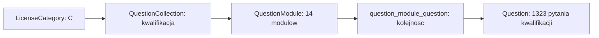
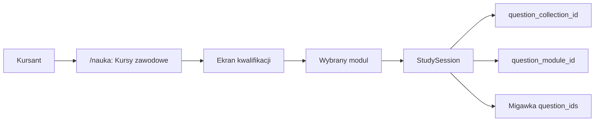

# Kwalifikacja wstepna przyspieszona - plan bezpiecznego odseparowania kursu

**Status dokumentu:** Etap 6 zostal bezpiecznie wdrozony na produkcji, a kurs
jest wlaczony jako kontrolowany pilot dla osob z aktywnym dostepem do produktu.
Schemat, kod, historyczny backfill, widok kursanta oraz kluczowy przeplyw
odpowiedzi zostaly zweryfikowane bez modyfikowania danych konta administratora.
**Ostatnia aktualizacja:** 2026-08-20
**Obszar:** `/nauka`, sesje nauki, postep, analityka, dostep oraz kolekcje pytan

## 1. Cel

Udostepnic kursantom program **Kwalifikacja wstepna przyspieszona - kat. C** jako
odrebny kurs w `/nauka`.

Kurs ma pokazywac i uruchamiac **wylacznie** pytania przypisane do tej kolekcji.
Nie moze mieszac sie z oficjalnym kursem prawa jazdy kategorii C, jego egzaminami,
mapa dzialow, lista bledow, powtorkami ani analityka.

To ma byc osobny program nauki dla kursanta, a nie kolejny tryb `Zen`, `Egzamin`
czy `Trener pamieci`.

## 2. Uzgodnione decyzje

| Decyzja | Status | Uzgodniony kierunek |
|---|---:|---|
| Model produktu | Zrobione | Kwalifikacja jest osobnym kursem, nie sztuczna kategoria prawa jazdy. |
| Zakres pytan | Zrobione | Kurs korzysta wylacznie z pytan przypietych do kolekcji i jej modulow. |
| Kategoria C | Zrobione | Zwykla nauka C pozostaje bez zmian i nie dostaje pytan kwalifikacji. |
| Miejsce w UI | Zrobione | Lewy panel `/nauka`, pod trybami, w osobnej sekcji `Kursy zawodowe`. |
| Zachowanie po kliknieciu | Zrobione | Glowny obszar zamiast mapy prawa jazdy pokazuje mape/liste modulow kwalifikacji. |
| Panel administratora | Zrobione | Sterowanie jest w lewym menu Filamenta: `Kursy zawodowe` pod `/admin/kursy-zawodowe`. Dawny adres `/admin/kolekcje-pytan` przekierowuje tam dla zgodnosci. |
| Dostep handlowy | Zrobione | Kurs jest dostepny dla uzytkownikow z aktywnym obecnym dostepem do produktu tylko wtedy, gdy administrator wlaczy go globalnym przelacznikiem. |

### 2.1. Przelacznik dostepnosci kursu

Dodamy pole `is_available_to_learners` do `question_collections`, domyslnie
`false`. Jest to jedyne zrodlo prawdy dla globalnej decyzji administratora o
udostepnieniu kursu kursantom.

Importer katalogu nie moze ustawic ani zmienic tego pola. Dostepnosc dla
kursantow zmienia wylacznie administrator przez dedykowana akcje w panelu
administracyjnym.

- przelacznik jest w strefie administratora Filament, w zakladce `Kursy zawodowe`
  pod `/admin/kursy-zawodowe`, przy konkretnej kolekcji;
- zmienic go moze tylko administrator, a zmiana trafi do dziennika audytu;
- kursant widzi kurs tylko, gdy jednoczesnie ma aktywny dostep do obecnego
  produktu, kolekcja jest technicznie aktywna, a przelacznik ma wartosc `true`;
- przy wartosci `false` kurs znika z `/nauka`, endpoint startu i wznowienie
  sesji sa blokowane bez ujawniania danych kolekcji;
- wylaczenie ma natychmiast ukryc rowniez aktywna sesje kursu na stronie i w
  `GET /api/v1/me/learning-home`; nie moze pozostac kafel `Wznow`;
- blokada obejmuje wszystkie endpointy sesji: web, `current`, pobieranie pytan,
  zapis odpowiedzi, zakonczenie i wynik przez API;
- istniejace odpowiedzi, postep i sesje nie sa kasowane. Po ponownym wlaczeniu
  kursant moze bezpiecznie wrocic do zachowanej sesji;
- administrator nadal ma dostep do obecnego podgladu roboczego, takze gdy kurs
  jest wylaczony dla kursantow;
- `is_active` pozostaje flaga techniczna kolekcji, a `is_public` nie zmienia
  sie i nie sluzy do kontroli dostepu kursanta.

## 3. Stan obecny potwierdzony w audycie

### 3.1 Dane produkcyjne

Na produkcji istnieje jedna kolekcja:

- nazwa: `Kwalifikacja wstepna przyspieszona - kat. C`,
- kod: `qualification-c-accelerated`,
- typ: `professional_qualification`,
- zrodlo: `testynaprawojazdy.eu`,
- status: niepubliczna, wersja robocza,
- modulow: 14,
- pytan przypisanych do modulow: 1323.

Moduly maja ustalona kolejnosc oraz zgodna liczbe pytan oczekiwanych i faktycznie
widocznych w panelu administratora.

### 3.2 Model danych



Kluczowe elementy:

| Odpowiedzialnosc | Plik | Stan |
|---|---|---|
| Kolekcja | `app/Models/QuestionCollection.php` | Gotowy model z kodem, slugiem, widocznoscia i kolejnoscia. |
| Modul | `app/Models/QuestionModule.php` | Gotowy model z pozycjami pytan w pivot. |
| Schemat | `database/migrations/2026_07_30_170000_create_question_collections_and_modules_tables.php` | Kolekcje, moduly i uporzadkowane przypisania juz istnieja. |
| Import | `app/Support/QuestionCatalogImporter.php` | Idempotentnie tworzy kolekcje, moduly i zachowuje kolejnosc. |
| Panel admina | `app/Filament/Pages/ProfessionalCourses.php` | Lewa nawigacja Filamenta oraz zarzadzanie dostepnoscia kursow zawodowych. |
| Zgodnosc panelu | `app/Http/Controllers/AdminQuestionCollectionPreviewController.php` | Dawny adres przekierowuje do Filamenta; kontroler zachowuje uruchomienie pojedynczego modulu i zapis zmiany dostepnosci. |

### 3.3 Obecne uruchamianie sesji

`StudySessionManager::startQuestionModule()` uruchamia pojedynczy modul na
istniejacym silniku sesji. Przechowuje liste pytan w migawce sesji i wpisuje
do `payload.context` typ `question_module` oraz identyfikatory kolekcji i modulu.

To jest bezpieczny adapter roboczy, ale nie jest jeszcze gotowym przeplywem dla
kursanta, poniewaz:

- trasa startowa wymaga roli administratora,
- powrot z sesji prowadzi do `/admin/kolekcje-pytan`,
- sesja jest technicznie przypieta do kategorii C,
- dashboard nazywa ja zwykla nauka lub `Zen mode`,
- nie ma kursowego widoku 14 modulow ani postepu per modul.

### 3.4 Obecny ekran `/nauka`

Na produkcji `/nauka` zawiera:

- lewy panel trybow: Nauka klasyczna, Zen mode, Trener pamieci, Egzamin,
- glowna mape dzialow obecnego kursu prawa jazdy,
- brak selektora kategorii prawa jazdy na tym ekranie.

Wniosek: kwalifikacji nie dodajemy do mapy obecnego kursu i nie doklejamy jej do
trybow nauki. Dostaje osobna sekcje `Kursy zawodowe` w lewym panelu.

## 4. Dlaczego nie tworzymy nowej `LicenseCategory`

Model `LicenseCategory` oznacza oficjalna kategorie prawa jazdy. Jest uzywany przez:

- profil kursanta i jego zablokowany wybor kategorii,
- rejestracje,
- filtrowanie oficjalnych pytan i egzaminow,
- mape dzialow prawa jazdy,
- strony analityczne i API mobilne.

Dodanie do niego sztucznego kodu typu `KWP-C` ryzykowaloby zmiane znaczenia tych
mechanizmow. Natomiast istniejacy `QuestionCollection` jest wlasnie odpowiednim
modelem kursu specjalistycznego.

Docelowo kursant ma widziec kwalifikacje jako osobny program nauki, ale warstwa
danych zachowa powiazanie z C tylko jako techniczna informacje o kontekscie kursu.

## 5. Granice, ktorych nie wolno naruszyc

1. **Nie zmieniac `is_active` pytan kwalifikacji na `true`.**
   Zwykle zapytania dla kategorii C pobieraja aktywne pytania gotowe do dostarczenia.
   Aktywacja wprowadzilaby pytania kwalifikacji do normalnej nauki, egzaminu i mapy C.

2. **Nie kopiowac pytan do nowej tabeli ani nie przepinac ich z kategorii C.**
   Istniejace przypisanie do kolekcji i modulu jest zrodlem prawdy oraz zachowuje media,
   wyjasnienia, identyfikatory i kolejnosc importu.

3. **Nie wykorzystywac `is_public` ani `is_active` jako przelacznika kursanta.**
   Publicznosc i stan techniczny kolekcji maja inne znaczenie. Dostep kursanta
   kontroluje wylacznie `is_available_to_learners`, ustawiane przez administratora.

4. **Nie liczyc kwalifikacji w analityce kategorii C.**
   Wszystkie zapytania o progres i odpowiedzi musza rozroznic sesje zwykle od
   sesji kolekcji.

5. **Nie udostepniac kontroli kursu w publicznej nawigacji.**
   Sterowanie dostepnoscia nalezy do Filamenta; dawny adres administratora moze
   pozostac tylko przekierowaniem zgodnosciowym.

## 6. Wykryte zaleznosci i ryzyka

| Obszar | Obecne zachowanie | Ryzyko przy publikacji | Wymagane dzialanie |
|---|---|---|---|
| Zwykla sesja | Wymaga `license_category_id` | Nie umie wskazac kolekcji jako zrodla pytan | Dodac osobny start kolekcji, nie zmieniac kontraktu zwyklej sesji. |
| Sesja kolekcji | Kontekst jest tylko w JSON `payload` | Trudne, wolne i niepewne filtrowanie analityki | Dodac relacyjne pola kolekcji i modulu do `study_sessions`. |
| Analityka C | Filtruje odpowiedzi po kategorii pytania | Odpowiedzi kwalifikacji moga zawyzac wynik C | Wykluczyc sesje kolekcji z analityki C. |
| Postep pytania | `user_question_progress` jest per pytanie | Dane sa wspolne technicznie, ale potrzebuja kursowego odczytu | W kolekcji liczyc postep przez czlonkostwo w module, nie przez mape C. |
| Lista bledow | Ignoruje pytania nieaktywne | Bledy kwalifikacji nie pokazuja sie w zwyklej liscie | Zaprojektowac osobna liste bledow/powtorek kursu albo swiadomie odlozyc te funkcje. |
| Trener pamieci | Pobiera tylko aktywne pytania kategorii | Nie obejmie kwalifikacji | Nie wlaczac go automatycznie do kwalifikacji w pierwszym wydaniu. |
| Egzamin | Buduje zestaw 20 + 12 z oficjalnych pytan | Nie odpowiada strukturze kwalifikacji | Nie udostepniac zwyklego egzaminu dla kwalifikacji bez osobnych zasad. |
| API mobilne | Przyjmuje tylko kategorie prawa jazdy | Nie obsluzy kolekcji | Dodac pozniej osobne, addytywne endpointy; nie zmieniac obecnego API. |
| Dostep | `ProductAccessGrant` jest globalny | Kurs nie moze byc wlaczony samym zakupem bez decyzji administratora | Wymagac jednoczesnie aktywnego dostepu produktu i `is_available_to_learners = true`. |

## 7. Docelowy UX desktop

### 7.1 Wejscie w kurs

Lewy panel `/nauka` zostaje podzielony wizualnie na dwie sekcje:

```text
TRYBY NAUKI
Nauka klasyczna
Zen mode
Trener pamieci
Egzamin

KURSY ZAWODOWE
Kwalifikacja wstepna
kat. C
```

W stanie zwinietym panelu kurs pokazuje tylko wyrazista ikone kursu zawodowego.
Po najechaniu kursorem panel rozwija sie tak samo jak obecne menu i ujawnia nazwe.

### 7.2 Ekran kwalifikacji

Po kliknieciu pozycji kursowej:

- glowny obszar przestaje pokazywac 31 dzialow prawa jazdy,
- wyswietla sciezke 14 modulow kwalifikacji,
- modul pokazuje liczbe pytan, stan przerobienia oraz wznowienie ostatniej sesji,
- rozpoczecie modulu pobiera tylko uporzadkowane pytania z `question_module_question`,
- powrot z sesji prowadzi do ekranu kwalifikacji, nie do administratora.

### 7.3 Pierwsze wydanie funkcjonalne

Pierwsze wydanie obejmuje:

- nauke modul po module,
- kolejnosc z importu,
- poprawna odpowiedz, wyjasnienia, media i obecny odtwarzacz pytan,
- postep modulu,
- wznowienie aktywnej sesji,
- oddzielne podsumowanie kursu.

Pierwsze wydanie celowo nie wlacza automatycznie:

- egzaminu 32 pytan,
- Trenera pamieci,
- globalnej listy bledow,
- rankingu,
- API mobilnego.

Kazdy z tych elementow wymaga osobnej definicji kursowej i osobnego testu.

## 8. Docelowy model sesji

Do tabeli `study_sessions` nalezy dodac nullable relacje:

- `question_collection_id`,
- `question_module_id`.

Zwykla sesja prawa jazdy ma oba pola `NULL`. Sesja kwalifikacji zapisuje oba pola
oraz pozostawia `license_category_id = C` jako techniczny kontekst. JSON `payload`
pozostaje migawka interfejsu i listy pytan, ale nie jest jedynym zrodlem relacji.



To umozliwi bezpieczne filtrowanie analityki, danych historycznych i aktywnych sesji
bez parsowania JSON w kazdym zapytaniu.

## 9. Plan wdrozenia

### Etap 0 - decyzje i preflight danych

- [x] Potwierdzic, ze kurs jest odseparowany od zwyklej kategorii C.
- [x] Potwierdzic miejsce w desktopowym UI: lewy panel, sekcja `Kursy zawodowe`.
- [x] Ustalic model dostepu: obecny pelny produkt oraz globalny przelacznik
  administratora `is_available_to_learners`, domyslnie wylaczony.
- [x] Wykonac raport danych: liczba unikalnych pytan, powtorzenia miedzy modulami,
  brakujace media, `delivery_issue`, odpowiedzi i poprawne warianty.
- [x] Zarchiwizowac raport przed pierwsza migracja.

### Etap 1 - fundament danych i autoryzacji

- [x] Dodac pola relacyjne kolekcji i modulu do `study_sessions` wraz z indeksami.
- [x] Dodac `is_available_to_learners` z domyslnym `false` do kolekcji.
- [x] Dodac administratorski przelacznik i wpis do dziennika audytu.
- [x] Dodac `QuestionCollectionAccessService` oraz polityke wymagajaca pelnego
  dostepu do produktu i wlaczonego kursu.
- [x] Ta sama usluga ma chronic aktywna sesje w webie, dashboardzie i wszystkich
  ogolnych endpointach API sesji, nie tylko nowy endpoint startu kursu.
- [x] Dodac testy: kurs wylaczony, kurs wlaczony, brak dostepu produktu,
  modul nieaktywny, modul z innej kolekcji oraz wylaczenie kursu w trakcie
  aktywnej sesji. Bezposrednie adresy kursanta zostana dodane i przetestowane
  w etapie 2 wraz z nowymi trasami.
- [x] Zachowac dzialanie administratora, a dawny adres kolekcji przekierowac do
  dedykowanej zakladki Filamenta.

### Etap 2 - bezpieczny start i sesja kursu

- [x] Wydzielic uruchamianie kursowego modulu z adaptera administratora.
- [x] Dodac osobne trasy kursanta dla ekranu kolekcji i startu modulu.
- [x] Zapisywac relacyjne identyfikatory kolekcji/modulu oraz migawke `question_ids`.
- [x] Zmienic tytul sesji, kontekst i adres powrotu na kursowe.
- [x] Zachowac zasade jednej aktywnej sesji, z czytelnym potwierdzeniem zastapienia.

### Etap 3 - ekran `/nauka`

- [x] Dodac sekcje `Kursy zawodowe` do rozwinietego lewego panelu.
- [x] W stanie zwinietym pokazac sama ikone kursu z prawidlowym opisem dostepnosci.
- [x] Po kliknieciu podmieniac glowny obszar na widok kolekcji, bez mieszania z mapa C.
- [x] Zbudowac liste 14 modulow z kolejnoscia, liczba pytan i postepem.
- [x] Dodac stan pusty, brak dostepu i modul chwilowo niedostepny.

### Etap 4 - postep i analityka

- [x] Dodac `QuestionCollectionProgressService` liczacy postep przez przypisania modulow.
- [x] Oddzielic podsumowanie kursu i modulow od dashboardu kategorii C.
- [x] Wykluczyc sesje kolekcji z `CategoryAnalyticsService` dla C.
- [x] Wykluczyc sesje kolekcji z licznikow i widokow przeznaczonych dla zwyklej C.
- [x] Ustalic zachowanie pierwszego wydania: odpowiedz kursowa zapisuje sie tylko
  w sesji i postepie kursu; nie tworzy wpisu zwyklej listy bledow, powtorek ani
  gotowosci kategorii C. Osobna lista bledow i powtorki kursowe sa zakresem etapu 5.

### Etap 5 - kursowa lista bledow i powtorki desktop

Zakres tego etapu obejmuje wylacznie web desktopowy. Mobilne API, Trener pamieci
i egzamin kwalifikacji pozostaja swiadomie odlozone na pozniej.

- [x] Dodac osobny rejestr blednych pytan powiazany z uzytkownikiem, kolekcja
  i pytaniem; nie uzywac `user_incorrect_questions`.
- [x] Po blednej odpowiedzi kursowej dodawac lub odswiezac wpis na liscie kursu.
- [x] Zachowac znane ustawienie konta automatycznego usuwania po poprawnej
  odpowiedzi, ale stosowac je do osobnego rejestru kursowego.
- [x] Dodac ekran `Pytania do poprawy` wewnatrz wybranej kolekcji oraz mozliwosc
  recznego usuniecia wpisu.
- [x] Uruchamiac osobna sesje `Powtorz pytania` z aktywnych wpisow tej kolekcji,
  takze gdy pochodza z wielu modulow.
- [x] Utrzymac granice: sesja powtorki kursu nie zasila mapy, analityki, egzaminu,
  zwyklej listy bledow, gotowosci ani Trenera pamieci kategorii C.
- [x] Dodac testy zapisu, poprawnej odpowiedzi, recznego usuniecia, autoryzacji,
  wielu modulow i postepu po sesji powtorkowej.

**Odlozone poza biezacy zakres:**

- addytywne endpointy kursu dla aplikacji mobilnej; nie zmieniac kontraktu
  obecnego `POST /api/v1/sessions`,
- kursowy Trener pamieci,
- kursowy egzamin kwalifikacji.

### Etap 6 - rollout

- [x] Wdrozyc addytywne migracje z domyslnie wylaczona widocznoscia kursu dla
  kursantow. Produkcja: 2026-08-20; wykonano swiezy backup bazy, migracje
  `2026_08_19_130000` i `2026_08_19_170000`, a nastepnie prawidlowy smoke test.
- [x] Zintegrowac i wdrozyc kod kursu wzgledem aktualnego kodu produkcyjnego,
  nadal z widocznoscia kursu wylaczona dla kursantow. Integracja stagingowa
  zachowuje produkcyjny wyglad mapy i bocznego panelu, dodajac tylko sekcje
  `Kursy zawodowe` oraz widok modulow.
- [x] Dodac kontrolowany backfill relacji dla istniejacych sesji administratora.
  Komenda `questions:backfill-collection-session-context` domyslnie wykonuje
  tylko odczytowy podglad. `--apply` zapisuje dane wyłącznie po czystym,
  kompletnym raporcie; wymaga zgodnych identyfikatorow kolekcji, modulu i
  pytan zapisanych w historycznej sesji. Rozbieznosc blokuje caly zapis.
- [x] Uzyc `nullOnDelete` dla nowych relacji sesji. Usuniecie kolekcji lub modulu
  nie moze usunac historii sesji ani odpowiedzi kursanta.
- [x] Sprawdzic raport danych, rozdzial analityki C i kursu oraz historyczny
  backfill. Produkcja: 8 jednoznacznych sesji zapisano, a ponowny podglad ma
  `ready_sessions: 0` i `blocking_sessions: 0`.
- [x] Wlaczyc kurs jako potwierdzony pilot globalny przez `Admin > Kursy zawodowe`.
  Produkcja: 2026-08-20. Zmiana jest zapisana w dzienniku audytu.
- [x] Zweryfikowac dostep, widok 14 modulow, postep oraz uruchomienie modulu bez
  zapisu na koncie administratora. Test odpowiedzi w wycofywanej transakcji
  potwierdzil kursowa liste bledow i brak zapisu do zwyklej listy bledow.
- [ ] Obserwowac pierwsze rzeczywiste sesje kursantow, w tym media, wyjasnienia,
  powrot do mapy i liste pytan do poprawy.

## 10. Kryteria akceptacji

Funkcja jest gotowa dopiero, gdy wszystkie ponizsze punkty sa spelnione:

- [x] Kursant widzi osobna pozycje kursowa tylko wtedy, gdy ma do niej dostep.
- [x] Klikniecie nie uruchamia ani nie zmienia zwyklej kategorii C.
- [x] Widok kwalifikacji pokazuje dokladnie aktywne moduly nalezace do kolekcji.
- [x] Sesja modulu zawiera tylko pytania z wybranego modulu i zachowuje kolejnosc.
- [x] Zwykla nauka, egzamin i mapa C nie zawieraja zadnego pytania kwalifikacji.
- [x] Powrot z sesji i wznowienie prowadza do kursu, nie do `/admin`.
- [x] Analityka C nie liczy odpowiedzi ani sesji kwalifikacji.
- [x] Postep kwalifikacji nie zmienia licznika przerobienia ani bledow zwyklej C.
- [x] Administrator nadal moze uruchomic istniejacy podglad bez regresji.
- [x] Brak dostepu, nieaktywny modul i manipulacja URL zwracaja bezpieczna odpowiedz.
- [x] Testy web, API i build przechodza przed wdrozeniem lokalnym.

## 11. Testy wymagane przed wdrozeniem

### Backend

- dostep kursanta z uprawnieniem i bez uprawnienia,
- kolekcja ukryta, nieaktywna i aktywna,
- zgodnosc kolekcji oraz modulu w adresie startowym,
- kolejnosc pytan, brak duplikatow i migawka sesji,
- aktywna sesja oraz jej zamiana,
- klient mobilny nie odczyta, nie odpowie ani nie wznowi sesji kursu w pierwszym
  wydaniu: otrzymuje `COURSE_WEB_ONLY`, a sesja i postep pozostaja nienaruszone,
- zapis odpowiedzi i progres modulu,
- brak wplywu na C: pytania, egzamin, mapa, lista bledow i analityka,
- kompatybilnosc panelu administratora i importu manifestu.

### Frontend

- panel zwiniety i rozwiniety po najechaniu kursorem,
- widocznosc sekcji kursowej tylko dla uprawnionego kursanta,
- przejscie z mapy prawa jazdy do mapy modulow i z powrotem,
- wznowienie sesji kwalifikacji,
- stany ladowania, brak modulu, brak dostepu i blad startu,
- brak przepelnien na desktopowych szerokosciach.

### Produkcja

- backup przed migracja,
- migracja bez usuwania pytan, mediow ani dotychczasowych sesji,
- preflight danych i porownanie liczby pytan per modul,
- smoke test na koncie testowym,
- kontrola logow i zapytan analitycznych po pilocie.

#### Kolejnosc rolloutu Etapu 6

1. Utworzyc niezalezny backup produkcyjnej bazy poleceniem
   `php artisan ops:backup-db --label=qualification-course-rollout` i zachowac
   manifest jako punkt powrotu.
2. Wdrozyc commit z migracjami. Migracja ustawia
   `is_available_to_learners=false`, wiec kurs pozostaje ukryty dla kursantow.
3. Wykonac odczytowy preflight danych:
   `php artisan questions:preflight-collection qualification-c-accelerated --fail-on-errors --report=storage/app/question-collection-preflight/production-rollout.json`.
4. Wykonac wyłącznie odczytowy raport historycznych sesji:
   `php artisan questions:backfill-collection-session-context qualification-c-accelerated --report=storage/app/question-collection-backfill/production-preview.json`.
5. Jesli raport ma `blocking_sessions: 0`, uruchomic ten sam command z
   `--apply` i zapisać osobny raport. Gdy wystapi choc jedna rozbieznosc,
   komenda nie zmieni zadnego rekordu; najpierw analizujemy probki z raportu.
6. Powtorzyc podglad backfillu. Oczekiwany wynik po zapisie to
   `ready_sessions: 0` i `blocking_sessions: 0`.
7. Wykonac smoke test administracyjny oraz kursanta z aktywnym dostepem:
   lista kursu, start modulu, odpowiedz, postep modulu, lista bledow i powrot
   do zwyklej nauki C.
8. Dopiero po pozytywnym smoke tescie wlaczyc kurs w `Admin > Kursy zawodowe`.
   Zmiana pozostawia wpis audytowy i moze zostac od razu cofnięta tym samym
   przełącznikiem.

#### Weryfikacja integracji kodu przed paczka produkcyjna

Wykonano ja na odizolowanej kopii aktualnych zrodel produkcji, nie na starym
punkcie odniesienia Git. To istotne, bo produkcja zawiera pozniejsze zmiany w
sesjach i widoku `/nauka`, ktorych nie wolno zastapic starszym wariantem.

1. Zachowano obecny produkcyjny wyglad mapy oraz bocznego panelu. Dodano tylko
   niewidoczna przy pustej liscie kursow sekcje `Kursy zawodowe`, wybor kursu
   i obszar modulow.
2. Dodano `withCommands([app/Console/Commands])` w `bootstrap/app.php`.
   Bez tego Laravel nie rejestrowal komend preflightu oraz backfillu, mimo ze
   ich klasy byly obecne w katalogu aplikacji.
3. `vue-tsc && vite build` zakonczyl sie poprawnie dla zintegrowanej kopii.
4. Składnia wszystkich zmienionych plikow PHP oraz Laravel Pint dla 14 nowych
   plikow kursowych przeszly poprawnie.
5. `route:list` potwierdzil 3 trasy administracyjne i 6 tras kursanta.
6. Odczytowy preflight na lokalnej kopii danych: 14 modulow, 1323 przypisania,
   1323 unikalne pytania, 808 mediow, 0 bledow i 0 ostrzezen. Suchy backfill:
   773 sesje przeskanowane, 3 jednoznaczne sesje kursowe, 0 rozbieznosci i 0
   zapisow.

Po rolloucie uruchomiono potwierdzony pilot produkcyjny. Kod, preflight,
bezpieczny backfill i podstawowy przeplyw kursanta zostaly juz zweryfikowane;
pozostaje obserwacja pierwszych rzeczywistych sesji kursantow.

#### Wynik technicznego rolloutu produkcyjnego - 2026-08-20

1. Wdrozono paczke kodu `release-qualification-course-code-20260820121313.tar.gz`
   po porownaniu hashy 19 krytycznych plikow z aktualna produkcja. Przed
   wdrozeniem wykonano backup bazy
   `20260820-101855-prawkonarazpl-pgsql-pgsql-qualification-course-code-20260820101855.sql.gz`
   oraz kopie nadpisanych plikow w
   `/tmp/prawkonaraz-qualification-course-code-backup-20260820101855`.
2. Migracje obu tabel/relacji maja status `Ran`; nowy build Vite i manifest sa
   obecne na serwerze. `ops:smoke-test`, strona glowna i API health zwrocily
   `200`, a skan logu nie pokazal bledow kursowych.
3. Produkcyjny preflight ma `0` bledow blokujacych i `0` ostrzezen. Suchy
   backfill wykryl 8 zgodnych sesji; zapis uzupelnil wszystkie 8. Ponowny suchy
   przebieg potwierdzil `0` rekordow gotowych do zapisu oraz `0` blokad.
4. Po wyraznym potwierdzeniu administrator wlaczyl `is_available_to_learners`
   w `Admin > Kursy zawodowe`. Kurs jest dostepny dla osob z aktywnym dostepem
   do produktu, a wpis audytowy potwierdza nowa wartosc `true`.
5. Produkcyjny widok `/nauka?kurs=kwalifikacja-wstepna-przyspieszona-c` pokazal
   kurs w lewym panelu, 14 modulow i kursowy postep. Uruchomienie modulu oraz
   bledna odpowiedz sprawdzono przez prawdziwy serwis aplikacji wewnatrz
   transakcji, ktora zostala celowo wycofana. Potwierdzono utworzenie wpisu
   kursowej listy bledow, brak wpisu na zwyklej liscie oraz brak trwalej zmiany
   sesji i danych administratora.
6. Po wlaczeniu pilota ponownie wykonano `ops:smoke-test`; wszystkie piec
   kontroli przeszlo poprawnie, a strona glowna odpowiada HTTP 200.

## 12. Warunek przed pierwszym wdrozeniem

Decyzja produktowa zostala zrealizowana: kurs jest czescia obecnego pelnego
dostepu i administrator wlaczyl go globalnym przelacznikiem po kontroli
produkcyjnej. W razie potrzeby dostep mozna natychmiast wycofac tym samym
przelacznikiem w panelu administratora.

## 13. Drugi przebieg audytu - 2026-08-19

Drugi przebieg objal kod sesji, odpowiedzi, postepu, dashboardu, API, importu,
agregatow oraz istniejace testy. Nie wprowadzal zmian w aplikacji.

### 13.1. Potwierdzenia

- Obecne dane sa bezpiecznie namespacowane jako `tpj:Y:*`. Historyczny audyt
  importu potwierdza 1323 unikalne identyfikatory, 1323 pytania i 1323 relacje
  modul-pytanie. Nie ma obecnie kolizji z oficjalna baza C.
- Zwykla nauka, mapa dzialow, egzamin, lista bledow, trener pamieci i publiczna
  baza filtruje pytania przez `is_active = true`. Pytania kwalifikacji maja
  `is_active = false`, wiec nie trafiaja tam przypadkiem.
- Aktualny adapter uruchamia pytania w kolejnosci z relacji modulu, nie przez
  ogolne zapytanie kategorii C. Istniejacy test pokrywa kolejnosc, media,
  autoryzacje administratora i brak grup tematow.
- Kolekcja i moduly maja niezalezne flagi aktywnosci oraz indeksy potrzebne do
  listowania. Nie potrzeba kopiowac pytan ani zmieniac ich kategorii technicznej.

### 13.2. Nowe obowiazkowe zabezpieczenia

| Obszar | Co znaleziono | Wymagane dzialanie |
|---|---|---|
| Import | Namespacing jest dzis zapewniany przez skrypt importu, a nie twarda regula importera. | Dodac preflight: prefiks zarezerwowany dla kursu, brak kolizji z pytaniami C i brak duplikatu pytania w modulach kursu. Import ma przerwac sie przed zapisem przy bledzie. |
| Model sesji | `StudySession` przechowuje kolekcje i modul w JSON `payload`, a techniczna kategoria jest C. | Dodac nullable FK `question_collection_id` i `question_module_id`, relacje modelu oraz backfill z istniejacego kontekstu. JSON zostaje kompatybilnym opisem UI, nie zrodlem prawdy. |
| Dostep | `ProductAccessGrant` jest globalny i nie rozroznia produktu/kursu. | Dodac przelacznik `is_available_to_learners`; kurs wymaga jego wlaczenia oraz aktywnego obecnego dostepu produktu. |
| Wznowienie | `EnsureStudySessionAccess` sprawdza tylko globalny dostep produktu albo PJM. | Dodac sprawdzenie dostepu do kolekcji dla kazdej trasy sesji, takze po globalnym wylaczeniu kursu i przy bezposrednim URL. |
| Analityka C | `CategoryAnalyticsService` liczy surowe odpowiedzi i ukonczone sesje po kategorii C, bez odciecia kolekcji. | Wykluczyc sesje kolekcji z analityki C. Oddzielne statystyki kursu liczyc po FK kolekcji/modulu. |
| Gotowosc i dashboard | `UserReadinessService`, czesc `DashboardMetricsService` i zapamietywanie ostatniego trybu filtruja tylko po C. | Nie wliczac kursu do wyniku gotowosci C, licznikow C ani ostatnich ustawien mapy C. Aktywny kurs opisac nazwa kursu i modulu, nie `Zen mode - Kategoria C`. |
| Podsumowanie sesji | Web ma wyjatki dla `question_module`, ale API i niektore ogolne sciezki wywoluja zapis rekordow tematow bez jawnej blokady. | Przeniesc ochrone do centralnej uslugi: sesja kolekcji nigdy nie tworzy rekordu ukonczenia dzialu C ani porownania z sesja C. |
| Agregaty dobowe | Agregaty zapisuja dane kursu z techniczna kategoria C. Publiczne odczyty sa obecnie bezpieczne dzieki `is_active`, ale warstwa surowa miesza zakresy. | Nowy raport kursu ma filtrowac po kolekcji; raporty kategorii C nie moga uzywac odpowiedzi sesji kolekcji. Decyzje o migracji starych agregatow zapisac przed publikacja. |
| Jedna aktywna sesja | Start modulu, jak kazdy start nauki, konczy poprzednia aktywna sesje uzytkownika. | Zachowac te obecna zasade, ale przed startem pokazac ten sam komunikat o zastapieniu sesji. |

### 13.3. Doprecyzowanie danych i postepu

`user_question_progress` jest dzis kluczem `uzytkownik + pytanie`. Dla obecnej
kolekcji jest to bezpieczne, bo import potwierdzil 1323 roznych pytan i 1323
relacje modul-pytanie, czyli pytanie nie wystepuje w dwoch modulach. Przy
kolejnym kursie musimy wykonac ten sam audyt. Jezeli kiedykolwiek jedno pytanie
ma nalezec do dwoch niezaleznych programow, potrzebny bedzie osobny postep
programowy zamiast wspolnego statusu pytania.

W pierwszym wydaniu kursu zachowujemy wspolny techniczny zapis odpowiedzi i
postepu pytania, ale odczyt dla kursu ograniczamy zawsze do pytan jego modulu.
Nie wlaczamy tych danych do listy bledow, powtorek ani gotowosci kategorii C.

### 13.4. Doprecyzowanie API i interfejsu

- Zwykle `POST /api/v1/sessions` przyjmuje wylacznie `category_id`; nie wolno
  rozszerzac go parametrami modulu. Powstanie osobny endpoint startu kursu.
- Pierwsze wydanie kursu jest przeznaczone wylacznie dla webu desktopowego.
  API mobilne nie pokazuje kolekcji ani nie obsluguje jej aktywnej sesji. Gdy
  klient mobilny trafi na taka sesje rozpoczeta w webie, otrzyma jawny blad
  `COURSE_WEB_ONLY` oraz bezpieczny adres powrotu do `/nauka` w przegladarce.
  Sesja i postep pozostaja zachowane.
- Dopiero kolejne wydanie doda kursy do mobilnego payloadu i osobne,
  wersjonowane endpointy. Nie wolno zmieniac zachowania obecnego API kategorii.
- `/nauka` ma dostac tylko dane do lewego panelu `Kursy zawodowe` i widoku
  14 modulow. Mapa 31 dzialow oraz tryby klasyczne pozostaja bez zmian.
- Strona sesji ma zwracac do `/nauka` z otwartym kursem, a nie do prywatnego
  panelu administratora.

### 13.5. Dodatkowe testy wymagane przed pilotem kursantow

- nieuprawniony kursant nie widzi kolekcji, nie uruchomi modulu ani nie wznowi
  sesji przez bezposredni adres;
- uprawniony kursant widzi tylko aktywne kolekcje i moduly, uruchamia wylacznie
  pytania wybranego modulu w poprawnej kolejnosci;
- kolekcja nie zmienia licznika pytan, mapy, listy bledow, powtorek, egzaminu,
  gotowosci, analityki ani ostatniego trybu kategorii C;
- dashboard i wynik sesji pokazuja nazwe kursu oraz modulu, bez etykiety
  `Kategoria C` jako nazwy programu;
- w pierwszym wydaniu mobilne API odrzuca sesje kursu bledem
  `COURSE_WEB_ONLY`; po dodaniu dedykowanego API kursu web i mobile musza
  stosowac te same zasady dostepu przy odpowiedzi, zakonczeniu i wznowieniu;
- importer odrzuca kolizje `external_id`, powtorzone pytanie w modulach oraz
  probe aktywacji pytania kolekcji w oficjalnej bazie;
- importer nigdy nie mapuje `is_available_to_learners` i nie moze nadpisac
  decyzji administratora o dostepnosci kursu;
- migracja FK i backfill sa idempotentne, nie usuwaja sesji ani odpowiedzi;
- ponowne uruchomienie obecnych testow kategorii C, PJM, egzaminu i trenera
  pamieci nie zmienia ich wynikow.

### 13.6. Status po drugim audycie

Plan jest gotowy do implementacji. Nie ma potrzeby tworzenia nowej kategorii
prawa jazdy ani przenoszenia pytan. Przed pierwszym deploymentem wdrozimy
twarde granice dostepu, administratorski przelacznik, relacje sesji i izolacje
od analityki C w jednej serii zmian, a dopiero potem interfejs kursanta.

### 13.7. Trzeci przebieg - lifecycle przelacznika

Sprawdzono trasy `/nauka`, webowe sesje, API mobilne, dashboard, dziennik audytu,
migracje oraz zaleznosci kasowania danych.

1. **Jedna usluga dostepu do kolekcji.** Nie wystarczy middleware nowej trasy
   kursu. Obecne `GET /api/v1/sessions/current`, pobieranie pytan, odpowiedzi,
   zakonczenie i wynik korzystaja z ogolnych endpointow sesji. Musza wszystkie
   wywolac ten sam `QuestionCollectionAccessService` dla sesji kolekcji. Gdy
   kurs jest wylaczony, usluga blokuje dostep. Gdy jest wlaczony, ale zapytanie
   pochodzi z obecnego klienta mobilnego, zwraca `COURSE_WEB_ONLY` do czasu
   wdrozenia dedykowanego API kursu.
2. **Natychmiastowy efekt w UI.** `LearningDashboardPresenter` i payload API
   pobieraja aktywna sesje bez znajomosci kursu. Po wylaczeniu kolekcji nie wolno
   zwrocic tej sesji jako `active_session`, bo moglby pojawic sie niedzialajacy
   przycisk wznowienia.
3. **Historia pozostaje trwala.** Nowe pola `study_sessions.question_collection_id`
   i `question_module_id` beda nullable i dostana `nullOnDelete`. Obecne tabele
   kolekcji kaskadowo usuwaja moduly, ale taka operacja nie moze skasowac sesji,
   odpowiedzi ani postepu kursanta.
4. **Zmiana administratora jest audytowalna.** Jest gotowy `AuditLogService`,
   ktory przechowuje administratora, request ID, IP, poprzednia i nowa wartosc.
   Zmiane przelacznika wykonamy w transakcji z blokada rekordu, aby dziennik
   zawsze odpowiadal faktycznej zmianie.
5. **Brak ukrytego cache dostepnosci.** Aktualny builder `/nauka` nie cacheuje
   listy kolekcji. Przelacznik moze wiec dzialac od razu; przy przyszlym cache
   wymagane bedzie jawne uniewaznienie po zmianie.
6. **Testy PostgreSQL.** Standardowe testy korzystaja z SQLite, a czesc FK jest
   tam celowo pomijana. Przed wdrozeniem uruchomimy osobny smoke migracji i test
   FK na PostgreSQL w Dockerze, obok zwyklej baterii PHPUnit.

### 13.8. Etap 0 - produkcyjny preflight danych

Wykonano 2026-08-19 odczytowy audyt produkcyjnej kolekcji
`qualification-c-accelerated`. Audyt nie uruchamial importu, migracji ani
zapisu do tabel aplikacji.

- 14 aktywnych technicznie modulow i 1323 przypisania modul-pytanie;
- 1323 unikalne pytania, bez powtorzen miedzy modulami;
- 0 pytan aktywnych w zwyklej bazie kategorii C;
- 808 obrazow, 515 pytan bez medium, ale 0 pytan wymaga medium i 0
  `delivery_issue`;
- 0 brakujacych identyfikatorow, tresci, odpowiedzi lub poprawnych wariantow;
- 0 pytan z innej kategorii, 0 rozbieznosci oczekiwanej liczby pytan i 0 luk w
  kolejnosci pozycji modulow.

Archiwum raportu na produkcji:
`/var/www/prawkobit/releases/20260527230800-admin-email-verified/storage/app/question-collection-preflight/qualification-c-accelerated-20260819-115551.json`.

Lokalnie dodano powtarzalna, odczytowa komende
`questions:preflight-collection`. Po odzyskaniu Docker Engine 2026-08-19
uruchomiono test `QuestionCollectionPreflightCommandTest`: 3 scenariusze i 19
asercji przeszly poprawnie. Test potwierdza, ze audyt nie zmienia pytan ani
przypisan do modulow. Laravel Pint przeszedl dla trzech nowych plikow PHP.

### 13.9. Etap 1 - fundament danych i autoryzacji

Etap 1 wykonano lokalnie. Nie uruchamiano migracji ani nie zmieniano
przelacznika na produkcji.

1. **Relacyjny kontekst sesji.** Dodano nullable
   `study_sessions.question_collection_id` i `study_sessions.question_module_id`
   z indeksami oraz `nullOnDelete`. Nowa sesja uruchomiona z modulu zapisuje oba
   identyfikatory obok dotychczasowej migawki `question_ids` i historycznego
   kontekstu JSON.
2. **Domyslnie ukryty kurs.** Kolekcja ma pole
   `is_available_to_learners`, ktore po migracji ma wartosc `false`. Administrator
   moze je zmienic z panelu kolekcji; zmiana zostaje zapisana w dzienniku audytu
   wraz z wartoscia przed i po zmianie.
3. **Jedno zrodlo decyzji o dostepie.**
   `QuestionCollectionAccessService` sprawdza aktywnosc kolekcji i modulu,
   dostep do produktu oraz przynaleznosc modulu do kolekcji. Ta sama decyzja
   chroni sesje na stronie, dashboardzie i ogolnym API sesji.
4. **Brak wycieku do obecnej aplikacji mobilnej.** Aktywna sesja kursu nie jest
   zwracana przez mobilny payload strony nauki. Gdy klient mobilny probuje pobrac
   jej szczegoly, API odpowiada kontrolowanym `403 COURSE_WEB_ONLY`. Gdy kurs lub
   modul zostal wylaczony, odpowiedz to `403 COURSE_NOT_AVAILABLE` z przyczyna.
5. **Panel administratora jest w strefie Filament.** Lewa pozycja `Kursy zawodowe`
   pokazuje stan dostepu i pozwala go zmienic. Administrator nadal moze uruchomic
   podglad modulu niezaleznie od przelacznika kursanta, co umozliwia kontrole
   materialu przed publikacja.
6. **Weryfikacja.** Pelna regresja objela dostep do kursu, panel administratora,
   payload mobilny, przeplyw sesji, API sesji i bramke produktu: `71` testow oraz
   `1352` asercje przeszly poprawnie. Laravel Pint oraz `git diff --check` nie
   zglosily problemow.

Kolejny krok to etap 2: dedykowane trasy webowe kursanta i bezpieczny start
modulu. Dopiero tam pojawia sie obsluga bezposrednich adresow kursu oraz
potwierdzenie zastapienia aktywnej sesji.

### 13.10. Etap 2 - bezpieczny start i sesja kursu

Etap 2 wykonano lokalnie. Nadal nie uruchamiano migracji ani nie zmieniano
dostepnosci kursu na produkcji.

1. **Oddzielny przeplyw kursanta.** Dodano webowy ekran kolekcji pod
   `/nauka/kursy/{collection}` oraz osobny `POST` do uruchomienia modulu.
   Trasy sa wewnatrz obecnej bramki pelnego dostepu i dodatkowo korzystaja z
   `QuestionCollectionAccessService`.
2. **Tylko moduly rzeczywiscie dostepne.** Ekran zwraca wylacznie aktywne
   moduly nalezace do wlaczonej kolekcji. Bezposredni adres do wylaczonej
   kolekcji, nieaktywnego modulu albo modulu z innej kolekcji konczy sie `404`.
3. **Swiadoma zmiana sesji.** Jesli kursant ma dowolna aktywna sesje, widzi
   prosty dialog potwierdzenia. Serwer niezaleznie wymaga
   `replace_active_session=true`, wiec bezposrednie wywolanie endpointu nie
   moze po cichu zakonczyc biezacej sesji. Administrator zachowuje dotychczasowy
   podglad, ktory uruchamia sesje bez tego kroku.
4. **Powrot do kursu.** Sesja kursanta zapisuje wewnetrzny adres powrotu do
   wlasnej kolekcji. Ekran sesji akceptuje tylko adres zaczynajacy sie od
   `/nauka/kursy/`; historyczne sesje administratora nadal wracaja do panelu
   kolekcji.
5. **Weryfikacja.** Dodano 5 scenariuszy etapu 2 (57 asercji), skompilowano
   frontend przez `vue-tsc && vite build`, a pelna regresja etapow 0-2 przeszla:
   `79` testow i `1428` asercji. Laravel Pint i `git diff --check` sa poprawne.

Kolejny krok to etap 3: dodanie pozycji `Kursy zawodowe` do lewej nawigacji
`/nauka` i zastapienie tym ekranem tymczasowego samodzielnego widoku kolekcji.

### 13.11. Etap 3 - ekran kursu w `/nauka` i postep modulow

Etap 3 wykonano lokalnie. Nie uruchamiano migracji ani nie wlaczano kursu dla
kursantow na produkcji.

1. **Jedno wejscie do kursu.** Uprawniony kursant widzi `Kursy zawodowe` w
   lewym panelu strony `/nauka`. Gdy panel jest zwiniety, zostaje sama ikona z
   poprawnym opisem dostepnosci. Po wybraniu kursu glowny obszar pokazuje jego
   moduly; mapa i ustawienia zwyklej kategorii C nie sa wtedy renderowane jako
   aktywny widok.
2. **Wspolny widok modulow.** Lista jest wspoldzielona przez ekran `/nauka` i
   dotychczasowy, bezposredni adres kolekcji. Pokazuje tylko aktywne moduly,
   zachowuje ich kolejnosc, liczbe pytan oraz bezpieczny start z potwierdzeniem
   zastapienia biezacej sesji. Stan pusty ma osobny komunikat. Brak dostepu
   nadal nie ujawnia kursu, a bezposredni adres zwraca `404`.
3. **Postep liczony po granicy kursu.** Dodano
   `QuestionCollectionProgressService`. Jedno zapytanie agregujace liczy dla
   kazdego widocznego modulu unikalne pytania, na ktore kursant odpowiedzial w
   sesji z tym samym `question_collection_id`, `question_module_id` oraz
   przypisaniem pytania do modulu. Odpowiedz z normalnej sesji kategorii C,
   innej kolekcji albo innego modulu nie zwieksza postepu. Interfejs pokazuje
   licznik `przerobionych` oraz procentowy pasek postepu.
4. **Granica mobile pozostala nienaruszona.** Desktopowy payload strony
   `/nauka` otrzymuje liste kursow. Obecny endpoint mobilny nadal zwraca puste
   `professional_courses`, wiec klient mobilny nie dostaje nieobslugiwanego
   kursu ani nowych akcji.
5. **Weryfikacja.** Dodano scenariusz odpowiadania w prawidlowym module,
   innym module i zwyklej sesji C. Test kursu przeszedl: `8` scenariuszy i
   `121` asercji. Testy kontraktu API oraz dostepu: `10` scenariuszy i `74`
   asercje. Laravel Pint, `git diff --check` oraz `vue-tsc && vite build`
   przeszly poprawnie. W lokalnej przegladarce sprawdzono rozwijanie panelu,
   liste 14 modulow oraz rzeczywiste uruchomienie pierwszego modulu (`1 / 117`).

Nastepny krok to etap 5: samodzielna lista bledow i powtorki kursowe w desktopie.
API mobilne, Trener pamieci i egzamin pozostaja poza tym zakresem.

### 13.12. Etap 4 - izolacja postepu i analityki

Etap 4 wykonano lokalnie. Nie uruchamiano migracji, nie wlaczano kolekcji dla
kursantow i nie wdrazano zmian na produkcje.

1. **Jednoznaczna granica zwyklej kategorii.** `StudySession::regularCategory()`
   wybiera tylko sesje bez `question_collection_id` i `question_module_id`.
   Uwzglednia rowniez starsze rekordy, w ktorych kurs byl oznaczony wylacznie
   przez `payload.context.type = question_module`.
2. **Wlasciwy postep kursu.** Widok samodzielny i obszar kursu w `/nauka`
   pokazuja podsumowanie wszystkich modulow oraz osobny postep kazdego modulu.
   Zrodlem sa odpowiedzi z sesji tej kolekcji i tego modulu, a nie wspolny
   postep pytan kategorii C.
3. **Brak zapisu do zwyklych mechanizmow C.** Odpowiedz z kursu nie tworzy
   wpisu `user_question_progress`, zwyklej listy bledow, postepu powtorek ani
   wpisu dziennego Trenera pamieci. Pozostaje zapisana jako odpowiedz sesji,
   dlatego poprawnie zasila licznik kursowego modulu.
4. **Odciete odczyty C.** Analityka kategorii, wynik gotowosci, ostatni tryb
   nauki, porownanie zakonczonych sesji i rekord ukonczenia dzialu pomijaja
   sesje kolekcji. Dotyczy to nowych rekordow z FK oraz kompatybilnych danych
   historycznych zapisanych w JSON.
5. **Weryfikacja.** Testy kursu obejmuja postep modulu, brak zapisu do zwyklej
   nauki, ostatni widok nauki i gotowosc C. Test analityki obejmuje jednoczesnie
   relacyjna oraz historyczna sesje kursu. Wynik: `16` scenariuszy i `202`
   asercje (`QuestionCollectionLearningTest` oraz `CategoryAnalyticsApiTest`).

Po etapie 4 poza pierwszym wydaniem pozostaja ekran bledow i powtorki kursowe,
egzamin kwalifikacji i mobilne API kursu. Ekran bledow oraz powtorki sa teraz
zakresem etapu 5; pozostale dwa elementy sa swiadomie odlozone.

### 13.13. Zakres etapu 5 - lista bledow i powtorki desktop

Ustalono, ze etap 5 nie rozszerza aplikacji mobilnej ani istniejacego Trenera
pamieci. Powstaje osobna funkcja kursu z wlasnym rejestrem bledow, aby nie
mieszac rekordow z `user_incorrect_questions` kategorii C.

1. **Granica danych.** Wpis zawiera `user_id`, `question_collection_id` i
   `question_id`. Nie zalezy od tego, czy pytanie jest aktywne w oficjalnej
   bazie, bo pytania kursowe celowo maja `is_active = false`.
2. **Zachowanie po odpowiedzi.** Bledna odpowiedz tworzy lub odswieza wpis.
   Poprawna odpowiedz stosuje istniejace ustawienie konta automatycznego
   usuwania; bez wlaczonego ustawienia pytanie zostaje na liscie do recznego
   usuniecia. Ta zasada jest taka sama jak na obecnej liscie uzytkownika.
3. **Powtorka bez modulu.** Sesja powtorkowa ma `question_collection_id`, ale
   nie ma jednego `question_module_id`, bo moze zawierac pytania z wielu
   modulow. Jej kontekst jest oznaczony osobnym typem `question_collection_review`.
4. **Postep nadal jest prawidlowy.** Odpowiedzi z powtorki licza sie do postepu
   modulu przez faktyczne przypisanie pytania do modulu, a nie przez kontekst
   wybranej sesji.
5. **Wyrazny zakres.** Mobilne API, Trener pamieci i egzamin kwalifikacji nie
   dostaja nowych endpointow, przyciskow ani danych w tym etapie.

### 13.14. Etap 5 - wykonanie lokalne

Etap zakonczono lokalnie; nie zostal jeszcze wdrozony na produkcje ani objety
osobnym mobilnym API.

1. Dodano migracje `2026_08_19_170000_create_question_collection_incorrect_questions_table`
   oraz model `QuestionCollectionIncorrectQuestion`. Rekord jest unikalny dla
   kombinacji uzytkownik-kolekcja-pytanie i zachowuje liczbe oraz czas bledow.
2. `QuestionCollectionIncorrectQuestionService` obsluguje zapis blednej
   odpowiedzi, ponowne otwarcie recznie usunietego wpisu, reczne usuniecie oraz
   automatyczne usuwanie po poprawnej odpowiedzi. Nie korzysta z
   `user_incorrect_questions`.
3. `StudySessionManager` rozpoznaje osobna sesje `question_collection_review`.
   Ma ona `question_collection_id`, nie ma `question_module_id` i pobiera tylko
   aktywne bledy wybranej kolekcji. Odpowiedzi nadal licza postep pod
   rzeczywistym modulem pytania.
4. Dodano desktopowy ekran
   `/nauka/kursy/{kolekcja}/bledne-pytania`, wejscie z widoku kursu, reczne
   usuwanie, uruchamianie powtorki i to samo ustawienie automatycznego
   porzadkowania co na zwyklej liscie bledow.
5. Lokalnie wykonano migracje. Przeszly: `QuestionCollectionLearningTest`
   (`15` testow, `219` asercji), `QuestionCollectionAccessTest` (`8` testow,
   `42` asercje), `AdminQuestionCollectionPreviewTest` (`4` testy,
   `95` asercji), `CategoryAnalyticsApiTest` (`5` testow, `48` asercji) oraz
   `IncorrectQuestionListTest` i `IncorrectQuestionRouteExposureTest` (`10`
   testow, `76` asercji), `StudySessionFlowTest` i `PjmStudySessionTest`
   (`47` testow, `983` asercje) oraz `npm run build`.

Do kolejnego etapu pozostaja wylacznie elementy celowo odlozone: mobilne API,
Trener pamieci i egzamin kwalifikacji. Przed wdrozeniem produkcyjnym trzeba
wykonac standardowy rollout z etapu 6.

### 13.15. Strefa administratora - zakladka kursow zawodowych

Przeniesiono obsluge kursu z osobnego widoku osadzonego w publicznym layoucie do
dedykowanej strony Filamenta `/admin/kursy-zawodowe`.

- `Kursy zawodowe` jest widoczne w lewym menu grupy `Zawartosc` tylko dla kont,
  ktore i tak maja dostep do panelu administratora;
- przy kursie widac jednoznaczny stan `Dostepna kursantom` albo `Ukryta przed
  kursantami` oraz przycisk zmieniajacy stan;
- zmiana nadal przechodzi przez dotychczasowy kontroler, walidacje i wpis do
  dziennika audytu; nie zmieniono kontraktu zapisu ani reguly dostepu kursanta;
- `/admin/kolekcje-pytan` pozostaje bezpiecznym przekierowaniem do nowej
  zakladki, aby stare zakladki i adresy nie prowadzily do innego ekranu;
- usunieto link `Pilot kwalifikacji C` z publicznego naglowka; administrator
  wchodzi do tej funkcji przez panel administratora.

## 14. Historia dokumentu

| Data | Zmiana |
|---|---|
| 2026-08-19 | Utworzono po audycie kodu i produkcyjnego panelu kolekcji. Potwierdzono model oddzielenia kursu, miejsce w UI i granice bezpieczenstwa. |
| 2026-08-19 | Dodano drugi przebieg: import, dostep, sesje, API, postep, dashboard i agregaty. Dopisano twarde zabezpieczenia oraz testy wymagane przed pilotem. |
| 2026-08-19 | Zatwierdzono globalny przelacznik administratora: kurs jest dostepny dla uzytkownikow z aktywnym obecnym dostepem tylko po wlaczeniu kolekcji przez administratora. |
| 2026-08-19 | Dodano trzeci przebieg: lifecycle przelacznika, API, aktywna sesja, FK, cache i testy PostgreSQL. |
| 2026-08-19 | Ujednolicono zakres pierwszego wydania: kurs jest tylko dla webu desktopowego, a obecne API mobilne bezpiecznie zwraca `COURSE_WEB_ONLY`. Importer nie zmienia dostepnosci kursu dla kursantow. |
| 2026-08-19 | Zakonczono etap 0: wykonano i zarchiwizowano odczytowy preflight produkcyjnej kolekcji kwalifikacji. |
| 2026-08-19 | Zweryfikowano lokalna komende preflight po przywroceniu Docker Engine: 3 testy i 19 asercji przeszly, a formatowanie Laravel Pint jest poprawne. |
| 2026-08-19 | Zakonczono lokalnie etap 1: dodano relacyjny kontekst sesji, domyslnie wylaczony przelacznik kursanta, audit, wspolna usluge dostepu oraz odciecie kursu od obecnego API mobilnego. Regresja: 71 testow i 1352 asercje. |
| 2026-08-19 | Zakonczono lokalnie etap 2: dodano dedykowane trasy i ekran kursanta, bezpieczny start modulu z serwerowym potwierdzeniem zastapienia sesji oraz wewnetrzny powrot do kolekcji. Regresja etapow 0-2: 79 testow i 1428 asercji; build frontendu poprawny. |
| 2026-08-19 | Zakonczono lokalnie etap 3: dodano kurs do lewej nawigacji `/nauka`, wspolny widok modulow oraz postep izolowany relacjami kolekcji i modulu. Nie wlaczano kursu ani nie uruchamiano migracji na produkcji. |
| 2026-08-19 | Zakonczono lokalnie etap 4: podsumowanie kursu, odciecie odpowiedzi kursowych od statystyk C, zwyklych bledow, powtorek, gotowosci i ustawien nauki. Testy graniczne przeszly; produkcja pozostaje bez zmian. |
| 2026-08-19 | Przeniesiono sterowanie dostepem kursu do zakladki `Kursy zawodowe` w lewym menu Filamenta. Dawny adres kolekcji przekierowuje do panelu; testy admina i kursu przeszly poprawnie. |
| 2026-08-20 | Przygotowano Etap 6 lokalnie: dodano idempotentny backfill historycznych sesji z domyslnym trybem podgladu, blokada calosci zapisu przy rozbieznosci oraz szczegolowa kolejnosc produkcyjnego rolloutu. Lokalny podglad wykryl 3 zgodne sesje i 0 blokad; nie wykonano zapisu ani deployu. |
| 2026-08-20 | Rozpoczeto produkcyjny Etap 6 od bezpiecznej warstwy schematu: utworzono niezalezny backup bazy, wdrozono dwie addytywne migracje i potwierdzono smoke test po powrocie aplikacji online. Kod kursu nie zostal jeszcze wdrozony, poniewaz aktualna produkcja ma niezsynchronizowane zmiany w krytycznych plikach sesji, dostepu, analityki i tras; wymaga to osobnej integracji przed kolejnym deployem. |
| 2026-08-20 | Zintegrowano kod kursu na odizolowanej kopii aktualnych zrodel produkcji. Zachowano pozniejszy produkcyjny layout mapy, dodano rejestracje komend preflightu i backfillu oraz potwierdzono build, Pint, trasy, preflight i suchy backfill. Kod nadal nie zostal wdrozony na produkcje, a przelacznik dostepnosci pozostaje wylaczony. |
| 2026-08-20 | Wdrożono kod kursu po backupie bazy i plikow. Produkcyjny smoke test, endpointy HTTP, build Vite i skan logu sa poprawne. Preflight nie wykryl bledow, a bezpieczny backfill uzupelnil 8 historycznych sesji i po ponownym podgladzie nie zostawil rekordow do zapisu. Kurs pozostaje globalnie ukryty przed kursantami do pilota. |
| 2026-08-20 | Administrator potwierdzil i wlaczyl globalny pilot kursu w `Admin > Kursy zawodowe`. Widok kursanta pokazal 14 modulow i kursowy postep. Test prawdziwego startu oraz blednej odpowiedzi wykonano w wycofywanej transakcji: kursowa lista bledow dziala, zwykla lista pozostaje odseparowana, a dane konta administratora nie zostaly zmienione. Koncowy smoke test przeszedl poprawnie. |
