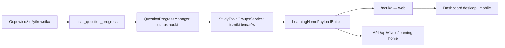
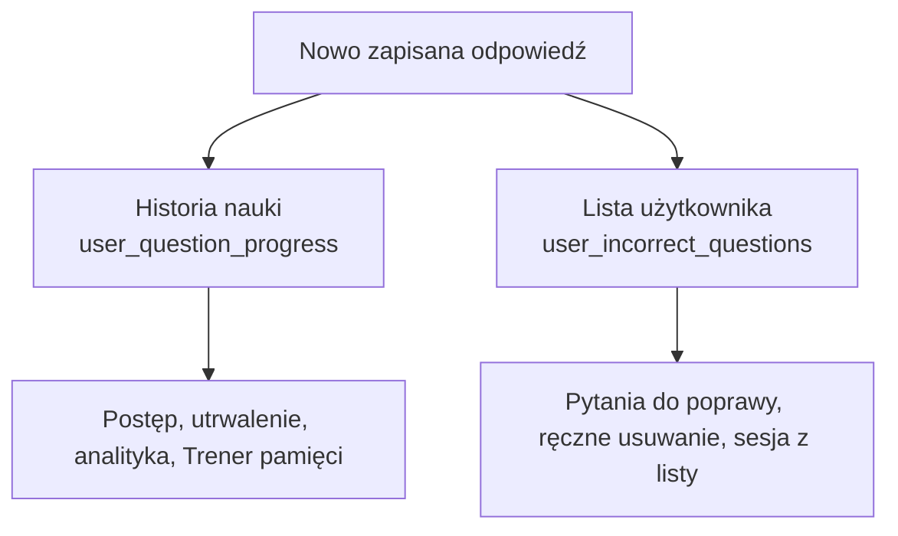

# Zarządzana lista błędnych pytań — plan wdrożenia i audyt regresji

**Status dokumentu:** implementacja aktywna i zweryfikowana lokalnie; funkcja niewdrożona produkcyjnie
**Ostatnia aktualizacja:** 2026-08-03
**Obszar:** `/nauka`, nauka klasyczna, web, API i widok mobilny

## 1. Gdzie jesteśmy

| Obszar | Status | Wynik |
|---|---:|---|
| Audyt obecnego licznika `PYTAŃ Z BŁĘDAMI` | Zrobione | Licznik jest wyliczany z historii `user_question_progress`, a nie z osobnej listy użytkownika. |
| Audyt zapisu odpowiedzi | Zrobione | Zmapowano zwykłe odpowiedzi, timeout egzaminu, ponowienia żądań oraz tryby nauki. |
| Audyt web/API/mobile | Zrobione | Ten sam model danych zasila `/nauka`, API learning home i mobilny dashboard. |
| Audyt Trenera pamięci i innych modułów | Zrobione | Trener pamięci, ranking, demo publiczne i znaki drogowe mają odrębne mechanizmy. |
| Audyt skali danych produkcyjnych | Zrobione | Stan z 2026-08-03: 5314 rekordów postępu, 626 obecnie widocznych kandydatów do listy, 6 użytkowników; maks. 272 na użytkownika. |
| Model docelowy i zasady zachowania | Zrobione | Osobna, trwała lista błędów i niezależna historia postępu. |
| Implementacja backendu, web, API i mobile | Zrobione lokalnie | Kod, migracje, testy, backfill preview/apply i audyt są gotowe za flagami. |
| Lokalne uruchomienie | Zrobione | Migracje w batchu 53, backfill 479 pozycji w paczce `6ae026b1-22b8-4368-aaaf-07378a722377`, audyt bez braków i aktywne lokalne UI. |
| Wdrożenie produkcyjne i backfill danych | Do zrobienia | Nie wykonano backupu, migracji ani komend na produkcji; flagi domyślnie pozostają wyłączone. |

Dokument rozdziela implementację lokalną od aktywacji produkcyjnej. Zaznaczenie `Zrobione lokalnie` oznacza kod zweryfikowany testami w repozytorium, ale jeszcze niewdrożony ani niewłączony dla użytkowników produkcyjnych.

### 1.1 Stan implementacji z 2026-08-03

- Dodano trwałą tabelę `user_incorrect_questions` i preferencję profilu.
- Dodano atomowy zapis w tej samej transakcji co nowa odpowiedź oraz obsługę timeoutu egzaminu.
- Dodano idempotentne komendy `questions:backfill-incorrect-list` i `questions:audit-incorrect-list`.
- Dodano osobny ekran `/nauka/bledne-pytania`, API, ręczne usuwanie i przełącznik automatycznego usuwania.
- Dodano filtr sesji `mistake_list`, nie zmieniając istniejącego `incorrect`.
- Desktop i mobile korzystają z addytywnego kontraktu i przełączają się dopiero przy `UI_ENABLED=true` oraz `READ_MODE=list`.
- Na `/nauka` są dwie odrębne akcje: licznik otwierający zarządzaną listę oraz `Powtórz pytania` rozpoczynające sesję z listy.
- Licznik kategorii jest wyliczany bezpośrednio z aktywnej listy, również dla pytań bez przypisanego tematu.
- Wpis utworzony przez backfill po kolejnym realnym błędzie zmienia źródło na `answer` i traci identyfikator paczki, co chroni dane użytkownika przed omyłkowym rollbackiem paczki.

## 2. Cel użytkownika

Po błędnej odpowiedzi pytanie ma trafić na osobistą listę użytkownika i pozostać na niej, dopóki:

- użytkownik sam go nie usunie, albo
- użytkownik wcześniej włączy opcję automatycznego usuwania po poprawnej odpowiedzi, a następnie odpowie poprawnie.

Domyślnie poprawna odpowiedź **nie usuwa** pytania z listy. Użytkownik ma dostać osobny ekran z listą, możliwość rozpoczęcia powtórki oraz czytelną kontrolę nad usuwaniem.

## 3. Czego nie zmieniamy

- Nie zerujemy `incorrect_count`, `correct_count` ani innych danych historycznych.
- Nie zmieniamy algorytmu utrwalania i harmonogramu powtórek.
- Nie łączymy listy błędów z Trenerem pamięci.
- Nie zmieniamy sposobu oceniania odpowiedzi ani wyniku egzaminu.
- Nie przebudowujemy istniejącego odtwarzacza pytań — powtórka korzysta z obecnego modułu sesji.
- Nie obejmujemy modułów znaków drogowych, rankingu 1v1 ani publicznego demo.
- Nie wykorzystujemy analityki kliknięć jako warunku działania tej funkcji.

## 4. Stan obecny — dlaczego pytania znikają

### 4.1 Brak osobnej listy

Tabela `user_question_progress` przechowuje historię i stan nauki:

- liczbę prób,
- liczbę dobrych i błędnych odpowiedzi,
- serię poprawnych odpowiedzi,
- parametry powtórek i datę następnej powtórki.

Nie ma w niej pola oznaczającego świadomą decyzję użytkownika: „to pytanie ma pozostać na mojej liście”.

### 4.2 Obecna definicja „błędnego pytania”

`QuestionProgressManager::progressBucketFromSnapshot()` najpierw sprawdza, czy pytanie jest utrwalone. Dopiero jeśli nie jest utrwalone, `incorrect_count > 0` kwalifikuje je jako błędne. W efekcie pytanie może zniknąć z obecnej sekcji automatycznie po osiągnięciu warunków utrwalenia, mimo że użytkownik niczego ręcznie nie usunął.

To zachowanie jest właściwe dla analityki nauki, ale nie spełnia wymagań trwałej, zarządzanej listy.

### 4.3 Obecny przepływ licznika



Licznik przy czerwonym przycisku jest sumą `counts.incorrect` z grup tematów. Nie jest odczytem z trwałej listy.

## 5. Mapa zależności sprawdzonych w kodzie

| Odpowiedzialność | Plik / komponent | Znaczenie dla wdrożenia |
|---|---|---|
| Historia postępu | `app/Support/QuestionProgressManager.php` | Pozostaje źródłem analityki i utrwalania; nie może być używana jako lista użytkownika. |
| Model historii | `app/Models/UserQuestionProgress.php` | Nie zmieniamy semantyki istniejących liczników. |
| Schemat historii | `database/migrations/2026_03_19_010000_create_user_question_progress_table.php` | Potwierdza brak osobnego członkostwa na liście. |
| Zapis odpowiedzi i timeoutów | `app/Support/StudySessionManager.php` | Tu trzeba atomowo aktualizować nową listę tylko dla nowo zapisanej odpowiedzi. |
| Filtrowanie sesji | `app/Support/StudySessionManager.php` | Obecny filtr `incorrect` używa historii postępu. |
| Drugie miejsce filtrowania | `app/Support/QuestionLearningOrderService.php` | Ma zduplikowany filtr statusu; nowego filtra nie wolno wdrożyć tylko w jednym miejscu. |
| Liczniki tematów | `app/Support/StudyTopicGroupsService.php` | Wymaga nowego, oddzielnego licznika listy. |
| Payload `/nauka` i API | `app/Support/LearningHomePayloadBuilder.php` | Wymaga addytywnego kontraktu, bez nadpisywania istniejącego `incorrect`. |
| Podsumowanie postępu | `app/Support/LearningDashboardPresenter.php` | `incorrect_questions` ma dziś znaczenie analityczne i nie powinno zmienić semantyki. |
| Dashboard web | `resources/js/Pages/Session/Index.vue` | Obecny globalny przycisk startuje sesję `question_status=incorrect`. |
| Dashboard mobile | `resources/js/Pages/Session/Partials/MobileLearningDashboard.vue` | Musi otrzymać ten sam licznik i te same akcje co desktop. |
| Wynik sesji | `resources/js/Pages/StudySessions/Show.vue` | Wymaga regresji, aby zmiana listy nie zmieniła oceny ani podsumowania sesji. |
| Profil web i API | `UserProfile`, `UserProfileService`, `UpsertUserProductProfileRequest`, kontrolery profilu | Tu trafia preferencja automatycznego usuwania. |
| Trener pamięci | `ReviewQueueController`, `resources/js/Pages/ReviewQueue/Index.vue` | Osobna kolejka powtórek; można wykorzystać wzorce UI, ale nie jej dane. |
| Ochrona dostępu | `routes/web.php` | Lista i jej mutacje muszą mieć `auth`, `verified` oraz właściwy warunek dostępu do produktu. |

## 6. Decyzja architektoniczna

Historia nauki i osobista lista błędów muszą być dwoma niezależnymi modelami:



Nie należy zmieniać znaczenia `incorrect_count`. Jest to licznik historyczny, a nie flaga listy.

## 7. Docelowy model danych

### 7.1 Nowa tabela `user_incorrect_questions`

Proponowane pola:

| Pole | Typ / zasada | Cel |
|---|---|---|
| `id` | klucz główny | Identyfikator rekordu. |
| `user_id` | FK, cascade delete | Właściciel listy. |
| `question_id` | FK, cascade delete | Pytanie. |
| `first_incorrect_at` | nullable timestamp | Pierwszy znany błąd; może być nieznany po backfillu. |
| `last_incorrect_at` | nullable timestamp | Ostatni znany błąd. |
| `removed_at` | nullable timestamp | `NULL` oznacza aktywne pytanie na liście. |
| `removal_reason` | nullable string | `manual` albo `correct_answer`. |
| `latest_study_session_id` | nullable FK, null on delete | Diagnostyka ostatniego dodania. |
| `latest_answer_id` | nullable FK, null on delete | Idempotencja i ślad odpowiedzi. |
| `created_source` | string | `answer` albo `legacy_backfill`. |
| `backfill_batch_id` | nullable UUID/string | Umożliwia audyt i ewentualne wycofanie konkretnej migracji danych. |
| `created_at`, `updated_at` | timestamps | Audyt techniczny. |

Wymagane ograniczenia i indeksy:

- unikalne `(user_id, question_id)` — jedna pozycja na parę użytkownik–pytanie,
- indeks `(user_id, removed_at, question_id)` — szybki licznik i lista,
- indeks `backfill_batch_id` — kontrolowany audyt migracji,
- klucze do sesji/odpowiedzi z `nullOnDelete`, ponieważ dane sesji mają politykę retencji.

Nie usuwamy rekordu fizycznie przy zwykłej akcji użytkownika. `removed_at` daje możliwość bezpiecznej reaktywacji po kolejnym błędzie oraz późniejszego dodania „Cofnij”.

### 7.2 Preferencja użytkownika

Do `user_profiles` dodajemy:

```text
auto_remove_incorrect_questions_on_correct boolean default false
```

Należy dodać pole do modelu, castów, wartości domyślnych, walidacji, zapisu profilu oraz odpowiedzi API profilu. Włączenie opcji działa wyłącznie na **przyszłe poprawne odpowiedzi** — nie czyści wstecz całej listy.

## 8. Reguły biznesowe

### 8.1 Podstawowe zdarzenia

| Zdarzenie | Wynik na liście |
|---|---|
| Pierwsza błędna odpowiedź | Utworzenie aktywnej pozycji. |
| Kolejna błędna odpowiedź | Brak duplikatu; aktualizacja `last_incorrect_at` i reaktywacja pozycji. |
| Poprawna odpowiedź, opcja wyłączona | Brak zmiany na liście. |
| Poprawna odpowiedź, opcja włączona | Ustawienie `removed_at`, powód `correct_answer`. |
| Ręczne usunięcie | Ustawienie `removed_at`, powód `manual`. |
| Błąd po ręcznym/automatycznym usunięciu | Reaktywacja tej samej pozycji. |
| Ponowienie tego samego żądania odpowiedzi | Brak drugiej aktualizacji; istniejąca idempotencja odpowiedzi musi zostać zachowana. |
| Usunięcie podczas trwającej sesji | Nie zmienia już zapisanego zestawu pytań bieżącej sesji; działa od kolejnej sesji. |

### 8.2 Źródła odpowiedzi

Najbezpieczniejsza zasada V1: nowa lista reaguje na te same, nowo zapisane odpowiedzi, które obecnie aktualizują klasyczny `QuestionProgressManager`.

| Źródło | V1 | Uzasadnienie |
|---|---:|---|
| Nauka klasyczna (`learn`) | Tak | Główna funkcja. |
| Egzamin (`exam`), w tym timeout | Tak | Timeout jest dziś błędną odpowiedzią i zwiększa obecny licznik. |
| Trudne (`hard`) i szybkie (`quick`) | Tak | Obecnie zasilają ten sam postęp. |
| PJM — odpowiedź wyboru | Tak, jeżeli już przechodzi przez klasyczny zapis postępu | Zachowanie zgodne z aktualnym źródłem danych; ekspozycja listy nadal podlega dostępowi produktu. |
| Trener pamięci (`sr_review`) | Nie | Ma osobny `ReviewMemoryProgress`; `Nie wiem` nie powinno trafić do klasycznej listy. |
| Ranking 1v1 | Nie | Osobny serwis i semantyka. |
| Publiczne demo | Nie | Brak właściciela listy i osobny przepływ. |
| Znaki drogowe | Nie | Osobny model postępu. |
| Administracyjny podgląd importowanych modułów | Nie | Pytania nieaktywne / niedostarczalne nie mogą przeciekać do listy użytkownika. |

Lista i jej licznik zawsze filtrują pytania do aktualnej kategorii oraz `is_active = true` i `delivery_issue IS NULL`. Nieaktywna pozycja może pozostać w tabeli, ale nie jest pokazywana ani używana w sesji. Dzięki temu ponowna aktywacja pytania nie wymaga rekonstrukcji historii.

## 9. Atomowość i odporność na błędy

Nowy `IncorrectQuestionListService` powinien być wywoływany wewnątrz tej samej transakcji, która tworzy `study_session_answers`:

- po utworzeniu nowej odpowiedzi wyboru,
- podczas tworzenia odpowiedzi typu timeout egzaminu,
- nigdy przy zwróceniu już istniejącej odpowiedzi po ponowieniu żądania.

Obecny `QuestionProgressManager` jest wywoływany po transakcji. Nie przenosimy go w tym wdrożeniu, aby nie rozszerzać zakresu i nie zmieniać istniejącego zachowania. Atomowość nowej listy zapobiega sytuacji „odpowiedź zapisana, ale pytania nie ma na liście”.

Upsert po unikalnym `(user_id, question_id)` zabezpiecza przed duplikatami i równoległymi żądaniami. Nowy błąd zapisany po ręcznym usunięciu ma pierwszeństwo i reaktywuje pytanie.

## 10. Kontrakt odczytu bez zmiany znaczenia istniejących pól

Największe ryzyko regresji to podmienienie obecnego `incorrect` na listę użytkownika. Tego nie robimy w pierwszym kroku.

### 10.1 Pola istniejące

- `counts.incorrect` pozostaje statusem postępu liczonym z `user_question_progress`.
- `learning_overview.incorrect_questions` pozostaje metryką analityczną.
- `question_status=incorrect` pozostaje kompatybilny ze starszym webem/API podczas shadow runu.

### 10.2 Pola addytywne

Dodajemy:

- `counts.mistake_list` w grupach tematów,
- `learning_overview.incorrect_list_count` jako globalny licznik,
- opcję filtra `question_status=mistake_list`,
- `profile.auto_remove_incorrect_questions_on_correct`.

Nowy dashboard i nowy ekran korzystają z `mistake_list`. Starszy kontrakt działa bez zmiany. Po stabilnym wdrożeniu można osobno zdecydować, czy stara nazwa `incorrect` ma być kiedyś zdeprecjonowana.

Filtrowanie `mistake_list` powinno zostać scentralizowane w jednej metodzie/scope, używanej zarówno przez `StudySessionManager`, jak i `QuestionLearningOrderService`. Nie należy kopiować trzeciej wersji zapytania.

## 11. Docelowy UX

### 11.1 Ekran `/nauka`

Rekomendowany układ:

- przycisk/licznik `228 pytań do poprawy` otwiera listę,
- obok osobna akcja `Powtórz pytania`, która rozpoczyna sesję z aktywnej listy,
- przy braku pozycji: komunikat `Nie masz teraz pytań do poprawy`.

Sformułowanie „pytania do poprawy” lepiej wyjaśnia cel niż techniczny „status incorrect”.

### 11.2 Nowy ekran `/nauka/bledne-pytania`

Elementy V1:

- tytuł `Pytania do poprawy`,
- opis `Zostają tutaj, dopóki sam ich nie usuniesz.`,
- globalna liczba aktywnych pozycji,
- filtr kategorii/tematu zgodny z aktywną kategorią konta,
- paginacja po 20–24 pozycje,
- treść pytania, miniatura medium, temat i ostatni znany błąd,
- akcja `Usuń z listy` przy każdym pytaniu,
- przełącznik `Usuwaj pytanie z listy po poprawnej odpowiedzi`, domyślnie wyłączony,
- akcja `Powtórz wszystkie` wykorzystująca istniejący odtwarzacz sesji.

Funkcje V1.1, które nie muszą blokować bezpiecznego startu:

- zaznaczanie wielu pozycji i usuwanie zbiorcze,
- komunikat z akcją `Cofnij`,
- wyszukiwarka tekstowa przy bardzo dużych listach.

Desktop i mobile muszą otrzymać identyczne zasady oraz liczniki w jednym wdrożeniu.

## 12. Backfill istniejących błędów

### 12.1 Granica semantyczna migracji

Backfill przenosi dokładnie pytania, które użytkownik widzi jako błędne w chwili przełączenia:

- aktywne i gotowe do dostarczenia,
- `total_attempts > 0`,
- `incorrect_count > 0`,
- jeszcze nieutrwalone według obecnych reguł.

Nie wskrzeszamy pytań, które już wcześniej automatycznie zniknęły jako utrwalone. Dzięki temu licznik nie skacze nagle w dniu wdrożenia. Od momentu włączenia nowego zapisu lista staje się trwała.

### 12.2 Komenda

Proponowana komenda:

```text
php artisan questions:backfill-incorrect-list --dry-run
php artisan questions:backfill-incorrect-list --apply --batch=<uuid>
php artisan questions:audit-incorrect-list --batch=<uuid>
```

Wymagania:

- `--dry-run` nie zapisuje danych,
- praca w chunkach,
- idempotentny upsert,
- raport JSON z sumami globalnymi i per kategoria/użytkownik bez PII,
- ponowne uruchomienie tej samej paczki nie tworzy duplikatów,
- pytania nieaktywne i z `delivery_issue` są pomijane.

Daty błędów należy odtworzyć z zachowanych `study_session_answers`, gdy to możliwe. Jeżeli retencja usunęła stare odpowiedzi, pola dat mogą pozostać `NULL`; nie zapisujemy fałszywie precyzyjnej daty z ostatniej dowolnej odpowiedzi.

### 12.3 Stan produkcji z audytu

Odczyt agregatów wykonany 2026-08-03, bez odczytywania PII:

| Metryka | Wartość |
|---|---:|
| Rekordy `user_question_progress` | 5314 |
| Obecni kandydaci do backfillu | 626 |
| Użytkownicy z kandydatami | 6 |
| Maksimum na użytkownika | 272 |
| Średnia na użytkownika z kandydatami | 104,3 |

Skala jest mała, więc migracja może być wykonana synchroniczną komendą w chunkach. Nadal wymagamy preview, kopii bazy i audytu po zapisie.

## 13. Etapy wdrożenia

### Etap 0 — audyt i kontrakt

- [x] Zmapować aktualny licznik i definicję błędnego pytania.
- [x] Zmapować wszystkie miejsca zapisu odpowiedzi i timeoutów.
- [x] Zmapować filtry w `StudySessionManager` i `QuestionLearningOrderService`.
- [x] Zmapować web, API i mobile.
- [x] Oddzielić listę użytkownika od Trenera pamięci i analityki.
- [x] Sprawdzić skalę danych produkcyjnych.
- [x] Zapisać plan migracji, rollout i rollback.

### Etap 1 — fundament danych bez zmiany zachowania

- [x] Migracja `user_incorrect_questions`.
- [x] Migracja preferencji w `user_profiles` z domyślną wartością `false`.
- [x] Modele, relacje i stałe powodów usunięcia.
- [x] `IncorrectQuestionListService` i wspólny filtr aktywnej listy.
- [x] Konfiguracja flag wdrożeniowych.
- [x] Testy funkcjonalne modelu, serwisu i pełnego przepływu.

Po tym etapie użytkownik nie widzi jeszcze zmiany.

### Etap 2 — preview i idempotentny backfill

- [x] Kopia bazy przed zapisem.
- [x] Zaimplementować `--dry-run` bez zapisu danych.
- [x] Zaimplementować `--apply` w chunkach z identyfikatorem paczki i bez reaktywowania usuniętych wpisów.
- [x] Zaimplementować audyt po zapisie.
- [x] Testowo potwierdzić idempotencję ponownego `--apply`.
- [x] Lokalnie: preview 479 pozycji, apply 479, ponowne apply 0, audyt 0 brakujących; paczka `6ae026b1-22b8-4368-aaaf-07378a722377`.
- [x] Uruchomić produkcyjny `--dry-run` i zachować raport.
- [x] Porównać liczby legacy i planowanego backfillu per użytkownik/kategoria bez PII.
- [x] Uruchomić `--apply` z identyfikatorem paczki.
- [x] Uruchomić audyt po zapisie.
- [x] Powtórzyć `--apply` i potwierdzić brak nowych rekordów.

### Etap 3 — dual-write / shadow

- [x] Dodać zapis listy za flagą, zachowując odczyty legacy.
- [x] Obsłużyć zwykłą odpowiedź oraz timeout w tej samej transakcji co odpowiedź.
- [x] Zachować idempotencję ponowionych żądań.
- [x] Włączyć `WRITE_ENABLED` na produkcji przy odczycie `legacy`.
- [x] Zebrać pierwsze operacyjne sumy rozbieżności i błędów bez PII.
- [ ] Porównać przyrosty przez minimum jeden pełny cykl użytkowania.

### Etap 4 — ekran listy w trybie read-only

- [x] Dodać kontroler, zapytanie i paginację.
- [x] Dodać trasę web i endpoint API pod właściwymi middleware.
- [x] Dodać ekran desktop/mobile za flagą.
- [ ] Udostępnić canary dla kont testowych lub za flagą.
- [ ] Zweryfikować media, filtry, kategorie, puste stany i wydajność zapytań.

### Etap 5 — kontrola użytkownika

- [x] Dodać pojedyncze ręczne usuwanie.
- [x] Dodać i zapisywać preferencję automatycznego usuwania.
- [x] Potwierdzić testem, że włączenie opcji nie czyści listy wstecz.
- [x] Dodać zabezpieczenie własności rekordu, istniejący CSRF i middleware dostępu produktu.
- [ ] Opcjonalnie dodać usuwanie zbiorcze i `Cofnij`.

### Etap 6 — sesja z listy i przełączenie UI

- [x] Dodać addytywny filtr `question_status=mistake_list`.
- [x] Przygotować przełączenie czerwonego licznika na `incorrect_list_count` za flagami.
- [x] Licznik `X pytań do poprawy` jest osobnym linkiem do `/nauka/bledne-pytania`.
- [x] Obok licznika jest osobny przycisk `Powtórz pytania`, który uruchamia istniejącą sesję `learn` z aktywnych pozycji.
- [x] Zachować niezmienny snapshot pytań już rozpoczętej sesji.
- [x] Przygotować równoczesne przełączenie desktop i mobile.
- [x] Zweryfikować obie akcje lokalnie na desktopie i w widoku mobilnym 390×844.
- [x] Zachować legacy `incorrect` dla zgodności API i analityki.

### Etap 7 — produkcja i stabilizacja

- [x] Backup produkcji.
- [x] Migracje addytywne.
- [x] Preview i backfill.
- [x] Shadow write i kontrola zapisu w transakcji zakończonej rollbackiem.
- [ ] Canary read dla kont testowych.
- [x] Smoke test web i API.
- [x] Przełączenie na nowy odczyt po zgodnym backfillu i audycie; obecne flagi są globalne, więc per-konto canary nie był dostępny.
- [ ] Obserwacja błędów i rozbieżności.
- [x] Aktualizacja tego dokumentu rzeczywistymi datami i wynikami testów.

### Stan produkcyjny po wdrożeniu 2026-08-03

- Backup przed migracjami: `backups/database-manifests/2026/08/20260803-171302-prawkonarazpl-pgsql-pgsql-pre-managed-incorrect-list-20260803.json`.
- Backup bezpośrednio przed backfillem: `backups/database-manifests/2026/08/20260803-171510-prawkonarazpl-pgsql-pgsql-pre-managed-incorrect-list-backfill-20260803.json`.
- Backup plików wdrożenia i `.env`: `/tmp/prawkonaraz-incorrect-list-backup-20260803190350`.
- Migracje `2026_08_03_100000` i `2026_08_03_101000`: batch produkcyjny `53`, status `Ran`.
- Backfill: batch `7b6e6c24-2b48-4bb8-b54f-1d88aa0c49d4`, 626 kandydatów, 626 zapisanych rekordów.
- Powtórny backfill: 0 nowych rekordów; idempotencja potwierdzona.
- Audyt końcowy: 626 rekordów legacy, 626 aktywnych wpisów listy, 0 brakujących relacji.
- Kontrola dual-write: błędna odpowiedź utworzyła dokładnie jeden wpis w transakcji testowej; transakcja została wycofana, więc nie pozostawiła danych testowych.
- Aktywne flagi: `WRITE_ENABLED=true`, `READ_MODE=list`, `UI_ENABLED=true`.
- Produkcyjny health report i smoke test z wymaganymi mediami: `OK`.
- Kontrola w zalogowanej przeglądarce: `/nauka` pokazuje osobny link do listy i osobny przycisk rozpoczęcia powtórki; `/nauka/bledne-pytania` renderuje listę, filtr tematów, paginację, ręczne usuwanie i preferencję automatycznego usuwania; konsola bez błędów i ostrzeżeń.
- Wdrożono odseparowany build oparty na źródłach produkcyjnych. Nie wdrożono innych lokalnych zmian checkoutu, analityki, nagłówka ani niedokończonych zmian stylistycznych widoku mobilnego.
- Pozostaje obserwacja pierwszego pełnego cyklu rzeczywistego użycia i ponowny audyt rozbieżności.

## 14. Flagi wdrożeniowe

Rekomendowane ustawienia w `config/study.php` i `.env.example`:

```text
INCORRECT_QUESTION_LIST_WRITE_ENABLED=false
INCORRECT_QUESTION_LIST_READ_MODE=legacy
INCORRECT_QUESTION_LIST_UI_ENABLED=false
```

Tryby odczytu:

- `legacy` — obecny licznik i obecne sesje,
- `shadow` — użytkownik nadal widzi legacy, system porównuje agregaty,
- `list` — UI i sesje korzystają z nowej listy.

Nie należy włączać `list`, zanim backfill, dual-write i audyt nie przejdą poprawnie.

## 15. Testy wymagane przed przełączeniem

### 15.1 Serwis listy

- [x] Błąd tworzy aktywną pozycję.
- [x] Kolejny błąd nie tworzy duplikatu.
- [x] Ręczne usunięcie dezaktywuje pozycję.
- [x] Kolejny błąd reaktywuje usuniętą pozycję.
- [x] Poprawna odpowiedź przy domyślnym ustawieniu nie usuwa.
- [x] Poprawna odpowiedź przy włączonym ustawieniu usuwa.
- [x] Włączenie opcji nie czyści istniejącej listy.
- [x] Ponowienie tego samego zapisu odpowiedzi nie zmienia listy drugi raz.
- [x] Pytanie nieaktywne/niedostarczalne nie trafia do widocznej listy.

### 15.2 Tryby i źródła

- [x] `learn`, `exam`, `hard`, `quick` oraz PJM dla odpowiedzi wyboru używają tych samych reguł listy.
- [x] Timeout egzaminu dodaje błąd.
- [x] `sr_review` nie dodaje do listy.
- [ ] Ranking, demo i znaki drogowe pozostają bez zmian.
- [ ] Administracyjny moduł importu nie przecieka do listy.

### 15.3 Bezpieczeństwo i dostęp

- [ ] Niezalogowany użytkownik nie widzi listy.
- [ ] Niezweryfikowany użytkownik nie mutuje listy.
- [x] Użytkownik nie może usunąć wpisu innego użytkownika.
- [x] Dostęp produktu jest spójny z `/nauka` i startem sesji.
- [ ] Mutacje web mają CSRF; API zachowuje istniejący mechanizm sesji/autoryzacji.
- [ ] Walidacja kategorii i pytania uniemożliwia IDOR.

### 15.4 Backfill

- [x] `--dry-run` nie zapisuje danych.
- [x] Powtórne `--apply` jest idempotentne.
- [ ] Liczba aktywnych wpisów odpowiada legacy w punkcie migracji.
- [ ] Pytania utrwalone, nieaktywne i niedostarczalne są pominięte.
- [ ] Brak historii odpowiedzi nie wymusza fałszywej daty.

### 15.5 Regresja istniejących funkcji

Uruchomić co najmniej:

```text
php artisan test tests/Feature/SessionPageTest.php
php artisan test tests/Feature/StudySessionFlowTest.php
php artisan test tests/Feature/ApiSessionTest.php
php artisan test tests/Feature/ApiLearningHomeTest.php
php artisan test tests/Feature/QuestionLearningOrderTest.php
php artisan test tests/Feature/PjmStudySessionTest.php
php artisan test tests/Feature/ReviewQueueTest.php
php artisan test tests/Feature/ReviewTrainerTelemetryTest.php
php artisan test tests/Feature/DashboardTest.php
php artisan test tests/Feature/CategoryAnalyticsApiTest.php
php artisan test tests/Feature/CategoryAnalyticsPageTest.php
php artisan test tests/Feature/ProductAccessGateTest.php
php artisan test tests/Feature/AdminQuestionCollectionPreviewTest.php
npm run test:unit
npm run build
```

Dodatkowo należy utworzyć testy komponentów dla `Session/Index.vue` i `MobileLearningDashboard.vue`, ponieważ obecnie nie ma bezpośrednich testów komponentowych tej logiki.

### 15.7 Wyniki lokalnej weryfikacji implementacji

Stan na 2026-08-03:

| Zestaw | Wynik |
|---|---:|
| `IncorrectQuestionListTest` | 9 testów zaliczonych; obejmuje listę, preferencję, IDOR, backfill, tryby i licznik bez tematu. |
| Sesje web/API, PJM, kolejka powtórek i profil | 91 testów, 1534 asercje — wszystkie zaliczone. |
| `SessionPageTest` | 29 testów, 552 asercje — wszystkie zaliczone. |
| Learning home, kolejność pytań i product gate | 21 testów, 199 asercji — wszystkie zaliczone. |
| Frontend unit | 43 pliki, 236 testów — wszystkie zaliczone. |
| TypeScript i build Vite | Zaliczone; 971 modułów przetworzonych. |
| Migracje `--pretend`, routing i lint PHP | Zaliczone lokalnie. |
| Smoke test lokalnego `/nauka` po migracjach | Zaliczone; strona załadowana bez błędu 500 i bez błędów konsoli. |
| Dwie akcje listy na desktopie i mobile | Zaliczone; licznik otwiera listę 179 pozycji, a osobny przycisk uruchomił sesję `mistake_list` 1/179. Testową sesję zakończono bez odpowiedzi; brak aktywnych sesji po teście. |

W kontenerze testowym należy jawnie ustawić `CACHE_STORE=array`; środowisko kontenera zachowuje Redis mimo wartości w `phpunit.xml`. To cecha obecnej konfiguracji testowej, niezwiązana z nową funkcją.

### 15.6 Smoke test produkcyjny

Na kontrolowanym koncie testowym:

1. Otworzyć `/nauka` na desktopie i mobile.
2. Zapisać błędną odpowiedź i potwierdzić wzrost licznika o jeden.
3. Odpowiedzieć poprawnie przy wyłączonej opcji i potwierdzić pozostanie pytania.
4. Usunąć pytanie ręcznie i potwierdzić spadek licznika.
5. Odpowiedzieć na nie ponownie błędnie i potwierdzić reaktywację.
6. Włączyć automatyczne usuwanie, odpowiedzieć poprawnie i potwierdzić usunięcie.
7. Uruchomić sesję z listy i porównać licznik z liczbą pytań w sesji.
8. Sprawdzić egzamin, PJM i Trenera pamięci pod kątem braku regresji.

## 16. Monitoring operacyjny

Wystarczą metryki działania, bez śledzenia kliknięć:

- liczba dodań,
- liczba reaktywacji,
- liczba ręcznych usunięć,
- liczba automatycznych usunięć,
- błędy zapisu listy,
- rozbieżność legacy vs nowa lista podczas shadow runu,
- rozbieżność między licznikiem listy a liczbą pytań utworzonej sesji.

Logi i raporty nie powinny zawierać e-maili ani innych danych osobowych. Do diagnostyki wystarczą wewnętrzne identyfikatory i agregaty.

## 17. Deploy i rollback

### Deploy

1. Wykonać backup bazy i potwierdzić możliwość odtworzenia.
2. Wdrożyć migracje addytywne z flagami wyłączonymi.
3. Uruchomić testy i health check.
4. Wykonać preview backfillu.
5. Wykonać backfill i audyt.
6. Włączyć `WRITE_ENABLED` przy odczycie `legacy`.
7. Przejść przez shadow run i canary.
8. Włączyć UI.
9. Przełączyć `READ_MODE=list`.

### Natychmiastowy rollback

1. Ustawić `INCORRECT_QUESTION_LIST_READ_MODE=legacy`.
2. Wyłączyć `INCORRECT_QUESTION_LIST_UI_ENABLED`.
3. W razie błędów zapisu wyłączyć `INCORRECT_QUESTION_LIST_WRITE_ENABLED`.
4. Nie usuwać tabeli i nie cofać migracji pod ruchem.
5. Nie resetować `user_question_progress`.

Ponieważ schemat jest addytywny, stary mechanizm może natychmiast przejąć odczyt. Dane nowej listy zostają do analizy i naprawy. Usuwanie rekordów backfillu, jeżeli w ogóle będzie potrzebne, wykonujemy wyłącznie po `backfill_batch_id` i po osobnym backupie.

## 18. Główne ryzyka i zabezpieczenia

| Ryzyko | Zabezpieczenie |
|---|---|
| Zmiana znaczenia dashboardowych statystyk | Oddzielne pola `incorrect` i `mistake_list`. |
| Inny wynik na desktopie i mobile | Jeden payload i przełączenie obu widoków w tym samym etapie. |
| Lista zapisuje się, ale odpowiedź nie | Aktualizacja listy w transakcji odpowiedzi. |
| Odpowiedź zapisuje się, ale lista nie | Ta sama transakcja i fail całej operacji. |
| Duplikaty po retry | Unikalny indeks i aktualizacja tylko dla nowej odpowiedzi. |
| Wyciekanie pytań importowanych/nieaktywnych | Wspólny filtr `is_active` + `readyForDelivery`. |
| Rozjazd dwóch filtrów sesji | Wspólny scope zamiast kopiowania zapytania. |
| Nagły skok licznika po wdrożeniu | Backfill dokładnie obecnie widocznego zbioru, bez wskrzeszania utrwalonych pytań. |
| Utrata możliwości rollbacku | Flagi, legacy read, brak zmiany historycznych liczników. |
| Zbyt duża lista | Paginacja; sesja może być dzielona na bezpieczne paczki bez zmiany samej listy. |

## 19. Definition of Done

Funkcja jest gotowa dopiero wtedy, gdy:

- błędne pytanie pozostaje na liście po poprawnej odpowiedzi przy ustawieniu domyślnym,
- użytkownik może sam usunąć pytanie,
- opcja automatycznego usuwania działa tylko po jej włączeniu i tylko dla przyszłych odpowiedzi,
- kolejny błąd reaktywuje wcześniej usunięte pytanie,
- licznik, lista i nowa sesja pokazują ten sam aktywny zbiór,
- desktop, mobile i API mają spójny kontrakt,
- obecna analityka postępu, egzamin, PJM, Trener pamięci, ranking, demo i znaki drogowe nie zmieniają zachowania,
- backfill jest idempotentny i audytowalny,
- testy regresyjne, build i smoke test przechodzą,
- rollback do legacy został sprawdzony przed pełnym przełączeniem.

## 20. Najbliższy bezpieczny krok

Wykonać **kontrolowany Etap 7 na produkcji**, bez natychmiastowego pokazywania funkcji użytkownikom:

1. zatwierdzić i wdrożyć kod z trzema flagami w wartościach domyślnych,
2. wykonać i potwierdzić backup bazy,
3. uruchomić migracje addytywne,
4. wykonać `questions:backfill-incorrect-list --dry-run` i zachować raport,
5. dopiero po akceptacji raportu wykonać `--apply --batch=<uuid>` oraz audyt,
6. włączyć `WRITE_ENABLED=true`, pozostawiając `READ_MODE=legacy` i `UI_ENABLED=false`,
7. po shadow runie aktywować UI dla kontrolowanego canary, a następnie przełączyć `READ_MODE=list`.

Do czasu wykonania tych kroków publiczny `/nauka` zachowuje dotychczasowe działanie.
